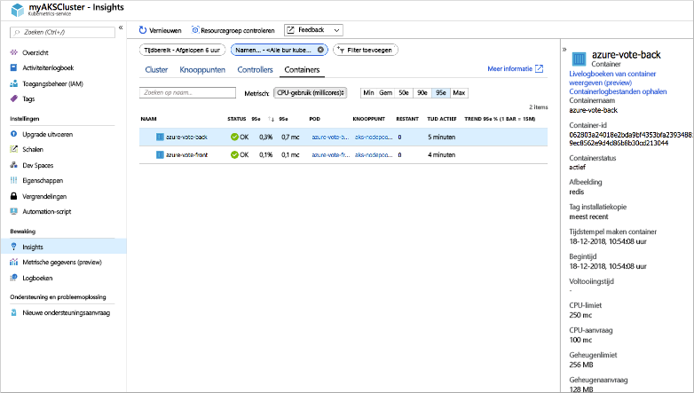
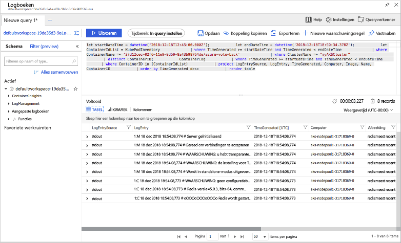

# <a name="quickstart-deploy-an-azure-kubernetes-service-aks-cluster-using-the-azure-cli"></a>Snelstart: Een AKS-cluster (Azure Kubernetes Service) implementeren met behulp van de Azure CLI

Azure Kubernetes Service (AKS) is een beheerde Kubernetes-service waarmee u snel clusters kunt implementeren en beheren. In deze snelstartgids implementeert u een AKS-cluster met behulp van Azure CLI. Een toepassing met meerdere containers die bestaat uit een web-front-end en een Redis-exemplaar wordt uitgevoerd in het cluster. U ziet vervolgens hoe u de status van het cluster en de pods die uw toepassing uitvoeren kunt bewaken.


In deze snelstart wordt ervan uitgegaan dat u een basisbegrip hebt van Kubernetes-concepten. Zie [Kubernetes-kernconcepten voor Azure Kubernetes Service-cluster (AKS)][kubernetes-concepts] voor meer informatie.

Als u nog geen abonnement op Azure hebt, maak dan een [gratis account](https://azure.microsoft.com/free/?WT.mc_id=A261C142F) aan voordat u begint.

[!INCLUDE [cloud-shell-try-it.md](../../includes/cloud-shell-try-it.md)]

Als u ervoor kiest om de CLI lokaal te installeren en te gebruiken, moet u voor deze snelstartgids de Azure CLI versie 2.0.52 of hoger uitvoeren. Voer `az --version` uit om de versie te bekijken. Als u Azure CLI 2.0 wilt installeren of upgraden, raadpleegt u [Azure CLI 2.0 installeren][azure-cli-install].

## <a name="create-a-resource-group"></a>Een resourcegroep maken

Een Azure-resourcegroep is een logische groep waarin Azure-resources worden geïmplementeerd en beheerd. Wanneer u een resourcegroep maakt, wordt u gevraagd een locatie op te geven. Dit is de locatie waar uw resources in Azure worden uitgevoerd. Maak een resourcegroep met de opdracht [az group create][az-group-create].

In het volgende voorbeeld wordt een resourcegroep met de naam *myAKSCluster* gemaakt op de locatie *US oost*.

```azurecli-interactive
az group create --name myResourceGroup --location eastus
```

In de volgende voorbeelduitvoer ziet u dat de resourcegroep is gemaakt:

```json
{
  "id": "/subscriptions/<guid>/resourceGroups/myResourceGroup",
  "location": "eastus",
  "managedBy": null,
  "name": "myResourceGroup",
  "properties": {
    "provisioningState": "Succeeded"
  },
  "tags": null
}
```

## <a name="create-aks-cluster"></a>AKS-cluster maken

Gebruik de opdracht [az aks create][az-aks-create] om een AKS-cluster te maken. In het volgende voorbeeld wordt een cluster met de naam *myAKSCluster* gemaakt met één knooppunt. Azure Monitor voor containers kan ook worden ingeschakeld met behulp van de parameter *--enable-addons monitoring*.

```azurecli-interactive
az aks create \
    --resource-group myResourceGroup \
    --name myAKSCluster \
    --node-count 1 \
    --enable-addons monitoring \
    --generate-ssh-keys
```

Na enkele minuten is de opdracht voltooid en retourneert deze informatie over het cluster in JSON-indeling.

## <a name="connect-to-the-cluster"></a>Verbinding maken met het cluster

Als u een Kubernetes-cluster wilt beheren, gebruikt u [kubectl][kubectl], de Kubernetes-opdrachtregelclient. Als u Azure Cloud Shell gebruikt, is `kubectl` al geïnstalleerd. Als u `kubectl` lokaal wilt installeren, gebruikt u de opdracht [az aks install-cli][az-aks-install-cli]:

```azurecli
az aks install-cli
```

Gebruik de opdracht [az aks get-credentials][az-aks-get-credentials] om `kubectl` te configureren dat er verbinding wordt gemaakt met het Kubernetes-cluster. Bij deze opdracht worden referenties gedownload en wordt Kubernetes CLI geconfigureerd voor het gebruik van deze referenties.

```azurecli-interactive
az aks get-credentials --resource-group myResourceGroup --name myAKSCluster
```

Als u de verbinding met uw cluster wilt controleren, gebruikt u de opdracht [kubectl get][kubectl-get] om een lijst met clusterknooppunten te retourneren.

```azurecli-interactive
kubectl get nodes
```

In de volgende voorbeelduitvoer ziet u het enkele knooppunt dat is gemaakt in de vorige stappen. Zorg ervoor dat de status van het knooppunt *Ready* is:

```
NAME                       STATUS   ROLES   AGE     VERSION
aks-nodepool1-31718369-0   Ready    agent   6m44s   v1.9.11
```

## <a name="run-the-application"></a>De toepassing uitvoeren

In een Kubernetes-manifestbestand wordt een gewenste status voor het cluster gedefinieerd, zoals welke containerinstallatiekopieën moeten worden uitgevoerd. In deze snelstart worden met behulp van een manifest alle objecten gemaakt die nodig zijn om de Azure Vote-toepassing uit te voeren. Dit manifest bevat twee [Kubernetes-implementaties][kubernetes-deployment], een voor de Azure Vote Python-voorbeeldtoepassingen en een voor een instantie van Redis. Er worden bovendien twee [Kubernetes-services][kubernetes-service] gemaakt: een interne service voor de Redis-instantie en een externe service voor toegang tot de Azure Vote-toepassing vanaf internet.

> [!TIP]
> In deze snelstart maakt en implementeert u handmatig uw toepassingsmanifesten in het AKS-cluster. In meer praktijkgerichte scenario’s kunt u [Azure Dev Spaces][azure-dev-spaces] gebruiken om uw code snel te herhalen en fouten op te sporen, rechtstreeks in het AKS-cluster. U kunt Dev Spaces gebruiken op alle OS-platformen en in alle ontwikkelomgevingen, en u kunt samenwerken met andere leden van uw team.

Maak een bestand met de naam `azure-vote.yaml` en kopieer de volgende YAML-definitie naar het bestand. Als u Azure Cloud Shell gebruikt, kan dit bestand worden gemaakt met behulp van `vi` of `nano`, zoals bij een virtueel of fysiek systeem:

```yaml
apiVersion: apps/v1
kind: Deployment
metadata:
  name: azure-vote-back
spec:
  replicas: 1
  selector:
    matchLabels:
      app: azure-vote-back
  template:
    metadata:
      labels:
        app: azure-vote-back
    spec:
      containers:
      - name: azure-vote-back
        image: redis
        resources:
          requests:
            cpu: 100m
            memory: 128Mi
          limits:
            cpu: 250m
            memory: 256Mi
        ports:
        - containerPort: 6379
          name: redis
---
apiVersion: v1
kind: Service
metadata:
  name: azure-vote-back
spec:
  ports:
  - port: 6379
  selector:
    app: azure-vote-back
---
apiVersion: apps/v1
kind: Deployment
metadata:
  name: azure-vote-front
spec:
  replicas: 1
  selector:
    matchLabels:
      app: azure-vote-front
  template:
    metadata:
      labels:
        app: azure-vote-front
    spec:
      containers:
      - name: azure-vote-front
        image: microsoft/azure-vote-front:v1
        resources:
          requests:
            cpu: 100m
            memory: 128Mi
          limits:
            cpu: 250m
            memory: 256Mi
        ports:
        - containerPort: 80
        env:
        - name: REDIS
          value: "azure-vote-back"
---
apiVersion: v1
kind: Service
metadata:
  name: azure-vote-front
spec:
  type: LoadBalancer
  ports:
  - port: 80
  selector:
    app: azure-vote-front
```

Implementeer de toepassing met de opdracht [kubectl apply][kubectl-apply] en geef de naam op van uw YAML-manifest:

```azurecli-interactive
kubectl apply -f azure-vote.yaml
```

In de volgende voorbeelduitvoer ziet u dat je implementaties en services zijn gemaakt:

```
deployment "azure-vote-back" created
service "azure-vote-back" created
deployment "azure-vote-front" created
service "azure-vote-front" created
```

## <a name="test-the-application"></a>De toepassing testen

Wanneer de toepassing wordt uitgevoerd, maakt een Kubernetes-service de front-end van de toepassing beschikbaar op internet. Dit proces kan enkele minuten duren.

Gebruik de opdracht [kubectl get service][kubectl-get] met het argument `--watch` om de voortgang te controleren.

```azurecli-interactive
kubectl get service azure-vote-front --watch
```

Eerst wordt het *EXTERNAL-IP*-adres voor de service *azure-vote-front* weergegeven als *in behandeling*.

```
NAME               TYPE           CLUSTER-IP   EXTERNAL-IP   PORT(S)        AGE
azure-vote-front   LoadBalancer   10.0.37.27   <pending>     80:30572/TCP   6s
```

Zodra het *EXTERNAL-IP*-adres is gewijzigd van *in behandeling* in een echt openbaar IP-adres, gebruikt u `CTRL-C` om het controleproces van `kubectl` te stoppen. In de volgende voorbeelduitvoer ziet u een geldig openbaar IP-adres dat aan de service is toegewezen:

```
azure-vote-front   LoadBalancer   10.0.37.27   52.179.23.131   80:30572/TCP   2m
```

Open een webbrowser naar het externe IP-adres van uw service om de Azure Vote-app te zien.


## <a name="monitor-health-and-logs"></a>Status en logboeken controleren

Toen het AKS-cluster werd gemaakt, werd Azure Monitor voor containers ingeschakeld om metrische gegevens over de status van de clusterknooppunten en -pods vast te leggen. Deze metrische gegevens over de status zijn in de Azure-portal beschikbaar.

Voer de volgende stappen uit als u de huidige status, de uptime en het resourcegebruik voor de Azure Vote-pods wilt zien:

1. Open een webbrowser naar de Azure-portal [https://portal.azure.com][azure-portal].
1. Selecteer de resourcegroep, zoals *myResourceGroup*, selecteer vervolgens uw AKS-cluster, zoals *myAKSCluster*.
1. Kies onder **Bewaking** aan de linkerkant de optie **Inzichten**
1. Kies bovenaan **+ Filter toevoegen**
1. Selecteer *Namespace* als eigenschap en kies vervolgens  *\<Alles behalve kube-systeem\>*
1. Kies de weergave **Containers**.

De containers *azure-vote-back* en *azure-vote-front* worden weergegeven, zoals in het volgende voorbeeld:



Selecteer de koppeling **Containerlogboeken weergeven** aan de rechterkant van de lijst met containers om de logboeken voor de `azure-vote-front`-pod te zien. Deze logboeken bevatten de stromen *stdout* en *stderr* van de container.



## <a name="delete-cluster"></a>Cluster verwijderen

Gebruik de opdracht [az group delete][az-group-delete] om de resourcegroep, de containerservice en alle gerelateerde resources te verwijderen wanneer u het cluster niet meer nodig hebt.

```azurecli-interactive
az group delete --name myResourceGroup --yes --no-wait
```

> [!NOTE]
> Wanneer u het cluster verwijdert, wordt de Azure Active Directory-service-principal die door het AKS-cluster wordt gebruikt niet verwijderd. Zie [Overwegingen voor en verwijdering van AKS service-principal][sp-delete] voor stappen voor het verwijderen van de service-principal.

## <a name="get-the-code"></a>Code ophalen

In deze snelstartgids zijn vooraf gemaakte containerinstallatiekopieën gebruikt om een Kubernetes-implementatie te maken. De gerelateerde toepassingscode, Dockerfile en het Kubernetes-manifestbestand zijn beschikbaar op GitHub.

[https://github.com/Azure-Samples/azure-voting-app-redis][azure-vote-app]

## <a name="next-steps"></a>Volgende stappen

In deze snelstart hebt u een Kubernetes-cluster geïmplementeerd en vervolgens een toepassing met meerdere containers geïmplementeerd.

Voor meer informatie over AKS en een volledig stapsgewijs voorbeeld van code tot implementatie gaat u naar de zelfstudie over Kubernetes-clusters.

> [!div class="nextstepaction"]
> [AKS-zelfstudie][aks-tutorial]

<!-- LINKS - external -->
[azure-vote-app]: https://github.com/Azure-Samples/azure-voting-app-redis.git
[kubectl]: https://kubernetes.io/docs/user-guide/kubectl/
[kubectl-apply]: https://kubernetes.io/docs/reference/generated/kubectl/kubectl-commands#apply
[kubectl-get]: https://kubernetes.io/docs/reference/generated/kubectl/kubectl-commands#get
[azure-dev-spaces]: https://docs.microsoft.com/azure/dev-spaces/

<!-- LINKS - internal -->
[kubernetes-concepts]: concepts-clusters-workloads.md
[aks-monitor]: https://aka.ms/coingfonboarding
[aks-tutorial]: ./tutorial-kubernetes-prepare-app.md
[az-aks-browse]: /cli/azure/aks?view=azure-cli-latest#az-aks-browse
[az-aks-create]: /cli/azure/aks?view=azure-cli-latest#az-aks-create
[az-aks-get-credentials]: /cli/azure/aks?view=azure-cli-latest#az-aks-get-credentials
[az-aks-install-cli]: /cli/azure/aks?view=azure-cli-latest#az-aks-install-cli
[az-group-create]: /cli/azure/group#az-group-create
[az-group-delete]: /cli/azure/group#az-group-delete
[azure-cli-install]: /cli/azure/install-azure-cli
[sp-delete]: kubernetes-service-principal.md#additional-considerations
[azure-portal]: https://portal.azure.com
[kubernetes-deployment]: concepts-clusters-workloads.md#deployments-and-yaml-manifests
[kubernetes-service]: concepts-network.md#services
