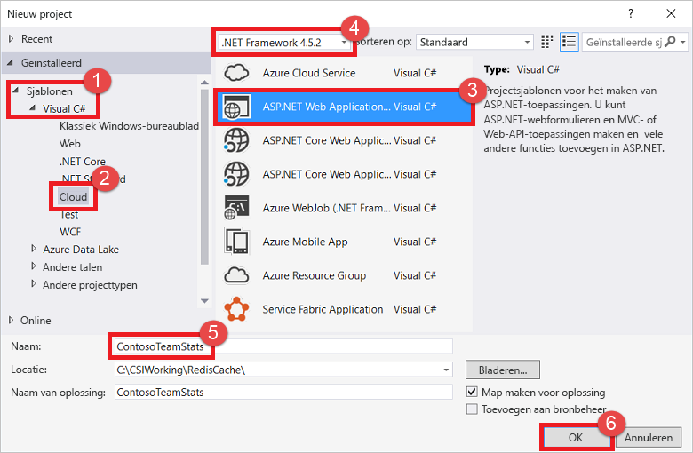
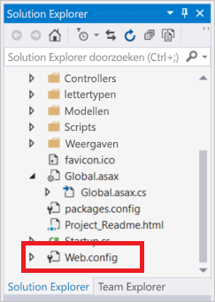
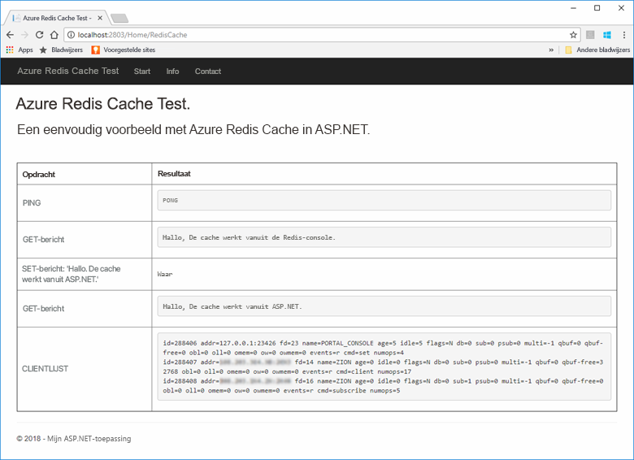
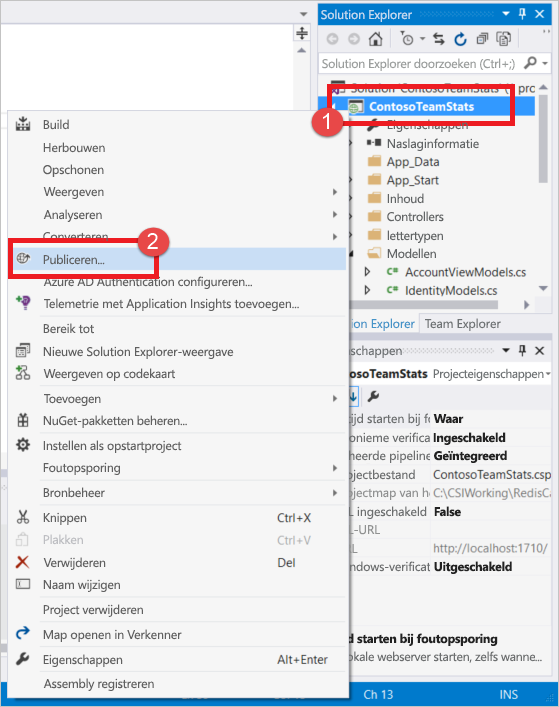
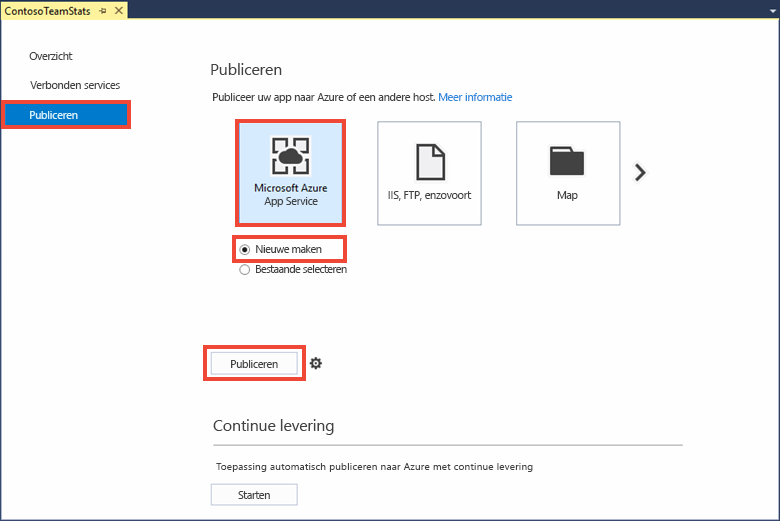
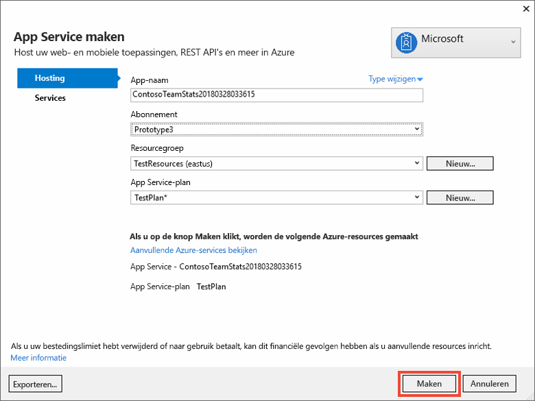
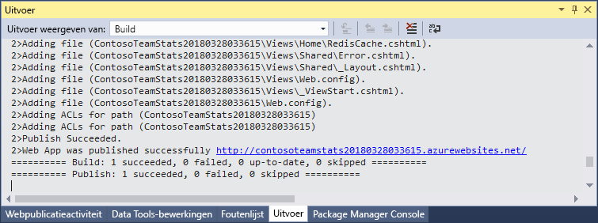
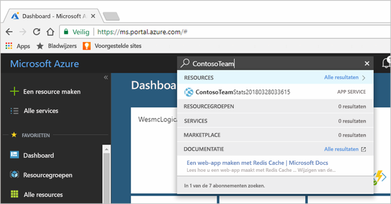
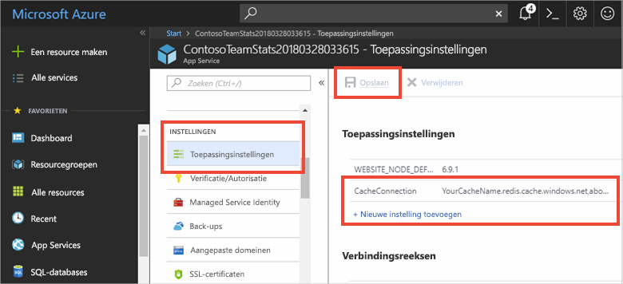
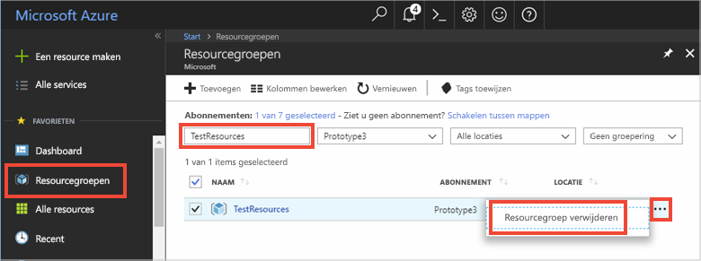

# <a name="quickstart-create-an-aspnet-web-app"></a>Snelstart: Een ASP.NET-web-app maken 

## <a name="introduction"></a>Inleiding

In deze snelstart ziet u hoe u een ASP.NET-webtoepassing maakt en implementeert in Azure App Service met behulp van Visual Studio 2017. De voorbeeldtoepassing maakt verbinding met Azure Cache voor Redis om gegevens uit de cache op te slaan en op te halen. Nadat u de snelstart hebt voltooid, hebt u een actieve web-app die wordt gehost in Azure en waarmee lees- en schrijfbewerkingen naar Azure Cache voor Redis kunnen worden uitgevoerd.


[!INCLUDE [quickstarts-free-trial-note](../../includes/quickstarts-free-trial-note.md)]

## <a name="prerequisites"></a>Vereisten

Om deze snelstart te kunnen voltooien moet [Visual Studio 2017](https://www.visualstudio.com/downloads/) zijn geïnstalleerd met de volgende omgevingen:
* ASP.NET-ontwikkeling en webontwikkeling
* Azure-ontwikkeling

## <a name="create-the-visual-studio-project"></a>Het Visual Studio-project maken

1. Open Visual Studio en selecteer vervolgens **Bestand** >**Nieuw** > **Project**.

2. Voer in het dialoogvenster **Nieuw project** de volgende stappen uit:

    

    a. Vouw in de lijst **Sjablonen** het knooppunt **Visual C#** uit.

    b. Selecteer **Cloud**.

    c. Selecteer **ASP.NET-webtoepassing**.

    d. Controleer of **.NET Framework 4.5.2** of hoger is geselecteerd.

    e. Geef in het vak **Naam** een naam op voor het project. In dit voorbeeld wordt de naam **ContosoTeamStats** gebruikt.

    f. Selecteer **OK**.
   
3. Selecteer **MVC** als het projecttype.

4. Zorg ervoor dat **Geen verificatie** is opgegeven voor de instellingen bij **Verificatie**. Afhankelijk van uw versie van Visual Studio wijkt de standaardinstelling voor **Verificatie** mogelijk af. Als u dit wilt wijzigen, selecteert u **Verificatie wijzigen** en vervolgens **Geen verificatie**.

5. Selecteer **OK** om het project te maken.

## <a name="create-a-cache"></a>Een cache maken

Maak vervolgens de cache voor de app.

[!INCLUDE [redis-cache-create](../../includes/redis-cache-create.md)]

[!INCLUDE [redis-cache-access-keys](../../includes/redis-cache-access-keys.md)]

#### <a name="to-edit-the-cachesecretsconfig-file"></a>Het bestand *CacheSecrets.config* bewerken

1. Maak op de computer een bestand met de naam *CacheSecrets.config*. Sla dit bestand op een locatie op waar het niet wordt ingecheckt met de broncode van de voorbeeldtoepassing. Voor deze snelstart bevindt het bestand *CacheSecrets.config* zich op *C:\AppSecrets\CacheSecrets.config*.

1. Bewerk het bestand *CacheSecrets.config*. Voeg nu de volgende inhoud toe:

    ```xml
    <appSettings>
        <add key="CacheConnection" value="<cache-name>.redis.cache.windows.net,abortConnect=false,ssl=true,password=<access-key>"/>
    </appSettings>
    ```

1. Vervang `<cache-name>` door de hostnaam van uw cache.

1. Vervang `<access-key>` door de primaire sleutel voor uw cache.

    > [!TIP]
    > U kunt de secundaire toegangssleutel tijdens sleutelroulatie gebruiken als een alternatieve sleutel terwijl u de primaire toegangssleutel opnieuw genereert.
   >
1. Sla het bestand op.

## <a name="update-the-mvc-application"></a>De MVC-toepassing bijwerken

In deze sectie werkt u de toepassing bij voor de ondersteuning van een nieuwe weergave waarin een eenvoudige test wordt weergegeven op basis van Azure Cache voor Redis.

* [Het web.config-bestand bijwerken met een app-instelling voor de cache](#update-the-webconfig-file-with-an-app-setting-for-the-cache)
* De toepassing configureren voor gebruik van de StackExchange.Redis-client
* De HomeController en lay-out bijwerken
* Een nieuwe RedisCache-weergave toevoegen

### <a name="update-the-webconfig-file-with-an-app-setting-for-the-cache"></a>Het web.config-bestand bijwerken met een app-instelling voor de cache

Als u de toepassing lokaal uitvoert, wordt de informatie in *CacheSecrets.config* gebruikt om verbinding te maken met uw instantie van Azure Cache voor Redis. Later implementeert u deze toepassing in Azure. Op dat moment configureert u een app-instelling in Azure die in de toepassing wordt gebruikt om de cacheverbindingsinformatie op te halen in plaats van dit bestand. 

Omdat het bestand *CacheSecrets.config* niet in Azure wordt geïmplementeerd met uw toepassing, gebruikt u het alleen tijdens het lokaal testen van de toepassing. Houd deze informatie zo veilig mogelijk om schadelijke toegang tot de gegevens in de cache te voorkomen.

#### <a name="to-update-the-webconfig-file"></a>Het bestand *web.config* bijwerken
1. Dubbelklik in **Solution Explorer** op het bestand *web.config* om het te openen.

    

2. Ga in het bestand *web.config* naar het element `<appSetting>`. Voeg vervolgens het volgende `file`-kenmerk toe. Als u een andere bestandsnaam of -locatie gebruikt, vervangt u deze waarden door de waarden die in het voorbeeld worden weergegeven.

* Voor: `<appSettings>`
* Na:  `<appSettings file="C:\AppSecrets\CacheSecrets.config">`

De ASP.NET-runtime voegt de inhoud van het externe bestand samen met de opmaak van het element `<appSettings>`. Als het opgegeven bestand niet kan worden gevonden, negeert de runtime het bestandskenmerk. Uw geheimen (de verbindingsreeks naar uw cache) worden niet opgenomen in de broncode van de toepassing. Wanneer u de web-app implementeert in Azure, wordt het bestand *CacheSecrets.config* niet geïmplementeerd.

### <a name="to-configure-the-application-to-use-stackexchangeredis"></a>De toepassing configureren voor het gebruik van StackExchange.Redis

1. Als u de app wilt configureren voor gebruik van het NuGet-pakket [StackExchange.Redis](https://github.com/StackExchange/StackExchange.Redis) voor Visual Studio, selecteert u **Tools > NuGet Package Manager > Package Manager Console**.

2. Voer de volgende opdracht uit vanuit het venster `Package Manager Console`:

    ```powershell
    Install-Package StackExchange.Redis
    ```

3. Met het NuGet-pakket downloadt u de vereiste assembly-verwijzingen voor de clienttoepassing en voegt u deze toe om met de StackExchange.Azure Cache voor Redis-client toegang te krijgen tot Azure Cache voor Redis. Als u een versie met een sterke naam van de `StackExchange.Redis`-clientbibliotheek verkiest, installeert u het `StackExchange.Redis.StrongName`-pakket.

### <a name="to-update-the-homecontroller-and-layout"></a>De HomeController en lay-out bijwerken

1. Vouw in **Solution Explorer** de map **Controllers** uit en open vervolgens het bestand *HomeController.cs*.

2. Voeg de volgende twee `using`-instructies boven aan het bestand toe ter ondersteuning van de cacheclient- en app-instellingen.

    ```csharp
    using System.Configuration;
    using StackExchange.Redis;
    ```

3. Voeg de volgende methode voor de `HomeController`-klasse toe ter ondersteuning van een nieuwe `RedisCache`-actie waarmee bepaalde opdrachten voor de nieuwe cache worden uitgevoerd.

    ```csharp
        public ActionResult RedisCache()
        {
            ViewBag.Message = "A simple example with Azure Cache for Redis on ASP.NET.";

            var lazyConnection = new Lazy<ConnectionMultiplexer>(() =>
            {
                string cacheConnection = ConfigurationManager.AppSettings["CacheConnection"].ToString();
                return ConnectionMultiplexer.Connect(cacheConnection);
            });

            // Connection refers to a property that returns a ConnectionMultiplexer
            // as shown in the previous example.
            IDatabase cache = lazyConnection.Value.GetDatabase();

            // Perform cache operations using the cache object...

            // Simple PING command
            ViewBag.command1 = "PING";
            ViewBag.command1Result = cache.Execute(ViewBag.command1).ToString();

            // Simple get and put of integral data types into the cache
            ViewBag.command2 = "GET Message";
            ViewBag.command2Result = cache.StringGet("Message").ToString();

            ViewBag.command3 = "SET Message \"Hello! The cache is working from ASP.NET!\"";
            ViewBag.command3Result = cache.StringSet("Message", "Hello! The cache is working from ASP.NET!").ToString();

            // Demonstrate "SET Message" executed as expected...
            ViewBag.command4 = "GET Message";
            ViewBag.command4Result = cache.StringGet("Message").ToString();

            // Get the client list, useful to see if connection list is growing...
            ViewBag.command5 = "CLIENT LIST";
            ViewBag.command5Result = cache.Execute("CLIENT", "LIST").ToString().Replace(" id=", "\rid=");

            lazyConnection.Value.Dispose();

            return View();
        }
    ```

4. Vouw in **Solution Explorer** de map **Views** > **Shared** uit. Open vervolgens het bestand *_Layout.cshtml*.

    Vervang:
    
    ```csharp
    @Html.ActionLink("Application name", "Index", "Home", new { area = "" }, new { @class = "navbar-brand" })
    ```

    door:

    ```csharp
    @Html.ActionLink("Azure Cache for Redis Test", "RedisCache", "Home", new { area = "" }, new { @class = "navbar-brand" })
    ```

### <a name="to-add-a-new-rediscache-view"></a>Een nieuwe RedisCache-weergave toevoegen

1. Vouw in **Solution Explorer** de map **Views** uit en klik met de rechtermuisknop op de map **Home**. Kies **Add** > **View...**.

2. Voer in het dialoogvenster **Add View** als weergavenaam in: **RedisCache**. Selecteer vervolgens **Toevoegen**.

3. Vervang de code in het bestand *RedisCache.cshtml* door de volgende code:

    ```csharp
    @{
        ViewBag.Title = "Azure Cache for Redis Test";
    }

    <h2>@ViewBag.Title.</h2>
    <h3>@ViewBag.Message</h3>
    <br /><br />
    <table border="1" cellpadding="10">
        <tr>
            <th>Command</th>
            <th>Result</th>
        </tr>
        <tr>
            <td>@ViewBag.command1</td>
            <td><pre>@ViewBag.command1Result</pre></td>
        </tr>
        <tr>
            <td>@ViewBag.command2</td>
            <td><pre>@ViewBag.command2Result</pre></td>
        </tr>
        <tr>
            <td>@ViewBag.command3</td>
            <td><pre>@ViewBag.command3Result</pre></td>
        </tr>
        <tr>
            <td>@ViewBag.command4</td>
            <td><pre>@ViewBag.command4Result</pre></td>
        </tr>
        <tr>
            <td>@ViewBag.command5</td>
            <td><pre>@ViewBag.command5Result</pre></td>
        </tr>
    </table>
    ```

## <a name="run-the-app-locally"></a>De app lokaal uitvoeren

Het project is standaard geconfigureerd voor het lokaal hosten van de app in [IIS Express](https://docs.microsoft.com/iis/extensions/introduction-to-iis-express/iis-express-overview) voor testen en foutopsporing.

### <a name="to-run-the-app-locally"></a>De app lokaal uitvoeren
1. Selecteer in Visual Studio **Debug** > **Start Debugging** om de app lokaal te bouwen en te starten voor testen en foutopsporing.

2. Selecteer in de browser **Azure Cache voor Redis Test** op de navigatiebalk.

3. In het volgende voorbeeld ziet u dat de `Message`-sleutel eerder een waarde in de cache had, die was ingesteld met behulp van de Azure Cache voor Redis-console in de portal. De app heeft die waarde in de cache bijgewerkt. De app heeft ook de opdrachten `PING` en `CLIENT LIST` uitgevoerd.

    

## <a name="publish-and-run-in-azure"></a>Publiceren en uitvoeren in Azure

Nadat het lokaal testen van de app is geslaagd, implementeert u de app in Azure en voert u deze uit in de cloud.

### <a name="to-publish-the-app-to-azure"></a>De app publiceren in Azure

1. Klik in Visual Studio met de rechtermuisknop op het projectknooppunt in Solution Explorer. Selecteer vervolgens **Publiceren**.

    

2. Selecteer **Microsoft Azure App Service**, selecteer **Nieuwe maken** en selecteer vervolgens **Publiceren**.

    

3. Breng in het dialoogvenster**App Service maken** de volgende wijzigingen aan:

    | Instelling | Aanbevolen waarde | Beschrijving |
    | ------- | :---------------: | ----------- |
    | **Naam van app** | Gebruik de standaard. | De app-naam is de hostnaam voor de app wanneer deze is geïmplementeerd in Azure. Aan de naam is mogelijk een tijdstempel als achtervoegsel toegevoegd om deze uniek te maken, indien nodig. |
    | **Abonnement** | Kies uw Azure-abonnement. | Voor dit abonnement worden eventuele gerelateerde hostingkosten in rekening gebracht. Als u meerdere Azure-abonnementen hebt, controleert u of het gewenste abonnement is geselecteerd.|
    | **Resourcegroep** | Gebruik dezelfde resourcegroep waar u de cache hebt gemaakt. (Bijvoorbeeld, *TestResourceGroup*.) | Met een resourcegroep kunt u alle resources als een groep beheren. Als u de app later wilt verwijderen, verwijdert u gewoon de groep. |
    | **App Service-plan** | Selecteer **Nieuw** en maak vervolgens een nieuw App Service-plan met de naam *TestingPlan*. <br />Gebruik dezelfde **locatie** die u hebt gebruikt bij het maken van uw cache. <br />Kies **Vrij** voor de grootte. | Een App Service-plan definieert een set van rekenresources waarmee een web-app wordt uitgevoerd. |

    

4. Nadat u de instellingen voor App Service-hosting hebt geconfigureerd, selecteert u **Maken**.

5. Controleer het venster **Uitvoer** in Visual Studio om de publicatiestatus te zien. Nadat de app is gepubliceerd, wordt de URL voor de app geregistreerd:

    

### <a name="add-the-app-setting-for-the-cache"></a>De app-instelling voor de cache toevoegen

Nadat de nieuwe app is gepubliceerd, voegt u een nieuwe app-instelling toe. Deze instelling wordt gebruikt om de verbindingsgegevens van de cache op te slaan. 

#### <a name="to-add-the-app-setting"></a>De app-instelling toevoegen 

1. Typ de app-naam in de zoekbalk boven aan Azure Portal om te zoeken naar de nieuwe app die u hebt gemaakt.

    

2. Voeg een nieuwe app instelling met de naam **CacheConnection** toe die de app kan gebruiken om verbinding te maken met de cache. Gebruik dezelfde waarde die u hebt geconfigureerd voor `CacheConnection` in het bestand *CacheSecrets.config*. De waarde bevat de hostnaam en toegangssleutel van de cache.

    

### <a name="run-the-app-in-azure"></a>De app in Azure uitvoeren

Ga in de browser naar de URL voor de app. De URL wordt weergegeven in de resultaten van de publicatiebewerking in het uitvoervenster van Visual Studio. Deze is ook beschikbaar in Azure Portal op de overzichtspagina van de app die u hebt gemaakt.

Selecteer op de navigatiebalk **Azure Cache voor Redis Test** om toegang tot de cache te testen.


## <a name="clean-up-resources"></a>Resources opschonen

Als u verder wilt gaan met de volgende zelfstudie, kunt u de resources die u in deze snelstart hebt gemaakt, behouden en opnieuw gebruiken.

Als klaar bent met de voorbeeldtoepassing uit de snelstart, kunt u de Azure-resources die u in deze snelstart hebt gemaakt, verwijderen om kosten te voorkomen. 

> [!IMPORTANT]
> Het verwijderen van een resourcegroep kan niet ongedaan worden gemaakt. Wanneer u een resourcegroep verwijdert, worden alle resources in de groep definitief verwijderd. Zorg ervoor dat u niet per ongeluk de verkeerde resourcegroep of resources verwijdert. Als u de resources voor het hosten van dit voorbeeld in een bestaande resourcegroep hebt gemaakt en deze groep ook resources bevat die u wilt behouden, kunt u elke resource afzonderlijk verwijderen via hun respectievelijke blade.

### <a name="to-delete-a-resource-group"></a>Een resourcegroep verwijderen

1. Meld u aan bij [Azure Portal](https://portal.azure.com) en selecteer vervolgens **Resourcegroepen**.

2. Typ in het vak **Filteren op naam...** de naam van de resourcegroep. In de instructies voor dit artikel is een resourcegroep met de naam *TestResources* gebruikt. Selecteer in de resourcegroep, in de resultatenlijst, de optie **...**. Selecteer vervolgens **Resourcegroep verwijderen**.

    

U wordt gevraagd om het verwijderen van de resourcegroep te bevestigen. Typ ter bevestiging de naam van de resourcegroep. Selecteer vervolgens **Verwijderen**.

Na enkele ogenblikken worden de resourcegroep en alle bijbehorende resources verwijderd.

## <a name="next-steps"></a>Volgende stappen

In de volgende zelfstudie gebruikt u Azure Cache voor Redis in een realistischer scenario om de prestaties van een app te verbeteren. U werkt deze toepassing bij zodat leaderboardresultaten in de cache worden geplaatst met behulp van het cache-aside-patroon met ASP.NET en een database.

> [!div class="nextstepaction"]
> [Een 'cache-aside' leaderboard maken in ASP.NET](cache-web-app-cache-aside-leaderboard.md)
