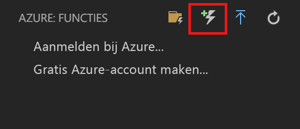
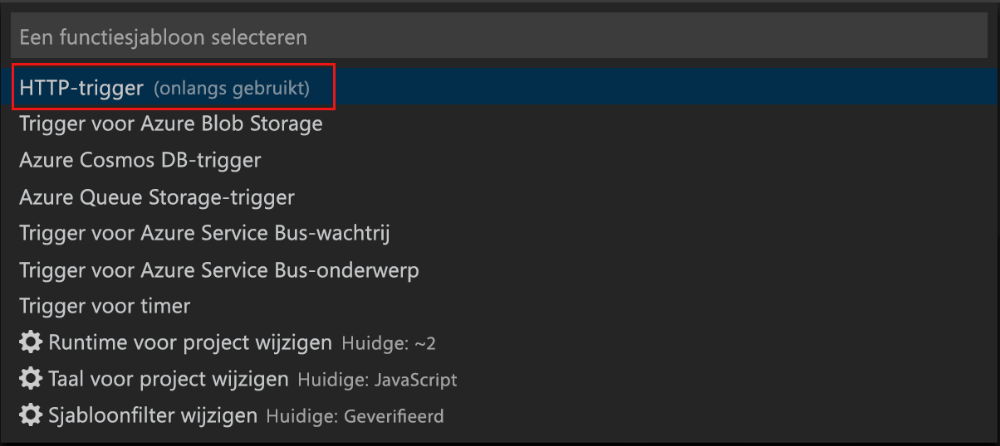

# Uw eerste duurzame functie maken in JavaScript

*Durable Functions* is een extensie van [Azure Functions](../functions-overview.md) waarmee u stateful functies kunt schrijven in een serverloze omgeving. Met de extensie worden status, controlepunten en het opnieuw opstarten voor u beheerd.

In dit artikel leert u hoe u de Azure Functions-extensie van Visual Studio Code kunt gebruiken om lokaal een duurzame ‘Hallo wereld’-functie te maken en te testen.  Met deze functie worden aanroepen naar andere functies ingedeeld en aan elkaar gekoppeld. Vervolgens publiceert u de functiecode op Azure.

## Vereisten

Vereisten voor het voltooien van deze zelfstudie:

* Installeer [Visual Studio Code](https://code.visualstudio.com/download).

* Zorg ervoor dat u beschikt over de [nieuwste versie van de hulpprogramma's van Azure Functions](../functions-develop-vs.md#check-your-tools-version).

* Op een Windows-computer controleert u of de [Azure Storage-emulator](../../storage/common/storage-use-emulator.md) is geïnstalleerd en wordt uitgevoerd. Op een Mac- of Linux-computer moet u daadwerkelijk een Azure-opslagaccount gebruiken.

* Zorg ervoor dat versie 8.0 of een latere versie van [Node.js](https://nodejs.org/) is geïnstalleerd.

[!INCLUDE [quickstarts-free-trial-note](../../../includes/quickstarts-free-trial-note.md)]

[!INCLUDE [functions-install-vs-code-extension](../../../includes/functions-install-vs-code-extension.md)]

[!INCLUDE [functions-create-function-app-vs-code](../../../includes/functions-create-function-app-vs-code.md)]

## Het NPM-pakket voor Durable Functions installeren

1. Installeer het `durable-functions` NPM-pakket met duurzame functies door `npm install durable-functions` uit te voeren in de hoofdmap van de functie-app.

## Een Starter-functie maken

Maak eerst een HTTP-geactiveerde functie waarmee de indeling voor een duurzame functie wordt gestart.

1. In **Azure: Functions** kiest u het pictogram Functie maken.

    

2. Selecteer de map met uw functie-appproject en selecteer de functiesjabloon **HTTP trigger**.

    

3. Typ `HttpStart` voor de functienaam en druk op Enter. Selecteer vervolgens **Anonymous** (Anoniem) bij verificatie.

    

    Een functie wordt gemaakt in de door u gekozen taal met de sjabloon voor een door HTTP getriggerde functie.

4. Vervang index.js door het onderstaande JavaScript:

    [!code-javascript[Main](~/samples-durable-functions/samples/javascript/HttpStart/index.js)]

5. Vervang function.json door de onderstaande JSON:

    [!code-json[Main](~/samples-durable-functions/samples/javascript/HttpStart/function.json)]

U hebt nu een ingangspunt gemaakt in de duurzame functie. Nu gaan we een orchestrator toevoegen.

## Een Orchestrator-functie maken

Vervolgens maakt u nog een functie die de orchestrator wordt. We gebruiken voor het gemak de HTTP-triggerfunctiesjabloon. De functiecode zelf wordt vervangen door de orchestrator-code.

1. Herhaal de stappen uit de vorige sectie om een tweede functie te maken met behulp van de HTTP-triggersjabloon. Deze keer geeft u de functie de naam `OrchestratorFunction`.

2. Open het index.js-bestand voor de nieuwe functie en vervang de inhoud door de volgende code:

    [!code-json[Main](~/samples-durable-functions/samples/javascript/E1_HelloSequence/index.js)]

3. Open het function.json-bestand en vervang het door de volgende JSON:

    [!code-json[Main](~/samples-durable-functions/samples/javascript/E1_HelloSequence/function.json)]

Er is een orchestrator toegevoegd om de activiteitsfuncties te coördineren. Nu gaan we de activiteitsfunctie toevoegen waarnaar wordt verwezen.

## Een Activiteitsfunctie maken

1. Herhaal de stappen uit de vorige sectie om een derde functie te maken met behulp van de HTTP-triggersjabloon. Maar deze keer geeft u de functie de naam `E1_SayHello`.

2. Open het index.js-bestand voor de nieuwe functie en vervang de inhoud door de volgende code:

    [!code-javascript[Main](~/samples-durable-functions/samples/javascript/E1_SayHello/index.js)]

3. Vervang function.json door de onderstaande JSON:

    [!code-json[Main](~/samples-durable-functions/samples/csx/E1_SayHello/function.json)]

Nu zijn alle benodigde onderdelen toegevoegd voor het starten van een indeling en om activiteitsfuncties te koppelen.

## De functie lokaal testen

Met Azure Functions Core-hulpprogramma's kunt u een Azure Functions-project uitvoeren op uw lokale ontwikkelcomputer. De eerste keer dat u een functie vanuit Visual Studio Code start, wordt u gevraagd deze hulpprogramma's te installeren.  

1. Op een Windows-computer start u de Azure Storage-emulator en zorgt u ervoor dat de eigenschap **AzureWebJobsStorage** van local.settings.json is ingesteld op `UseDevelopmentStorage=true`. Op een Mac- of Linux-computer moet u de eigenschap **AzureWebJobsStorage** instellen op de verbindingsreeks van een bestaand Azure-opslagaccount. Later in dit artikel maakt u een opslagaccount.

2. U kunt de functie testen door een onderbrekingspunt in de functiecode in te stellen en op F5 te drukken om het functie-appproject te starten. De uitvoer van Core Tools wordt weergegeven in het deelvenster **Terminal**. Als dit de eerste keer is dat u Durable Functions gebruikt, wordt de Durable Functions-extensie geïnstalleerd. Het bouwen kan enkele seconden duren.

    > [!NOTE]
    > Voor JavaScript Durable Functions is versie **1.7.0** of hoger van de extensie **Microsoft.Azure.WebJobs.Extensions.DurableTask** vereist. Controleer of de versie van de Durable Functions-extensie in uw `extensions.csproj`-bestand aan deze vereiste voldoet. Als dat niet het geval is, stopt u de functie-app, wijzigt u de versie en drukt u op F5 om de functie-app opnieuw op te starten.

3. Kopieer het URL-eindpunt van de door HTTP getriggerde functie in het deelvenster **Terminal**.

    

4. Vervang `{functionName}` door `OrchestratorFunction`.

5. Verzend met behulp van een hulpprogramma zoals [Postman](https://www.getpostman.com/) of [cURL](https://curl.haxx.se/) een HTTP POST-aanvraag naar het URL-eindpunt.

6. Als u wilt stoppen met het opsporen van fouten, drukt u op Shift+F1 in VS Code.

Nadat u hebt gecontroleerd of de functie correct wordt uitgevoerd op uw lokale computer, is het tijd om het project te publiceren in Azure.

[!INCLUDE [functions-create-function-app-vs-code](../../../includes/functions-sign-in-vs-code.md)]

[!INCLUDE [functions-publish-project-vscode](../../../includes/functions-publish-project-vscode.md)]

## Uw functie testen in Azure

1. Kopieer de URL van de HTTP-trigger vanuit het deelvenster **Output** (Uitvoer). De URL die uw HTTP-geactiveerde functie aanroept, moet de volgende indeling hebben:

        http://<functionappname>.azurewebsites.net/orchestrators/<functionname>

2. Plak deze nieuwe URL van de HTTP-aanvraag in de adresbalk van uw browser. U krijgt dezelfde statusreactie als eerder, toen u de gepubliceerde app gebruikte.

## Volgende stappen

U hebt Visual Studio Code gebruikt om een duurzame JavaScript-functie-app te maken en te publiceren.

> [!div class="nextstepaction"]
> [Meer informatie over algemene patronen van duurzame functies](durable-functions-concepts.md)