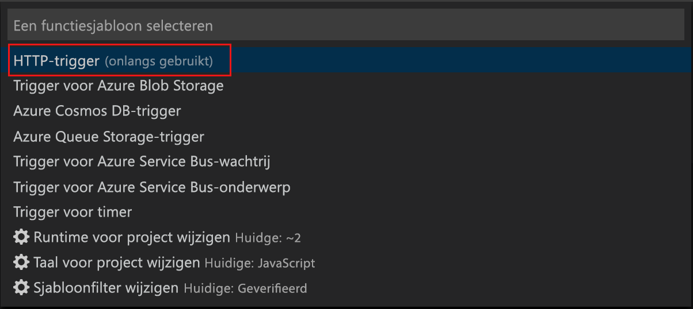

# Uw eerste functie maken met Visual Studio Code

Met Azure Functions kunt u uw code in een [serverloze](https://azure.microsoft.com/solutions/serverless/) omgeving uitvoeren zonder dat u eerst een virtuele machine moet maken of een webtoepassing publiceren.

In dit artikel leert u hoe u de [Azure Functions extension for Visual Studio Code] (Azure Functions-extensie voor Visual Studio Code) gebruikt om met Microsoft Visual Studio Code een 'hello world'-functie op uw lokale computer te maken en te testen. Vervolgens publiceert u de functiecode vanuit Visual Studio Code op Azure.

De extensie biedt op dit moment volledige ondersteuning voor functies van C#, JavaScript en Java, terwijl de ondersteuning voor Python in preview is. De stappen in dit artikel kunnen enigszins afwijken, afhankelijk van de taal die u kiest voor het Azure Functions-project. De extensie is momenteel beschikbaar als preview-product. Zie de uitbreidingspagina [Azure Functions extension for Visual Studio Code] (Azure Functions-extensie voor Visual Studio Code) voor meer informatie.

## Vereisten

Dit zijn de vereisten voor het voltooien van deze snelstart:

* Installeer [Visual Studio Code](https://code.visualstudio.com/) op een van de [ondersteunde platforms](https://code.visualstudio.com/docs/supporting/requirements#_platforms). Dit artikel is ontwikkeld en getest op een apparaat met MacOS (High Sierra).

* Installeer versie 2.x van [Azure Functions Core Tools](functions-run-local.md#v2). Deze bevindt zich nog steeds in preview.

* Installeer de specifieke vereisten voor de taal van uw keuze:

    | Taal | Toestelnummer |
    | -------- | --------- |
    | **C#** | [C# voor Visual Studio Code](https://marketplace.visualstudio.com/items?itemName=ms-vscode.csharp) [.NET Core CLI-hulpprogramma's](https://docs.microsoft.com/dotnet/core/tools/?tabs=netcore2x)*   |
    | **Java** | [Foutopsporingsprogramma voor Java](https://marketplace.visualstudio.com/items?itemName=vscjava.vscode-java-debug) [Java 8](https://aka.ms/azure-jdks) [Maven 3+](https://maven.apache.org/) |
    | **JavaScript** | [Node 8.0+](https://nodejs.org/)  |

    \* Ook vereist voor Core Tools.

[!INCLUDE [quickstarts-free-trial-note](../../includes/quickstarts-free-trial-note.md)]

[!INCLUDE [functions-install-vs-code-extension](../../includes/functions-install-vs-code-extension.md)]

[!INCLUDE [functions-create-function-app-vs-code](../../includes/functions-create-function-app-vs-code.md)]

## Een door HTTP geactiveerde functie maken

1. In **Azure: Functions** kiest u het pictogram Functie maken.

    

1. Selecteer de map met uw functie-appproject en selecteer de functiesjabloon **HTTP trigger**.

    

1. Typ `HTTPTrigger` voor de functienaam en druk op Enter. Selecteer vervolgens **Anonymous** (Anoniem) bij verificatie.

    

    Een functie wordt gemaakt in de door u gekozen taal met de sjabloon voor een door HTTP getriggerde functie.

    

U kunt invoer- en uitvoerbindingen aan de functie toevoegen door het bestand function.json te wijzigen. Zie [Concepten van Azure Functions-triggers en -bindingen](functions-triggers-bindings.md) voor meer informatie.

Nu u uw functieproject en een HTTP-geactiveerde functie hebt gemaakt, kunt u deze testen op uw lokale computer.

## De functie lokaal testen

Met Azure Functions Core-hulpprogramma's kunt u een Azure Functions-project uitvoeren op uw lokale ontwikkelcomputer. De eerste keer dat u een functie vanuit Visual Studio Code start, wordt u gevraagd deze hulpprogramma's te installeren.  

1. U kunt de functie testen door een onderbrekingspunt in de functiecode in te stellen en op F5 te drukken om het functie-appproject te starten. De uitvoer van Core Tools wordt weergegeven in het deelvenster **Terminal**.

1. Kopieer het URL-eindpunt van de door HTTP getriggerde functie in het deelvenster **Terminal**.

    

1. Plak de URL van de HTTP-aanvraag in de adresbalk van uw browser. Voeg de queryreeks `?name=<yourname>` toe aan de URL en voer de aanvraag uit. De uitvoering wordt onderbroken als het onderbrekingspunt wordt bereikt.

    

1. Hieronder ziet u het antwoord op de GET-aanvraag weergegeven in de browser als u met de uitvoering doorgaat:

    

1. Als u wilt stoppen met fouten opsporen, drukt u op Shift + F5.

Nadat u hebt gecontroleerd of de functie correct wordt uitgevoerd op uw lokale computer, is het tijd om het project te publiceren in Azure.

[!INCLUDE [functions-sign-in-vs-code](../../includes/functions-sign-in-vs-code.md)]

[!INCLUDE [functions-publish-project-vscode](../../includes/functions-publish-project-vscode.md)]

## Uw functie testen in Azure

1. Kopieer de URL van de HTTP-trigger vanuit het deelvenster **Output** (Uitvoer). Zorg ervoor dat u net als eerder de queryreeks `?name=<yourname>` toevoegt aan het eind van deze URL en de aanvraag uitvoert.

    De URL die uw HTTP-geactiveerde functie aanroept, moet de volgende indeling hebben:

        http://<functionappname>.azurewebsites.net/api/<functionname>?name=<yourname> 

1. Plak deze nieuwe URL van de HTTP-aanvraag in de adresbalk van uw browser. Hieronder ziet u het antwoord op de externe GET-aanvraag dat door de functie wordt geretourneerd, weergegeven in de browser: 

    

## Volgende stappen

U hebt een functie-app met een eenvoudige HTTP-geactiveerde functie gemaakt in Visual Studio Code. U kunt ook voor meer informatie over [lokale testen en foutopsporing van de Terminal of opdrachtprompt](functions-run-local.md) met behulp van Azure Functions Core Tools.

> [!div class="nextstepaction"]
> [Application Insights-integratie inschakelen](functions-monitoring.md#manually-connect-an-app-insights-resource)

[Azure Functions Core Tools]: functions-run-local.md
[Azure Functions extension for Visual Studio Code]: https://marketplace.visualstudio.com/items?itemName=ms-azuretools.vscode-azurefunctions (Azure Functions-extensie voor Visual Studio Code)
