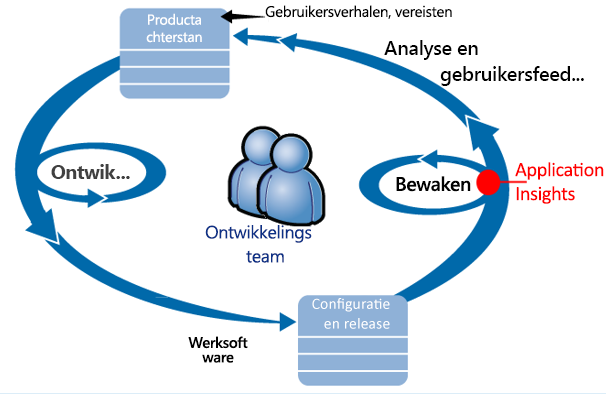
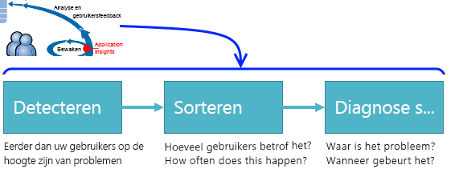
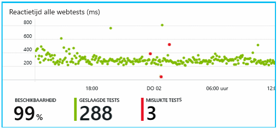
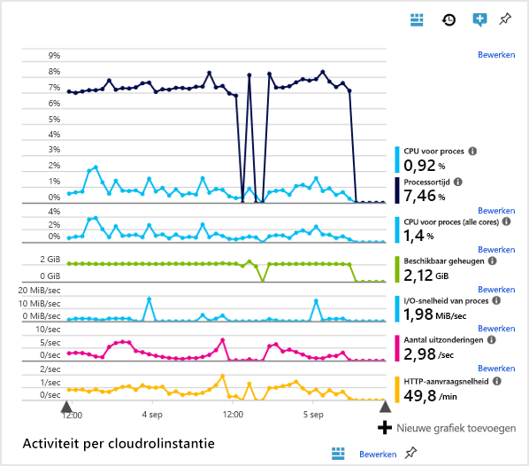
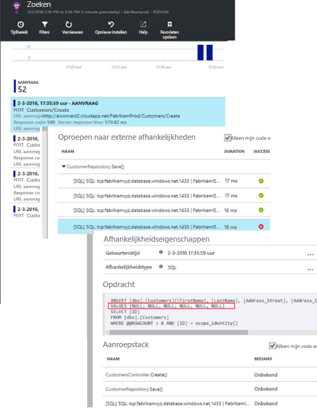
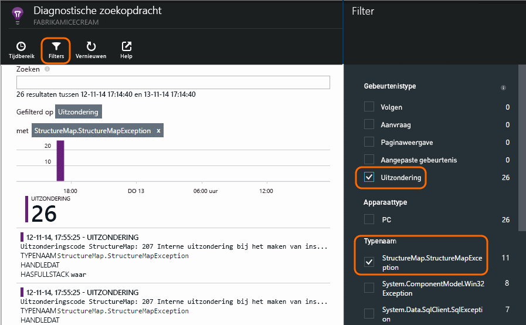
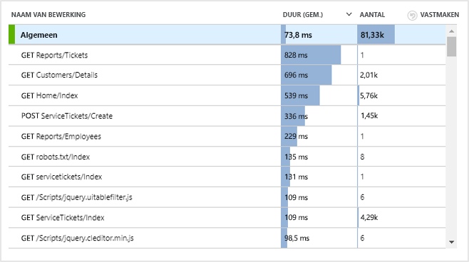
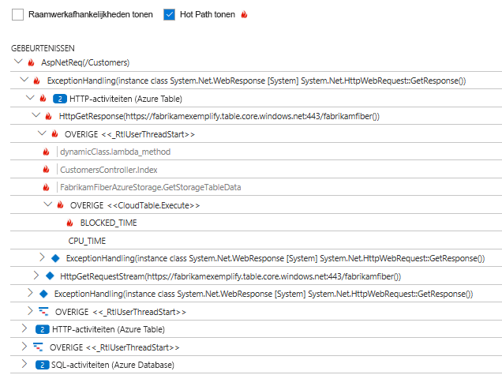

# Overzicht van Application Insights voor DevOps

Met [Application Insights](../../azure-monitor/app/app-insights-overview.md) komt u snel te weten hoe uw app presteert en hoe deze wordt gebruikt als ze actief is. Als er een probleem is, ziet u dat hier meteen, krijgt u hulp bij het beoordelen van de impact ervan en bij het achterhalen van de oorzaak.

Hier volgt een verhaal van een team dat webtoepassingen ontwikkelt:

* *"Een paar dagen geleden hebben we een 'kleine' hotfix geïmplementeerd. We hebben geen uitgebreide testronde uitgevoerd, maar helaas kwamen er een aantal onverwachte wijzigingen in de nettolading terecht, waardoor de front-end en back-end incompatibel waren. Er was een onmiddellijke toename van serveruitzonderingen, we ontvingen meteen waarschuwingen, en zijn op de hoogte gebracht van de situatie. Na een paar muisklikken op de Application Insights-portal beschikten we via de oproepstacks van de uitzonderingen over voldoende informatie om mogelijke oorzaken van het probleem vast te stellen. We hebben de hotfix onmiddellijk teruggedraaid en zo de schade beperkt. Application Insights heeft dit deel van de DevOps-cyclus erg vereenvoudigd en maakt het gemakkelijk actie te ondernemen."*

In dit artikel volgen we een team in Fabrikam Bank dat een systeem voor internetbankieren (IB) ontwikkelt om te zien hoe ze Application Insights gebruiken om snel te kunnen reageren op klanten en om updates uit te voeren.  

Het team maakt deel uit van een DevOps-cyclus die wordt uitgebeeld in de volgende afbeelding:

De vereisten worden toegevoegd aan de lijst met achterstallige ontwikkeltaken (takenlijst). Het team werkt in korte sprints en produceert werkende software, gewoonlijk in de vorm van verbeteringen en uitbreidingen voor de bestaande toepassing. De actieve app wordt regelmatig bijgewerkt met nieuwe functies. Zolang de toepassing actief is, gebruikt het team Application Insights om de prestaties ervan in de gaten te houden en het gebruik ervan te controleren. Deze gegevens over de toepassingsprestaties worden teruggekoppeld naar de lijst met achterstallige ontwikkeltaken.

Het team gebruikt Application Insights voor het nauwgezet controleren van de actieve webtoepassing op:

* Prestaties. Ze willen weten hoe reactietijden verschillen naargelang het aantal aanvragen; hoeveel CPU-, netwerk-, schijf- en andere resources worden gebruikt; door welke toepassingscode de prestaties verminderden; en waar de knelpunten zijn.
* Fouten. Als er uitzonderingen zijn of mislukte aanvragen, of als een prestatiemeteritem het vertrouwde bereik overschrijdt, moet het team dat snel weten, zodat er actie kan worden ondernomen.
* Gebruik. Steeds als er een nieuwe functie wordt uitgebracht, wil het team weten in welke mate deze wordt gebruikt en of gebruikers problemen ermee ondervinden.

Laten we ons richten op het feedbackgedeelte van de cyclus:

## Slechte beschikbaarheid detecteren
Marcela Markova is senior ontwikkelaar van het IB-team en heeft de leiding waar het om het controleren van onlineprestaties gaat. Ze zet verschillende [beschikbaarheidstests](../../azure-monitor/app/monitor-web-app-availability.md) op:

* Een enkele URL-test voor de belangrijkste startpagina van de app, http://fabrikambank.com/onlinebanking/. Ze stelt criteria op voor HTTP-code 200 en de tekst 'Welkom!'. Als deze test mislukt, is er een ernstig probleem met het netwerk of de servers, of is er misschien een probleem met de implementatie. (Of iemand heeft het welkomstbericht op de pagina gewijzigd zonder haar dat te laten weten.)
* Een diepgaandere test van meerdere stappen, waarbij een aanmelding plaatsvindt en er een lijst met huidige gebruikersaccounts wordt verkregen, en een aantal cruciale gegevens op elke pagina wordt gecontroleerd. Tijdens deze test wordt gecontroleerd of de koppeling naar de database met gebruikersaccounts werkt. Ze gebruikt een fictieve klant-id: een aantal wordt er aangehouden voor testdoeleinden.

Nadat ze deze tests heeft opgezet, heeft Marcela er alle vertrouwen in dat het team snel weet als er zich een storing voordoet.  

Fouten worden als rode punten in het webtestdiagram weergegeven:

Maar belangrijker is dat er per e-mail een waarschuwing over een storing naar het ontwikkelingsteam wordt verzonden. Op die manier zijn de teamleden er eerder van op de hoogte dan de meeste van hun klanten.

## Prestaties bewaken
Op de overzichtspagina in Application Insights bevindt zich een diagram met diverse [belangrijke metrische gegevens](../../azure-monitor/app/web-monitor-performance.md).

De laadtijd van een browserpagina wordt afgeleid van telemetriegegevens die rechtstreeks vanaf webpagina's worden verzonden. De serverreactietijd, het aantal serveraanvragen en het aantal mislukte aanvragen worden allemaal in de webserver gemeten en van daaruit naar Application Insights verzonden.

Marcela maakt zich enigszins ongerust als ze het diagram met de serverreactietijd ziet. Dit diagram toont de gemiddelde tijd tussen het tijdstip waarop de server een HTTP-aanvraag van de browser van een gebruiker ontvangt en het moment waarop de reactie wordt geretourneerd. Het is niet ongebruikelijk dat in dit diagram variaties zichtbaar zijn, omdat de belasting op het systeem varieert. Maar in dit geval lijkt er een correlatie te zijn tussen kleine pieken in het aantal aanvragen en een grote toename van de reactietijd. Dat kan erop wijzen dat het systeem bijna tegen zijn limiet aanzit.

Ze opent de serverdiagrammen:

Er zijn geen tekenen die wijzen op een beperking van een resource, dus misschien dat de dalen in de diagrammen met de serverreactietijden gewoon op toeval berusten.

## Waarschuwingen instellen om doelstellingen te behalen
Niettemin wil ze de reactietijden in gaten houden. Als die te groot worden, wil ze dat meteen weten.

Dus stelt ze een [waarschuwing](../../azure-monitor/app/metrics-explorer.md) in voor reactietijden die groter zijn dan een normale drempelwaarde. Zo weet ze zeker dat ze op de hoogte is als de reactietijden traag zijn.

Waarschuwingen kunnen worden ingesteld voor een groot aantal verschillende metrische gegevens. U kunt bijvoorbeeld instellen dat u e-mailberichten wilt ontvangen als het aantal uitzonderingen sterk toeneemt, als de beschikbare geheugenruimte laag is, of als er een piek in de clientaanvragen is.

## Blijf op de hoogte met slimme-detectiewaarschuwingen
Een dag later ontvangt ze een e-mailwaarschuwing van Application Insights. Maar als ze deze opent, ziet ze dat het niet de waarschuwing is die ze voor de reactietijd heeft ingesteld. In plaats daarvan leest ze dat er een plotselinge toename van mislukte aanvragen is geweest, dat wil zeggen, aanvragen die foutcodes van 500 of hoger hebben geretourneerd.

Mislukte aanvragen zijn aanvragen waarbij gebruikers een foutmelding hebben ontvangen, doorgaans nadat er een uitzondering is gegenereerd in de code. Mogelijk zien ze een bericht als: 'Uw gegevens kunnen momenteel niet worden bijgewerkt'. Maar het wordt pas echt gênant als er een stackdump wordt weergegeven op het scherm van de gebruiker, met dank aan de webserver.

Deze waarschuwing komt volledig onverwacht, omdat de laatste keer dat ze naar het aantal mislukte aanvragen keek, dit bemoedigend laag was. Er kan een klein aantal fouten worden verwacht op een zwaarbelaste server.

Het kwam voor haar ook nogal als een verrassing omdat ze deze waarschuwing niet heeft hoeven in te stellen. Application Insights bevat ook Slimme detectie. Deze functionaliteit voegt zich automatisch naar het normale foutpatroon van uw app en 'raakt gewend' aan fouten op een bepaalde pagina, aan fouten als gevolg van een hoge werkbelasting of aan fouten die met andere metrische gegevens samenhangen. Er wordt alleen een waarschuwing gegeven als de toename groter is dan er op grond van de ervaring mag worden verwacht.

Dit is een zeer handige e-mail. Deze waarschuwt u niet alleen. Veel van het classificatiewerk en het verzamelen van diagnostische gegevens wordt er ook door gedaan.

Er wordt weergegeven hoeveel klanten door een fout worden getroffen, en welke webpagina's of bewerkingen er gevolgen van ondervinden. Marcela kan nu bepalen of ze wil dat het hele team ermee aan de slag gaat als een soort van brandoefening, of dat het tot de volgende week kan wachten.

Het e-mailbericht toont haar of er een bepaald soort uitzondering is opgetreden, en, wellicht nog interessanter, dat de fout heeft te maken met mislukte pogingen om een bepaalde database aan te roepen. Dat verklaart waarom de fout plotseling optrad ook al heeft het team van Marcela recentelijk geen updates geïmplementeerd.

Marcella neemt contact op met de leidinggevende van het databaseteam op basis van deze e-mail. Deze vertelt haar dat zijn team in het afgelopen half uur een hotfix heeft uitgebracht, en dat het schema daardoor wellicht ietwat is veranderd....

Het probleem wordt mogelijk zelfs nog binnen vijftien minuten nadat het optrad, opgelost en zelfs nog voordat de logboeken zijn bestudeerd. Maar Marcela klikt op de koppeling waarmee Application Insights wordt geopend. Ze gaat hiermee rechtstreeks naar een mislukte aanvraag en ze ziet de mislukte databaseaanroep in de bijbehorende lijst met afhankelijkheidsaanroepen.

## Uitzonderingen detecteren
Door een beetje met instellingen te spelen, worden [uitzonderingen](../../azure-monitor/app/asp-net-exceptions.md) automatisch aan Application Insights gerapporteerd. Ze kunnen ook expliciet worden vastgelegd door aanroepen aan [TrackException()](../../azure-monitor/app/api-custom-events-metrics.md#trackexception) in de code in te voegen:  

    var telemetry = new TelemetryClient();
    ...
    try
    { ...
    }
    catch (Exception ex)
    {
       // Set up some properties:
       var properties = new Dictionary <string, string>
         {{"Game", currentGame.Name}};

       var measurements = new Dictionary <string, double>
         {{"Users", currentGame.Users.Count}};

       // Send the exception telemetry:
       telemetry.TrackException(ex, properties, measurements);
    }

Het team bij Fabrikam Bank heeft zich aangeleerd om telemetrie over een uitzondering te verzenden, tenzij er heel duidelijk een geslaagde herstelactie heeft plaatsgehad.  

In feite is hun strategie zelfs veelomvattender dan dat: ze verzenden telemetrie in alle gevallen waarbij de klant gefrustreerd is geraakt bij wat deze wilde doen, of dat nu overeenkomt met een uitzondering in de code of niet. Als bijvoorbeeld door het systeem voor het doen van interbancaire overboekingen een bericht als 'Deze transactie kan niet worden voltooid' om de een of andere operationele reden (geen fout van de klant) wordt weergegeven, volgen ze die gebeurtenis.

    var successCode = AttemptTransfer(transferAmount, ...);
    if (successCode < 0)
    {
       var properties = new Dictionary <string, string>
            {{ "Code", returnCode, ... }};
       var measurements = new Dictionary <string, double>
         {{"Value", transferAmount}};
       telemetry.TrackEvent("transfer failed", properties, measurements);
    }

TrackException wordt gebruikt om uitzonderingen te rapporteren omdat hiermee een kopie van de stack wordt verzonden. TrackEvent wordt gebruikt voor het rapporteren van andere gebeurtenissen. U kunt er alle eigenschappen aan koppelen die mogelijk nuttig zijn bij het diagnoseproces.

Uitzonderingen en gebeurtenissen worden weergegeven in de blade [Diagnostische gegevens doorzoeken](diagnostic-search.md). U kunt erop inzoomen om de aanvullende eigenschappen en stacktracering te zien.

## Proactief bewaken
Marcela zit niet de hele dag te wachten totdat er waarschuwingen binnenkomen. Steeds nadat er een nieuwe implementatie is uitgevoerd, bekijkt ze de [reactietijden](../../azure-monitor/app/web-monitor-performance.md), zowel het algemene cijfer en de tabel met de langzaamste aanvragen, als het aantal uitzonderingen.  

Ze kan het effect van de prestaties van elke implementatie beoordelen, en dit elke week vergelijken met dat van de afgelopen week. Als er een plotselinge verslechtering optreedt, wordt dat meteen aangekaart met de relevante ontwikkelaars.

## Problemen met classificeren
Classificeren: het beoordelen van de ernst en de omvang van een probleem is de eerste stap na detectie. Moeten we het team midden in de nacht alarmeren? Of kan het wachten tot het volgende handige gaatje zich voordoet in de achterstallige taken? Bij het classificeren doen zich een aantal belangrijke vragen voor.

Hoe vaak gebeurt dit? De diagrammen op de overzichtsblade geven een bepaalde mate van inzicht in een probleem. Zo heeft de toepassing van Fabrikam in één nacht tijd vier webtestwaarschuwingen gegenereerd. Als het team de ochtend daarna het diagram bekijkt, zou het kunnen zien dat er inderdaad een aantal rode punten zichtbaar zijn, hoewel de meeste tests groen worden weergeven. Door in te zoomen op het beschikbaarheidsdiagram wordt het duidelijk dat al deze onregelmatig voorkomende problemen afkomstig zijn van één testlocatie. Hier gaat het duidelijk om een netwerkprobleem dat op slechts één route invloed heeft en zich mogelijk vanzelf oplost.  

Als er daarentegen in het diagram met het aantal uitzonderingen een dramatisch en onafgebroken toename van reactietijden is te zien, is er duidelijk iets aan de hand waarover het team zich grote zorgen moet maken.

Een nuttige classificatietechniek is om het zelf uit te proberen. Als u tegen hetzelfde probleem aanloopt, weet u dat het een echt probleem is.

Welke fractie van de gebruikers heeft hier last van? Voor een ruwe schatting moet u het aantal fouten delen door het aantal sessies.

Als er trage reactietijden zijn, vergelijkt u de tabel met de aanvragen die het traagste reageren met de gebruiksfrequentie van elke pagina.

Hoe belangrijk is het geblokkeerde scenario? Als het om een functioneel probleem gaat dat een bepaalde gebruikerservaring blokkeert, moet u zichzelf de vraag stellen of het heel belangrijk is. Als klanten hun rekeningen niet kunnen betalen, is het een ernstig probleem; als ze hun persoonlijke voorkeuren voor schermkleuren niet kunnen wijzigen, kan het mogelijk even wachten. De details over de gebeurtenis of de uitzondering, of de id van de langzame pagina, laten u zien waar klanten problemen ervaren.

## Problemen diagnosticeren
Het diagnosticeren van problemen is niet hetzelfde als fouten opsporen. Voordat u via de code het probleem gaat traceren, moet u een ruw idee hebben van het waarom, waar en wanneer van het probleem.

**Wanneer treedt het op?** De historische weergave die door de diagrammen van de gebeurtenissen en door de metrische gegevens worden gegeven, maken het gemakkelijk om een correlatie met mogelijke oorzaken te zien. Als er onregelmatige pieken in de reactietijden of de aantallen uitzondering zijn, bekijkt u het aantal aanvragen: als deze op dezelfde momenten een piek laten zien, lijkt het erop alsof er een resourceprobleem is. Moet u meer CPU of geheugen toewijzen? Of gaat het om een afhankelijkheid die de belasting niet aankan?

**Ligt het aan ons?**  Als u te maken hebt met een plotselinge afname in de prestaties van een bepaald soort aanvraag, bijvoorbeeld wanneer de klant een rekeningoverzicht wil, bestaat de kans dat het met een extern subsysteem te maken heeft in plaats van met uw webtoepassing. Selecteer in Metrics Explorer de frequentie waarmee de afhankelijkheidsfout optreedt en de duur ervan, en vergelijk vervolgens de geschiedenis over de afgelopen paar uur of dagen ervan met het probleem dat u hebt gedetecteerd. Als er een correlatie met wijzigingen bestaat, moet het aan een extern subsysteem liggen.  

Bij een aantal problemen met trage afhankelijkheden gaat het om problemen met de geolocatie. Fabrikam Bank gebruikt virtuele Azure-machines en ontdekte dat ze hun webserver en accountserver per ongeluk in verschillende landen hadden geplaatst. Door een daarvan te migreren, trad er een dramatische verbetering op.

**Wat hebben we gedaan?** Als blijkt dat het probleem niet aan een afhankelijkheid is toe te schrijven, en als het er voorheen niet was, wordt het waarschijnlijk door een recente wijziging veroorzaakt. Het historische perspectief dat door de diagrammen met de metrische gegevens en gebeurtenissen wordt geboden, maakt het gemakkelijk om een correlatie aan te tonen tussen eventuele plotselinge wijzigingen en implementaties. Zo beperkt u de zoekactie naar het probleem. Om de regels in de toepassingscode te vinden waardoor de prestaties werden vertraagd, moet u Application Insights Profiler inschakelen. Raadpleeg [Profiling live Azure-web-apps met Application Insights](./../../azure-monitor/app/profiler.md) (Live Azure-web-apps profileren met Application Insights). Nadat de Profiler is ingeschakeld, ziet u een tracering die er ongeveer als volgt uitziet. In dit voorbeeld is goed te zien dat de methode *GetStorageTableData* het probleem heeft veroorzaakt.  

**Wat gebeurt er?** Sommige problemen doen zich slechts zelden voor en zijn lastig te achterhalen met offlinetests. Het enige wat we kunnen doen is om de bug vast te leggen op het moment dat deze zich voordoet. U kunt de stackdumps in uitzonderingenrapporten inspecteren. Bovendien kunt u traceringsaanroepen schrijven, ofwel met uw favoriete framework voor logboekregistratie, ofwel met TrackTrace() of TrackEvent().  

Fabrikam had een onregelmatig terugkerend probleem met overboekingen tussen rekeningen, maar alleen bij bepaalde rekeningtypen. Ze wilden beter begrijpen wat er precies gebeurde en hebben om die reden aanroepen van TrackTrace() op de belangrijkste punten in de code ingevoegd, waarbij het rekeningtype als eigenschap aan elke aanroep werd gekoppeld. Zo werd het gemakkelijker om alleen op traceringen te filteren die tijdens het doorzoeken van diagnostische gegevens werden gevonden. Ook koppelden ze parameterwaarden als eigenschappen en metingen aan de traceringsaanroepen.

## Reageren op gedetecteerde problemen
Zodra u het probleem hebt vastgesteld, kunt u een plan maken om het te herstellen. Mogelijk moet u een recente wijziging terugdraaien, of misschien gewoon proberen het probleem op te lossen. Als het probleem is opgelost, laat Application Insights u weten of u daarin bent geslaagd.  

Het ontwikkelteam van Fabrikam Bank kiest zo voor een meer gestructureerde benadering voor het meten van prestaties dan voordat het van Application Insights gebruikmaakte.

* Het team stelt op de overzichtspagina van Application Insights prestatiedoelen in als specifieke metingen.
* Ze bouwen al vanaf het begin prestatiemetingen in het ontwerp van de toepassing in, zoals de metrische gegevens waarmee de voortgang van de gebruiker via 'trechters' wordt gemeten.  

## Gebruikersactiviteit bewaken
Wanneer de reactietijd consistent goed is en er slechts enkele uitzonderingen zijn, kan het ontwikkelteam zich gaan bezighouden met de gebruikerservaring. De teamleden kunnen dan nadenken over hoe ze de gebruikerservaring kunnen verbeteren, en hoe ze meer gebruikers kunnen aanmoedigen om de gewenste doelstellingen te realiseren.

Application Insights kan ook worden gebruikt om erachter te komen wat gebruikers met een app doen. Zodra deze soepel werkt, wil het team graag weten welke functies het populairst zijn, wat gebruikers prettig vinden om te gebruiken of waar ze problemen ondervinden. En hoe vaak ze terugkeren. Met die informatie kunnen ze hun toekomstige taken beter organiseren. En ze kunnen als onderdeel van het ontwikkelingsproces inplannen om het succes van elke functie te meten.

Een normaal traject dat een gebruiker aflegt door de website verloopt bijvoorbeeld volgens een duidelijk trechterpatroon. Veel klanten bekijken de tarieven van verschillende soorten leningen. Een kleiner aantal gaat een stap verder en vult een offerteaanvraagformulier in. Van mensen die een offerte ontvangen, gaat een klein aantal nog een stap verder en neemt de lening.

Door na te denken over waar het grootste aantal klanten afhaakt, kan het bedrijf een manier bedenken die ertoe moet leiden om meer gebruikers naar het einde van de ‘trechter’ te leiden. In sommige gevallen ligt dat misschien aan een fout in de gebruikerservaring (UX), als bijvoorbeeld de knop 'Volgende' moeilijk is te vinden, of als de instructies niet duidelijk zijn. Maar het is waarschijnlijker dat de oorzaken van meer zakelijke aard zijn, bijvoorbeeld omdat het rentepercentage van de lening te hoog is.

Ongeacht de redenen, de gegevens helpen het team om erachter te komen wat gebruikers doen. Er kunnen meer traceringsaanroepen worden ingevoegd om nog meer details bloot te leggen. TrackEvent() kan worden gebruikt voor het tellen van eventuele gebruikersacties, vanaf de kleinste details over het klikken op knoppen tot grote acties als het afbetalen van een lening.

Het team raakt eraan gewend om informatie over gebruikersactiviteiten te krijgen. Als ze tegenwoordig een nieuwe functie ontwerpen, denken ze al na over hoe ze feedback over het gebruik ervan kunnen krijgen. Ze bouwen vanaf het begin al traceringsaanroepen in het ontwerp van de functie in. Ze gebruiken de feedback om in elke ontwikkelingscyclus de functie te kunnen verbeteren.

[Meer informatie over gebruikstracering](../../azure-monitor/app/usage-overview.md).

## De DevOps-cyclus toepassen
Dit is dus hoe een team Application Insights niet alleen gebruikt om afzonderlijke problemen op te lossen, maar om de ontwikkelingscyclus in zijn geheel te verbeteren. Hopelijk hebt u nu een aantal ideeën opgedaan over hoe Application Insights u kan helpen met het beheren van de prestaties van uw toepassingen.

## Video

> [!VIDEO https://channel9.msdn.com/events/Connect/2016/112/player]

## Volgende stappen
U kunt op verschillende manieren aan de slag, afhankelijk van de kenmerken van uw toepassing. Kies wat het beste bij u past:

* [ASP.NET-webtoepassing](../../azure-monitor/app/asp-net.md)
* [Java-webtoepassing](../../azure-monitor/app/java-get-started.md)
* [Node.js-webtoepassing](../../azure-monitor/app/nodejs.md)
* Reeds geïmplementeerde apps die worden gehost op [IIS](../../azure-monitor/app/monitor-web-app-availability.md)
* [Azure](../../azure-monitor/app/app-insights-overview.md).
* [Webpagina's](../../azure-monitor/app/javascript.md): een app die uit één pagina bestaat of een normale webpagina; gebruik deze afzonderlijk of in aanvulling op een van de serveropties.
* [Beschikbaarheidstests](../../azure-monitor/app/monitor-web-app-availability.md) voor het testen van uw app op het openbare internet.
