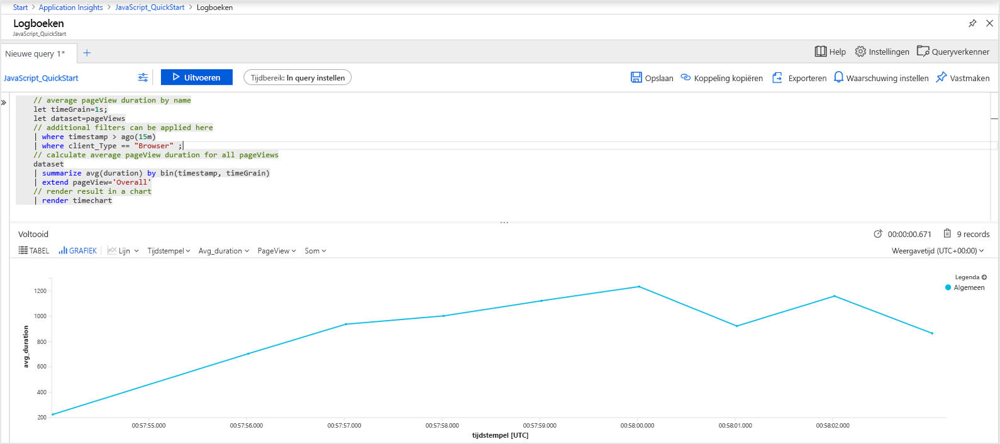
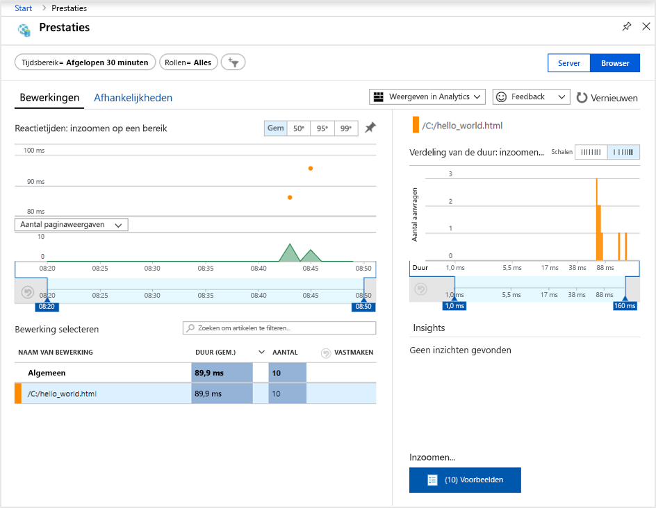
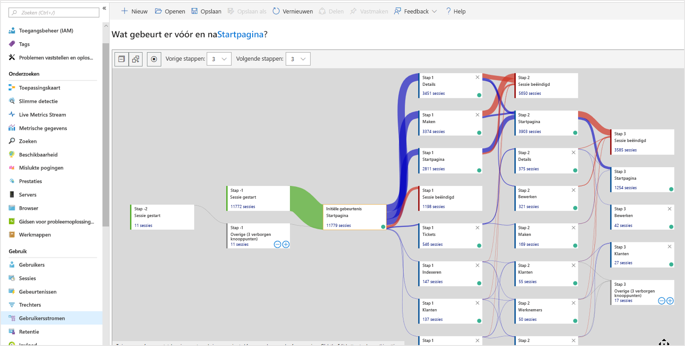

# <a name="start-monitoring-your-website"></a>Start met het controleren van uw website

Met Azure Monitor Application Insights kunt u eenvoudig de beschikbaarheid, de prestaties en het gebruik van een website controleren. U kunt ook snel fouten in de toepassing identificeren en er een diagnose voor uitvoeren, zonder dat u hoeft te wachten totdat een gebruiker ze heeft gerapporteerd. Application Insights biedt mogelijkheden voor controles van de server evenals van de browser/client.

Deze quickstart helpt u bij het toevoegen van de [opensource Application Insights JavaScript SDK](https://github.com/Microsoft/ApplicationInsights-JS) waarmee u inzicht krijgt in de ervaring aan de browser-/clientzijde van bezoekers van uw website.

## <a name="prerequisites"></a>Vereisten

Dit zijn de vereisten voor het voltooien van deze quickstart:

- U hebt een Azure-abonnement nodig.

Als u nog geen Azure-abonnement hebt, maakt u een [gratis account](https://azure.microsoft.com/free/) voordat u begint.

## <a name="sign-in-to-the-azure-portal"></a>Aanmelden bij Azure Portal

Meld u aan bij [Azure Portal](https://portal.azure.com/).

## <a name="enable-application-insights"></a>Application Insights inschakelen

Met Application Insights kunnen telemetriegegevens worden verzameld vanuit elke toepassing met een internetverbinding, ongeacht of deze on-premises wordt uitgevoerd of in de cloud. Gebruik de volgende stappen om deze gegevens te bekijken.

1. Selecteer **Een resource maken** > **Hulpprogramma's voor beheer** > **Application Insights**.

   Er wordt een configuratiescherm weergegeven. Gebruik de volgende tabel om de invoervelden in te vullen.

    | Instellingen        | Waarde           | Beschrijving  |
   | ------------- |:-------------|:-----|
   | **Naam**      | Globaal unieke waarde | Naam die de app beschrijft die u wilt controleren |
   | **Toepassingstype** | Algemene toepassing | Type app dat u wilt controleren |
   | **Resourcegroep**     | myResourceGroup      | Naam voor de nieuwe resourcegroep waarin App Insights-gegevens worden gehost |
   | **Locatie** | US - oost | Kies een locatie in uw buurt of in de buurt van waar de app wordt gehost |

2. Klik op **Create**.

## <a name="create-an-html-file"></a>Een HTML-bestand maken

1. Maak op uw lokale computer een bestand met de naam ``hello_world.html``. In dit voorbeeld wordt het bestand in de hoofdmap van de C-schijf geplaatst in ``C:\hello_world.html``.
2. Kopieer het onderstaande script naar ``hello_world.html``:

    ```html
    <!DOCTYPE html>
    <html>
    <head>
    <title>Azure Monitor Application Insights</title>
    </head>
    <body>
    <h1>Azure Monitor Application Insights Hello World!</h1>
    <p>You can use the Application Insights JavaScript SDK to perform client/browser-side monitoring of your website. To learn about more advanced JavaScript SDK configurations visit the <a href="https://github.com/Microsoft/ApplicationInsights-JS/blob/master/API-reference.md" title="API Reference">API reference</a>.</p>
    </body>
    </html>
    ```

## <a name="configure-app-insights-sdk"></a>App Insights-SDK configureren

1. Selecteer **Overzicht** > **Essentials** > kopieer de **Instrumentatiesleutel** van uw toepassing.

   

2. Voeg het volgende script toe aan ``hello_world.html`` vóór de afsluitende ``</head>``-code:

   ```javascript
      <script type="text/javascript">
        var appInsights=window.appInsights||function(a){
            function b(a){c[a]=function(){var b=arguments;c.queue.push(function(){c[a].apply(c,b)})}}var c={config:a},d=document,e=window;setTimeout(function(){var b=d.createElement("script");b.src=a.url||"https://az416426.vo.msecnd.net/scripts/a/ai.0.js",d.getElementsByTagName("script")[0].parentNode.appendChild(b)});try{c.cookie=d.cookie}catch(a){}c.queue=[];for(var f=["Event","Exception","Metric","PageView","Trace","Dependency"];f.length;)b("track"+f.pop());if(b("setAuthenticatedUserContext"),b("clearAuthenticatedUserContext"),b("startTrackEvent"),b("stopTrackEvent"),b("startTrackPage"),b("stopTrackPage"),b("flush"),!a.disableExceptionTracking){f="onerror",b("_"+f);var g=e[f];e[f]=function(a,b,d,e,h){var i=g&&g(a,b,d,e,h);return!0!==i&&c["_"+f](a,b,d,e,h),i}}return c
        }({
            instrumentationKey: "xxxxxxxx-xxxx-xxxx-xxxx-xxxxxxxx"
        });
        
        window.appInsights=appInsights,appInsights.queue&&0===appInsights.queue.length&&appInsights.trackPageView();
</script>
   ```

3. Bewerk ``hello_world.html`` en voeg de instrumentatiesleutel toe.

4. Open ``hello_world.html`` in een lokale browsersessie. Er wordt dan een enkele paginaweergave gemaakt. U kunt uw browser vernieuwen voor het genereren van meerdere testpaginaweergaven.

## <a name="start-monitoring-in-the-azure-portal"></a>Beginnen met controleren in Azure Portal

1. U kunt de pagina **Overzicht** van Application Insights in Azure Portal, waar u de instrumentatiesleutel hebt opgehaald, nu opnieuw openen om de details te bekijken van de toepassing die momenteel wordt uitgevoerd. De vier standaardgrafieken op de overzichtspagina hebben betrekking op toepassingsgegevens op de server. Omdat we de interacties van de browser/client instrumenteren met de JavaScript SDK, is deze specifieke weergave niet van toepassing tenzij er ook een SDK op de server is geïnstalleerd.

2. Klik op het  **Analytics**.  Hierdoor wordt **Analytics** geopend. Dit biedt een uitgebreide querytaal voor het analyseren van alle gegevens die zijn verzameld met Application Insights. Als u gegevens wilt weergeven die betrekking hebben op de browseraanvragen van de client, moet u de volgende query uitvoeren:

    ```kusto
    // average pageView duration by name
    let timeGrain=1s;
    let dataset=pageViews
    // additional filters can be applied here
    | where timestamp > ago(15m)
    | where client_Type == "Browser" ;
    // calculate average pageView duration for all pageViews
    dataset
    | summarize avg(duration) by bin(timestamp, timeGrain)
    | extend pageView='Overall'
    // render result in a chart
    | render timechart
    ```

   

3. Ga terug naar de **overzichtspagina**. Klik op **Browser** onder de header **Onderzoeken**, selecteer vervolgens **Prestaties**. Hier vindt u metrische gegevens over de prestaties van uw website. Er is ook een overeenkomstige weergave waarmee u fouten en uitzonderingen op uw website kunt analyseren. U kunt op **Voorbeelden** klikken om in te zoomen op details van afzonderlijke transacties. Hier hebt u toegang tot de [end-to-end-ervaring](../../azure-monitor/app/transaction-diagnostics.md) met betrekking tot transactiedetails.

   

4. Als u wilt beginnen met de verkenning van de [hulpprogramma’s voor het analyseren van gebruikersgedrag ](../../azure-monitor/app/usage-overview.md), selecteert u in het hoofdmenu van Application Insights de optie [**Gebruikers**](../../azure-monitor/app/usage-segmentation.md) onder de header **Gebruik**. Omdat we vanaf één enkele computer testen, zien we alleen gegevens voor één gebruiker. Voor een live website kan de verdeling van gebruikers er als volgt uitzien:

     

5. Als we een complexere website met meerdere pagina's hadden geïnstrumenteerd, was het hulpprogramma [**Gebruikersstromen**](../../azure-monitor/app/usage-flows.md) ook heel handig geweest. Met **Gebruikersstromen** kunt u het traject volgen dat bezoekers afleggen door de diverse onderdelen van uw website.

  

Zie de [naslagdocumentatie over de JavaScript SDK API](https://github.com/Microsoft/ApplicationInsights-JS/blob/master/API-reference.md) als u meer wilt weten over geavanceerdere configuraties voor het controleren van websites.

## <a name="clean-up-resources"></a>Resources opschonen

Als u van plan bent om door te gaan met andere Quick Starts of met de zelfstudies, verwijdert u de resources die u in deze Quick Start hebt gemaakt niet. Als u echter niet wilt doorgaan, gebruikt u de volgende stappen om alle resources te verwijderen die tijdens deze quickstart in de Azure-portal zijn gemaakt.

1. Klik in het menu links in Azure Portal op **Resourcegroepen** en klik vervolgens op **myResourceGroup**.
2. Klik op de pagina van uw resourcegroep op **Verwijderen**, typ **myResourceGroup** in het tekstvak en klik vervolgens op **Verwijderen**.

## <a name="next-steps"></a>Volgende stappen

> [!div class="nextstepaction"]
> [Prestatieproblemen zoeken en diagnoses uitvoeren](https://docs.microsoft.com/azure/application-insights/app-insights-analytics)
