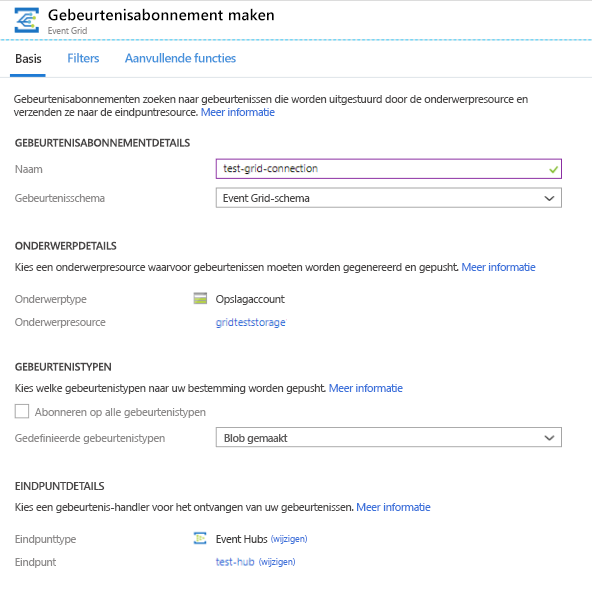
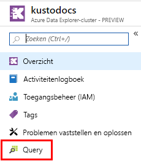
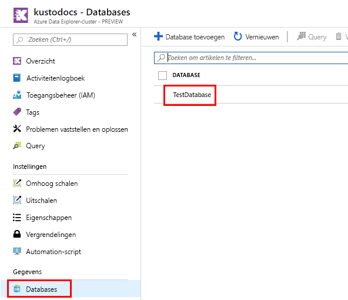
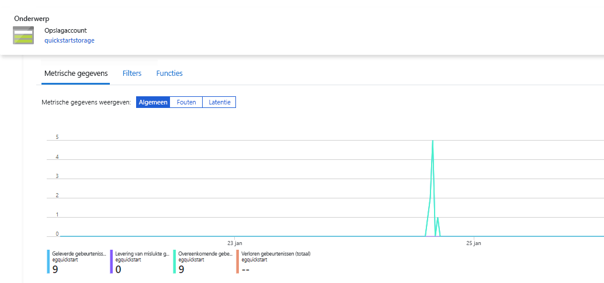

# <a name="quickstart-ingest-azure-blobs-into-azure-data-explorer-by-subscribing-to-event-grid-notifications"></a>Snelstart: Azure-blobs opnemen in Azure Data Explorer door u te abonneren op Event Grid-meldingen

Azure Data Explorer is een snelle en zeer schaalbare service om gegevens in logboeken en telemetrie te verkennen. Azure Data Explorer biedt continue opname (gegevens laden) van blobs die naar blob-containers zijn geschreven. Dit wordt bereikt door een [Azure Event Grid](/azure/event-grid/overview)-abonnement in te stellen voor gebeurtenissen waarbij blobs worden gemaakt en door de gebeurtenissen naar Kusto door te sturen via een Event Hub. Voor deze quickstart hebt u een opslagaccount nodig met een Event Grid-abonnement die meldingen naar Event Hub verzendt. U kunt vervolgens een Event Grid-gegevensverbinding maken en de gegevensstroom door het systeem bekijken.

## <a name="prerequisites"></a>Vereisten

1. Als u nog geen Azure-abonnement hebt, [maakt u een gratis Azure-account](https://azure.microsoft.com/free/)
1. [Een cluster en een database](create-cluster-database-portal.md)
1. [Een opslagaccount](https://docs.microsoft.com/azure/storage/common/storage-quickstart-create-account?tabs=azure-portal)
1. [Een Event Hub](https://docs.microsoft.com/azure/event-hubs/event-hubs-create)

## <a name="create-an-event-grid-subscription-in-your-storage-account"></a>Een Event Grid-abonnement maken in uw opslagaccount

1. Ga in de Azure-portal naar uw opslagaccount
1. Klik op het tabblad **Gebeurtenissen** en vervolgens op **Gebeurtenisabonnement**

    

1. Geef de volgende waarden op in het venster **Gebeurtenisabonnement maken** in het tabblad **Basic**:

    **Instelling** | **Voorgestelde waarde** | **Beschrijving van veld**
    |---|---|---|
    | Naam | *test-grid-connection* | De naam van het Event Grid dat u wilt maken.|
    | Gebeurtenisschema | *Event Grid-schema* | Het schema dat moet worden gebruikt voor het Event Grid. |
    | Onderwerptype | *Opslagaccount* | Het type Event Grid-onderwerp. |
    | Onderwerpresource | *gridteststorage* | De naam van uw opslagaccount. |
    | Abonneren op alle gebeurtenistypen | *Uitschakelen* | Geen meldingen ontvangen voor alle gebeurtenissen. |
    | Gedefinieerde gebeurtenistypen | *Blob gemaakt* | Voor welke specifieke gebeurtenissen u een melding ontvangt. |
    | Eindpunttype | *Event Hubs* | Het type eindpunt waarnaar u de gebeurtenissen verzendt. |
    | Eindpunt | *test-hub* | De Event Hub die u hebt gemaakt. |
    | | |

1. Selecteer het tabblad **Extra functies** als u bestanden uit een specifieke container wilt bijhouden. Stel de filters voor de meldingen als volgt in:
    * Het veld **Onderwerp begint met** is het *letterlijke* voorvoegsel van de blob-container (aangezien het toegepaste patroon *startswith* is, kan het meerdere containers omvatten). Er zijn geen jokertekens zijn toegestaan.
     Het veld *moet* als volgt zijn ingesteld: *`/blobServices/default/containers/`*[container-voorvoegsel]
    * Het veld **Onderwerp eindigt met** veld is het *letterlijke* achtervoegsel van de blob. Er zijn geen jokertekens zijn toegestaan.

## <a name="create-a-target-table-in-azure-data-explorer"></a>Een doeltabel maken in Azure Data Explorer

Maak een tabel in Azure Data Explorer waarnaar via Event Hubs gegevens worden verzonden. U maakt de tabel in het cluster en de database die zijn voorbereid in **Vereisten**.

1. Selecteer in de Azure-portal, onder het cluster, de optie **Query**.

    

1. Kopieer de volgende opdracht in het venster en selecteer **Uitvoeren** om de tabel (TestTable) te maken waarin de opgenomen gegevens worden geplaatst.

    ```Kusto
    .create table TestTable (TimeStamp: datetime, Value: string, Source:string)
    ```

    

1. Kopieer de volgende opdracht in het venster en selecteer **Uitvoeren** om de binnenkomende JSON-gegevens toe te wijzen aan de kolomnamen en gegevenstypen van de tabel (TestTable).

    ```Kusto
    .create table TestTable ingestion json mapping 'TestMapping' '[{"column":"TimeStamp","path":"$.TimeStamp"},{"column":"Value","path":"$.Value"},{"column":"Source","path":"$.Source"}]'
    ```

## <a name="create-an-event-grid-data-connection-in-azure-data-explorer"></a>Een Event Grid-gegevensverbinding maken in Azure Data Explorer

Nu maakt u vanuit Azure Data Explorer verbinding met de Event Grid, zodat de gegevens die worden verzonden naar de blobcontianer, naar de testtabel worden gestreamd.

1. Selecteer op de werkbalk de optie **Meldingen** om te controleren of de implementatie van de Event Hub is geslaagd.

1. Selecteer onder het gemaakte cluster de optie **Databases** en vervolgens **TestDatabase**.

    

1. Selecteer **Gegevensopname** en vervolgens **Gegevensverbinding toevoegen**.

    

1. Verbindingstype selecteren: **Blob Storage**.

1. Vul het formulier in met de volgende gegevens en klik vervolgens op **Maken**.

    

     Gegevensbron:

    **Instelling** | **Voorgestelde waarde** | **Beschrijving van veld**
    |---|---|---|
    | Naam van gegevensverbinding | *test-hub-connection* | De naam van de verbinding die u wilt maken in Azure Data Explorer.|
    | Abonnement van opslagaccount | Uw abonnements-id | Het abonnements-id waarin uw opslagaccount zich bevindt.|
    | Storage-account | *gridteststorage* | De naam van het opslagaccount dat u eerder hebt gemaakt.|
    | Event Grid | *test-grid-connection* | De naam van het Event Grid dat u hebt gemaakt. |
    | Event Hub-naam | *test-hub* | De Event Hub die u hebt gemaakt. Dit wordt automatisch ingevuld wanneer u een Event Grid selecteert. |
    | Consumentengroep | *test-group* | De consumentengroep die u hebt gedefinieerd in de gemaakte Event Hub. |
    | | |

    Doeltabel:

     **Instelling** | **Voorgestelde waarde** | **Beschrijving van veld**
    |---|---|---|
    | Tabel | *TestTable* | De tabel die u hebt gemaakt in **TestDatabase**. |
    | Gegevensindeling | *JSON* | JSON- en CSV-indelingen worden ondersteund. |
    | Toewijzen van kolommen | *TestMapping* | De toewijzing die u hebt gemaakt in **TestDatabase** en waarmee die binnenkomende JSON-gegevens worden toegewezen aan de kolomnamen en gegevenstypen van **TestTable**.|
    | | |

## <a name="generate-sample-data"></a>Voorbeeldgegevens genereren

Nu Azure Data Explorer en het opslagaccount zijn verbonden, kunt u voorbeeldgegevens maken en uploaden naar de blobopslag.

U werkt met een klein shellscript dat een paar eenvoudige Azure CLI-opdrachten opgeeft voor interactie met Azure Storage-resources. Het script maakt eerst een nieuwe container in uw opslagaccount en uploadt vervolgens een bestaand bestand (als blob) naar die container. Vervolgens worden alle blobs in de container vermeld. U kunt [Cloud Shell](https://docs.microsoft.com/azure/cloud-shell/overview) gebruiken om het script rechtstreeks in de portal uit te voeren.

Sla de volgende gegevens in een bestand op en gebruik deze met het onderstaande script:

```Json
{"TimeStamp": "1987-11-16 12:00","Value": "Hello World","Source": "TestSource"}
```

```bash
#!/bin/bash
### A simple Azure Storage example script

    export AZURE_STORAGE_ACCOUNT=<storage_account_name>
    export AZURE_STORAGE_KEY=<storage_account_key>

    export container_name=<container_name>
    export blob_name=<blob_name>
    export file_to_upload=<file_to_upload>
    export destination_file=<destination_file>

    echo "Creating the container..."
    az storage container create --name $container_name

    echo "Uploading the file..."
    az storage blob upload --container-name $container_name --file $file_to_upload --name $blob_name

    echo "Listing the blobs..."
    az storage blob list --container-name $container_name --output table

    echo "Done"
```

## <a name="review-the-data-flow"></a>De gegevensstroom controleren

> [!NOTE]
> ADX heeft een aggregatiebeleid (batchverwerking) voor gegevensopname ontworpen om de gegevensopname te optimaliseren.
Standaard is het beleid geconfigureerd op vijf minuten.
Het is mogelijk om het beleid later aan te passen, indien nodig. Verwacht in deze quickstart een latentie van een paar minuten.

1. In de Azure-portal, onder uw Event Grid, ziet u de piek in activiteit terwijl de app wordt uitgevoerd.

    

1. Als u wilt controleren hoeveel berichten er op dat moment de database hebben bereikt, voert u de volgende query uit in de testdatabase.

    ```Kusto
    TestTable
    | count
    ```

1. Voer de volgende query in uw testdatabase uit om de inhoud van de berichten te bekijken.

    ```Kusto
    TestTable
    ```

    De resultatenset ziet er ongeveer als volgt uit.

    

## <a name="clean-up-resources"></a>Resources opschonen

Als u niet van plan bent de Event Grid opnieuw te gebruiken, wist u de **test-hub-rg** om te voorkomen dat er kosten in rekening worden gebracht.

1. Selecteer in Azure Portal **Resourcegroepen** aan de linkerkant en selecteer vervolgens de resourcegroep die u hebt gemaakt.  

    Als het menu links is samengevouwen, selecteert u  om het menu uit te vouwen.

   

1. Selecteer onder **test-resource-group** de optie **Resourcegroep verwijderen**.

1. Typ in het nieuwe venster de naam van de resourcegroep die u wilt verwijderen (*test-hub-rg*), en klik vervolgens op **Verwijderen**.

## <a name="next-steps"></a>Volgende stappen

> [!div class="nextstepaction"]
> [Snelstart: query's uitvoeren op gegevens in Azure Data Explorer](web-query-data.md)