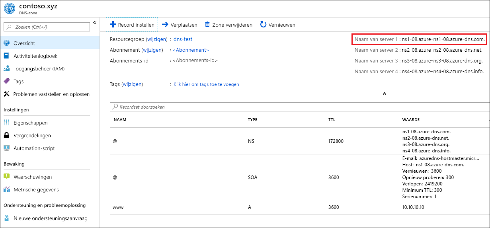

# <a name="quickstart-configure-azure-dns-for-name-resolution-by-using-the-portal"></a>Snelstartgids: Azure DNS configureren voor naamomzetting met behulp van de portal

U kunt Azure DNS configureren voor het omzetten van hostnamen in uw openbare domein. Als u bijvoorbeeld de domeinnaam *contoso.com* hebt gekocht bij een domeinnaamregistrar, kunt u Azure DNS configureren om het domein *contoso.com* te hosten en *www.contoso.com* om te zetten in het IP-adres van uw webserver of web-app.

In deze quickstart maakt u een testdomein en maakt u vervolgens een adresrecord om *www* om te zetten in het IP-adres *10.10.10.10*.

>[!IMPORTANT]
>Alle namen en IP-adressen in deze quickstart zijn voorbeelden en geen weerspiegelingen van praktijkscenario’s. In deze quickstart worden ook, waar van toepassing, gevolgen in de praktijk beschreven.

<!---
You can also perform these steps using [Azure PowerShell](dns-getstarted-powershell.md) or the cross-platform [Azure CLI](dns-getstarted-cli.md).
--->

Als u nog geen abonnement op Azure hebt, maak dan een [gratis account](https://azure.microsoft.com/free/?WT.mc_id=A261C142F) aan voordat u begint.

Voor alle portal-stappen meldt u zich aan bij de [Azure-portal](https://portal.azure.com).

## <a name="create-a-dns-zone"></a>Een DNS-zone maken

Een DNS-zone bevat de DNS-vermeldingen voor een domein. Als u uw domein wilt hosten in Azure DNS, maakt u een DNS-zone voor deze domeinnaam. 

**De DNS-zone maken:**

1. Selecteer linksboven **Een resource maken**, en vervolgens **Netwerken** en **DNS-zone**.
   
1. Typ of selecteer op de pagina **DNS-zone maken** de volgende waarden:
   
   - **Naam**: Voer *contoso.xyz* in voor het voorbeeld in deze snelstartgids. De naam van de DNS-zone mag elke waarde zijn die nog niet is geconfigureerd op de Azure DNS-servers. Een werkelijke waarde zou een domein zijn dat u hebt gekocht via een domeinnaamregistrar.
   - **Resourcegroep**: Selecteer **Nieuwe maken**, voer *dns-test* in en selecteer **OK**. De naam van de resourcegroep moet uniek zijn binnen het Azure-abonnement. 
   
1. Selecteer **Maken**.

   
   
Het maken van de zone kan een paar minuten duren.

## <a name="create-a-dns-record"></a>Een DNS-record maken

DNS-vermeldingen of -records voor het domein maakt u binnen de DNS-zone. Maak een nieuwe adresrecord of A-record om een hostnaam om te zetten in een IPv4-adres.

**Een A-record maken:**

1. Open in de Azure-portal onder **Alle resources** de DNS-zone **contoso.xyz** in de resourcegroep **dns-test**. U kunt *contoso.xyz* invoeren in het vak **Filteren op naam**  om deze eenvoudiger te vinden.

1. Selecteer boven aan de pagina **DNS-zone** de optie **+ Recordset**.

1. Typ of selecteer op de pagina **Recordset toevoegen** de volgende waarden:

   - **Naam**: Voer *www* in. De recordnaam is de hostnaam die u wilt omzetten in het opgegeven IP-adres.
   - **Type**: Selecteer **A**. A-records worden het meest gebruikt, maar er zijn andere recordtypen voor e-mailservers (MX), IPv6-adressen (AAAA), enzovoort. 
   - **TTL**: Voer *1* in. *Time-to-live* van de DNS-aanvraag geeft aan hoelang DNS-servers en -clients een antwoord kunnen opslaan in de cache.
   - **TTL-eenheid**: Selecteer **Uren**. Dit is de tijdseenheid voor de **TTL**-waarde. 
   - **IP-adres**: Voer voor het voorbeeld in deze snelstartgids *10.10.10.10* in. Deze waarde is het IP-adres waarin de recordnaam wordt omgezet. In een praktijkscenario zou u het openbare IP-adres van de webserver invoeren.

Aangezien in deze quickstart geen echt domein wordt gebruikt, hoeft u de Azure DNS-naamservers niet te configureren bij de registrar van uw domeinnaam. Bij een echt domein wilt u dat iedereen op internet de hostnaam omzet, zodat ze verbinding kunnen maken met uw webserver of web-app. U gaat naar uw domeinnaamregistrar om de naamserverrecords te vervangen door de Azure DNS-naamservers. Zie [Zelfstudie: Uw domein hosten in Azure DNS](dns-delegate-domain-azure-dns.md#delegate-the-domain) voor meer informatie.

## <a name="test-the-name-resolution"></a>De naamomzetting testen

Nu u een testzone hebt met daarin een DNS-record, kunt u de naamomzetting testen met het hulpprogramma *nslookup*. 

**DNS-naamomzetting testen:**

1. Open in de Azure-portal onder **Alle resources** de DNS-zone **contoso.xyz** in de resourcegroep **dns-test**. U kunt *contoso.xyz* invoeren in het vak **Filteren op naam**  om deze eenvoudiger te vinden.

1. Kopieer een van de namen van de naamservers uit de lijst op de pagina **Overzicht**. 
   
   
   
   >[!NOTE]
   >In een praktijkscenario kopieert u de namen van alle vier de naamservers, inclusief de punt aan het einde, en gebruikt u deze voor de nieuwe Azure DNS-naamservernamen bij uw domeinregistrar. Zie [Een domein delegeren naar Azure DNS](dns-delegate-domain-azure-dns.md) voor meer informatie
   
1. Open een opdrachtprompt en voer de volgende opdracht uit:

   ```
   nslookup <host name> <name server name>
   ```
   
   Bijvoorbeeld:
   
   ```
   nslookup www.contoso.xyz ns1-08.azure-dns.com.
   ```
   
   Er verschijnt een scherm dat er ongeveer als volgt uitziet:
   
   

De hostnaam **www.contoso.xyz** wordt omgezet in **10.10.10.10**, net zoals u hebt geconfigureerd. Met dit resultaat wordt gecontroleerd of de naamomzetting juist werkt. 

## <a name="clean-up-resources"></a>Resources opschonen

Wanneer u de resources die u in deze quickstart hebt gemaakt, niet meer nodig hebt, verwijdert u ze door de resourcegroep **dns-test** te verwijderen. Open de resourcegroep **dns-test** en selecteer **Resourcegroep verwijderen**.

## <a name="next-steps"></a>Volgende stappen

> [!div class="nextstepaction"]
> [DNS-records voor een web-app in een aangepast domein maken](./dns-web-sites-custom-domain.md)