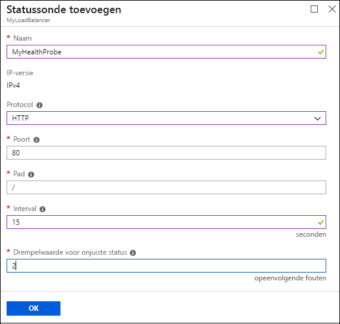
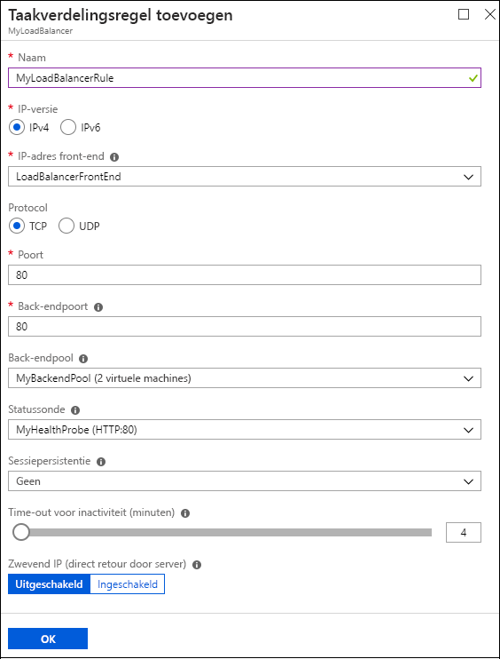

# Quickstart: een openbare Basic Load Balancer maken met behulp van de Azure-portal

Taakverdeling zorgt voor een hogere beschikbaarheid en betere schaalbaarheid door binnenkomende aanvragen te spreiden over meerdere virtuele machines (VM's). U kunt de Azure-portal gebruiken om een load balancer te maken en verkeer over virtuele machines te verdelen. In deze quickstart wordt beschreven hoe u een load balancer, back-endservers en netwerkresources kunt maken in de prijscategorie Basic.

Als u nog geen abonnement op Azure hebt, maak dan een [gratis account](https://azure.microsoft.com/free/?WT.mc_id=A261C142F) aan voordat u begint. 

Als u de taken in deze quickstart wilt uitvoeren, moet u zich aanmelden bij de [Azure-portal](http://portal.azure.com).

## Een Basic Load Balancer maken

Maak eerst een openbare Basic Load Balancer met behulp van de portal. De naam en het openbare IP-adres die u maakt, worden automatisch geconfigureerd als de front-end van de load balancer.

1. Selecteer **Een resource maken** > **Netwerken** > **Load Balancer** linksboven in het scherm.
   
1. Typ of selecteer de volgende waarden in het deelvenster **Load balancer maken**:
   
   - **Naam**: Typ *MyLoadBalancer*.
   - **Type**: Select **Openbaar**. 
   - **SKU**: Selecteer **Basic**.
   - **Openbaar IP-adres:** Selecteer **Nieuw maken**. 
     - Veld **Openbaar IP-adres**: Typ *MyPublicIP*.
     - **Openbaar IP-adres configureren** > **Toewijzing**: selecteer **Dynamisch**.
   - **ResourceGroup**: selecteer **Nieuwe maken**, voer vervolgens *MyResourceGroupLB* in en selecteer **OK**. 
   
1. Selecteer **Maken**.
   

## Back-endservers maken

Vervolgens maakt u een virtueel netwerk en twee virtuele machines voor de back-endpool van uw Basic Load Balancer. 

### Een virtueel netwerk maken

1. Selecteer **Een resource maken** > **Netwerken** > **Virtueel netwerk** linksboven in de portal.
   
1. In het deelvenster **Virtueel netwerk maken** typt of selecteert u de volgende waarden:
   
   - **Naam**: typ *MyVnet*.
   - **ResourceGroup**: selecteer in de vervolgkeuzelijst **Bestaande selecteren** de optie **MyResourceGroupLB**. 
   - **Subnet** > **Naam**: typ *myBackendSubnet*.
   
1. Selecteer **Maken**.

   

### Virtuele machines maken

1. Selecteer **Een resource maken** > **Compute** > **Windows Server 2016 Datacenter** linksboven in de portal. 
   
1. In **Een virtuele machine maken** typt of selecteert u de volgende waarden op het tabblad **Basisinformatie**:
   - **Abonnement** > **Resourcegroep**: selecteer in de vervolgkeuzelijst de optie **MyResourceGroupLB**.
   - **Instantiedetails** > **Naam van virtuele machine**: typ *MyVM1*.
   - **Instantiedetails** > **Beschikbaarheidsopties**: 
     1. Selecteer **Beschikbaarheidsset** in de vervolgkeuzelijst. 
     2. Selecteer **Nieuwe maken**, typ *MyAvailabilitySet* en selecteer **OK**.
  
1. Selecteer het tabblad **Netwerken** of selecteer **Volgende: Schijven** en vervolgens **Volgende: Netwerken**. 
   
   Zorg ervoor dat de volgende opties zijn geselecteerd:
   - **Virtueel netwerk**: **MyVnet**
   - **Subnet**: **MyBackendSubnet**
   - **Openbare IP**: **MyVM1-ip**
   
   Als u een nieuwe netwerkbeveiligingsgroep (NSG) wilt maken, een soort firewall, selecteert u onder **Netwerkbeveiligingsgroep** de optie **Geavanceerd**. 
   1. Selecteer in het veld **Netwerkbeveiligingsgroep configureren** de optie **Nieuwe maken**. 
   1. Typ *MyNetworkSecurityGroup* en selecteer **OK**. 
   
1. Selecteer het tabblad **Beheer** of selecteer **Volgende** > **Beheer**. Stel bij **Bewaking** **Diagnostische gegevens over opstarten** in op **Uit**.
   
1. Selecteer **Controleren + maken**.
   
1. Controleer de instellingen en selecteer vervolgens **Maken**. 

1. Volg de stappen voor het maken van een tweede virtuele machine met de naam *MyVM2* en het **openbaar IP**-adres *MyVM2-ip*, en stel daarvoor alle andere instellingen in zoals bij MyVM1. 

### NSG-regels maken voor de virtuele machines

In deze sectie maakt u regels voor de netwerkbeveiligingsgroep (NSG) voor de VM's om binnenkomende internet- (HTTP) en extern-bureaublad (RDP)-verbindingen toe te staan.

1. Selecteer **Alle resources** in het menu aan de linkerkant. Selecteer in de lijst met resources **MyNetworkSecurityGroup** in de resourcegroep **MyResourceGroupLB**.
   
1. Selecteer onder **Instellingen** **Inkomende beveiligingsregels** en selecteer vervolgens **Toevoegen**.
   
1. Typ of selecteer in het dialoogvenster **Binnenkomende beveiligingsregel toevoegen** voor de HTTP-regel de volgende waarden:
   
   - **Bron**: selecteer **Servicetag**.  
   - **Bronservicetag**: selecteer **Internet**. 
   - **Poortbereiken van doel**: typ *80*.
   - **Protocol**: selecteer **TCP**. 
   - **Actie**: selecteer **Toestaan**.  
   - **Prioriteit**: typ *100*. 
   - **Naam**: typ *MyHTTPRule*. 
   - **Beschrijving**: typ *HTTP toestaan*. 
   
1. Selecteer **Toevoegen**. 
   
   
   
1. Herhaal de stappen voor de inkomende RDP-regel met de volgende, afwijkende waarden:
   - **Poortbereiken van doel**: typ *3389*.
   - **Prioriteit**: typ *200*. 
   - **Naam**: typ *MyRDPRule*. 
   - **Beschrijving**: typ *RDP toestaan*. 

## Resources voor de load balancer maken

In deze sectie configureert u de instellingen van de load balancer voor een back-endadresgroep, een statustest en een regel voor de load balancer.

### Een back-endadresgroep maken

De load balancer gebruikt een backend-adresgroep om verkeer te distribueren over de virtuele machines. De back-endadresgroep bevat de IP-adressen van de virtuele netwerkinterfaces (NIC's) die zijn verbonden met de load balancer. 

**Voor het maken van een back-endadresgroep bevat die VM1 en VM2:**

1. Selecteer **Alle resources** in het linkermenu en selecteer vervolgens **MyLoadBalancer** in de lijst met resources.
   
1. Selecteer onder **Instellingen** de optie **Back-endpools** en selecteer vervolgens **Toevoegen**.
   
1. Op de pagina **Een back-endpool toevoegen** typt of selecteert u de volgende waarden:
   
   - **Naam**: typ *MyBackEndPool*.
   - **Gekoppeld aan**: Selecteer **Beschikbaarheidsset** in de vervolgkeuzelijst.
   - **Beschikbaarheidsset**: selecteer **MyAvailabilitySet**.
   
1. Selecteer **Een doel-netwerk-IP-configuratie toevoegen**. 
   1. Voeg elke virtuele machine (**MyVM1** en **MyVM2**) die u hebt gemaakt toe aan de back-endpool.
   2. Nadat u alle machines hebt toegevoegd, selecteert u in de vervolgkeuzelijst de bijbehorende **netwerk-IP-configuratie**. 
   
1. Selecteer **OK**.
   
   
   
1. Vouw op de pagina **Back-endpools** **MyBackendPool** uit en controleer of zowel **VM1** als **VM2** worden vermeld.

### Een statustest maken

U gebruikt een statustest om de load balancer toe te staan de status van uw virtuele machine te bewaken. De statustest voegt dynamisch VM's toe aan de load balancer-rotatie of verwijdert ze, op basis van hun reactie op statuscontroles. 

**Voor het maken van een statustest om de status van de VM's te bewaken:**

1. Selecteer **Alle resources** in het linkermenu en selecteer vervolgens **MyLoadBalancer** in de lijst met resources.
   
1. Selecteer onder **Instellingen** de optie **Statustests** en selecteer vervolgens **Toevoegen**.
   
1. Op de pagina **Een statustest toevoegen** typt of selecteert u de volgende waarden:
   
   - **Naam**: typ *MyHealthProbe*.
   - **Protocol**: selecteer **HTTP** in de vervolgkeuzelijst. 
   - **Poort**: typ *80*. 
   - **Pad**: accepteer */* als de standaard-URI. U kunt deze waarde vervangen door een andere URI. 
   - **Interval**: typ *15*. Een interval is het aantal seconden tussen tests.
   - **Drempelwaarde voor onjuiste status**: typ *2*. Deze waarde duidt het aantal opeenvolgende mislukte tests aan dat moet optreden voordat wordt besloten dat een VM een onjuiste status heeft.
   
1. Selecteer **OK**.
   
   

### Een load balancer-regel maken

Een load balancer-regel bepaalt hoe het verkeer over de VM's wordt verdeeld. De regel definieert de front-end-IP-configuratie voor het inkomende verkeer, de back-end-IP-groep om het verkeer te ontvangen en de vereiste bron- en doelpoorten. 

De load balancer-regel met de naam **myLoadBalancerRuleWeb** luistert op poort 80 van de front-end **LoadBalancerFrontEnd**. Met de regel wordt netwerkverkeer naar de back-endadresgroep **MyBackEndPool** verzonden, ook op poort 80. 

**Voor het maken van een load balancer-regel:**

1. Selecteer **Alle resources** in het linkermenu en selecteer vervolgens **MyLoadBalancer** in de lijst met resources.
   
1. Selecteer onder **Instellingen** **Taakverdelingsregels** en selecteer vervolgens **Toevoegen**.
   
1. Op de pagina **Load balancer-regel toevoegen** typt of selecteert u de volgende waarden:
   
   - **Naam**: typ *MyLoadBalancerRule*.
   - **IP-adres voor front-end:** typ *LoadBalancerFrontend*.
   - **Protocol**: selecteer **TCP**.
   - **Poort**: typ *80*.
   - **Back-endpoort**: typ *80*.
   - **Back-end-pool**: selecteer **MyBackEndPool**.
   - **Statustest**: selecteer **MyHealthProbe**. 
   
1. Selecteer **OK**.
   
  

## Load balancer testen

U gebruikt het openbare IP-adres om de load balancer op de VM's te testen. 

Zoek in de portal, op de **overzichtspagina** voor **MyLoadBalancer**, het openbare IP-adres onder **Openbaar IP-adres**. Beweeg de muisaanwijzer boven het adres en selecteer het pictogram **Kopiëren** om het te kopiëren. 

### IIS installeren op de VM's

Installeer Internet Information Services (IIS) op de virtuele machines om de load balancer te testen.

**Via Extern bureaublad naar de VM:**

1. Selecteer in de portal **Alle resources** in het menu aan de linkerkant. Selecteer in de lijst met resources **MyVM1** in de resourcegroep **MyResourceGroupLB**.
   
1. Op de **overzichtspagina** selecteert u **Verbinding maken** en vervolgens **RDP-bestand downloaden**. 
   
1. Open het gedownloade RDP-bestand en selecteer **Verbinding maken**.
   
1. Selecteer in het scherm Windows-beveiliging **Meer opties** en vervolgens **Een ander account gebruiken**. 
   
   Voer een gebruikersnaam en wachtwoord in en selecteer **OK**.
   
1. Antwoord met **Ja** als u om een certificaat wordt gevraagd. 
   
   Het bureaublad van de virtuele machine wordt in een nieuw venster geopend. 
   
**IIS installeren op de VM:**

1. Als **Serverbeheer** nog niet op het bureaublad van de server is geopend, gaat u naar **Windows Systeembeheer** > **Serverbeheer**.
   
1. Selecteer in **Serverbeheer** de optie **Add roles and features**.
   
   
   
1. In **Add Roles and Features Wizard**:
   1. Selecteer op de pagina **Type installatie selecteren** de optie **Installatie die op de functie of het onderdeel is gebaseerd**.
   1. Selecteer op de pagina **De doelserver selecteren** de optie **MyVM1**.
   1. Selecteer op de pagina **Een serverfunctie selecteren** de optie **Webserver (IIS)**. 
   1. Als u wordt gevraagd de vereiste hulpprogramma's te installeren, selecteert u **Onderdelen toevoegen**. 
   1. Accepteer de standaardwaarden en selecteer **Installeren**. 
   1. Als de onderdelen zijn geïnstalleerd, selecteert u **Sluiten**. 
   
1. Herhaal de stappen voor de virtuele machine **MyVM2**, maar stel de doelserver in op **MyVM2**.

### Load balancer testen

Open een browser en plak het openbare IP-adres van de load balancer in de adresbalk van de browser. De standaardpagina van de IIS-webserver wordt weergegeven in de browser.

## Resources opschonen

Als u de load balancer en alle bijbehorende resources wilt verwijderen omdat u deze niet meer nodig hebt, opent u de resourcegroep **MyResourceGroupLB** en selecteert u **Resourcegroep verwijderen**.

## Volgende stappen

In deze quickstart hebt u een load balancer van het niveau Basic gemaakt. U hebt een resourcegroep, netwerkresources, back-endservers, een statustest en regels voor de load balancer gemaakt en geconfigureerd. U hebt IIS op de VM's geïnstalleerd en deze gebruikt om de load balancer te testen. 

Voor meer informatie over Azure Load Balancer gaat u door naar de zelfstudies.

> [!div class="nextstepaction"]
> [Zelfstudies voor Azure Load Balancer](tutorial-load-balancer-basic-internal-portal.md)
