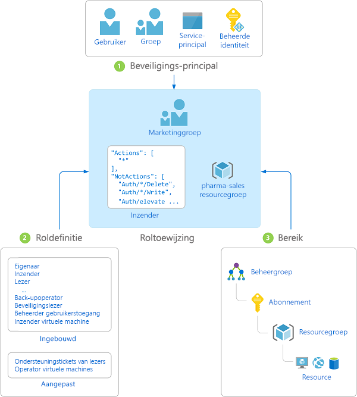
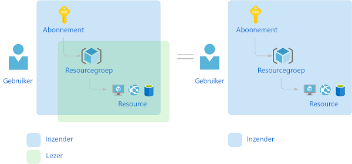

# Wat is op rollen gebaseerd toegangsbeheer (RBAC) voor Azure-resources?

Toegangsbeheer voor cloudresources is een uiterst belangrijke functie voor elke organisatie die van de cloud gebruikmaakt. Het gebruik van op rollen gebaseerd toegangsbeheer helpt u bij het beheren van wie er toegang heeft tot Azure-resources, wat ze kunnen doen met die resources en tot welke gebieden ze toegang hebben.

Op rollen gebaseerd toegangsbeheer is een machtigingssysteem dat is gebouwd op [Azure Resource Manager](../azure-resource-manager/resource-group-overview.md) dat een geavanceerd toegangsbeheer van Azure-resources biedt.

## Wat kan ik doen met op rollen gebaseerd toegangsbeheer?

Hier volgen enkele voorbeelden van wat u met op rollen gebaseerd toegangsbeheer kunt doen:

- Toestaan dat één gebruiker de virtuele machines in een abonnement kan beheren en een andere gebruiker de virtuele netwerken kan beheren.
- Een DBA-groep toestaan de SQL-databases in een abonnement te beheren.
- Toestaan dat een gebruiker alle resources in een resourcegroep kan beheren, zoals virtuele machines, websites en subnetten.
- Toestaan dat een toepassing toegang heeft tot alle resources in een resourcegroep.

## Aanbevolen procedures voor het gebruik van RBAC

Met op rollen gebaseerd toegangsbeheer kunt u taken scheiden binnen uw team en alleen de mate van toegang verlenen aan gebruikers die nodig is om de taken uit te voeren. In plaats van iedereen onbeperkte machtigingen te verlenen in uw Azure-abonnement of -resources, kunt u zelf bepalen welke acties er met een bepaalde bereik zijn toegestaan.

Het is een aanbevolen procedure om tijdens het plannen van een strategie voor toegangsbeheer gebruikers minimale bevoegdheden te verlenen om hun werk gedaan te krijgen. In het volgende diagram wordt een voorgesteld patroon weergegeven voor het gebruik van RBAC.

## Hoe op rollen gebaseerd toegangsbeheer werkt

De manier waarop u de toegang tot resources beheert met behulp van op rollen gebaseerd toegangsbeheer is door roltoewijzingen te maken. Dit is een belangrijke concept om te weten: het is de manier waarop machtigingen worden afgedwongen. Een roltoewijzing bestaat uit drie elementen: beveiligings-principal, roldefinitie en bereik (ook wel scope of niveau genoemd).

### Beveiligings-principal

Een *beveiligings-principal* is een object dat een gebruiker, groep, service-principal of beheerde identiteit vertegenwoordigt die toegang tot Azure-resources aanvraagt.

- Gebruiker: een persoon een profiel heeft in Azure Active Directory. U kunt ook rollen toewijzen aan gebruikers in andere tenants. Zie [Azure Active Directory B2B](../active-directory/b2b/what-is-b2b.md) voor meer informatie over gebruikers in andere organisaties.
- Groep: een aantal gebruikers dat in Azure Active Directory is gemaakt. Wanneer u een rol aan een groep toewijst, hebben alle gebruikers binnen die groep die rol. 
- Service-principal: een beveiligings-id die wordt gebruikt door toepassingen of services om toegang tot specifieke Azure-resources te krijgen. U kunt het zien als een *gebruikersidentiteit* (gebruikersnaam en wachtwoord of certificaat) voor een toepassing.
- Beheerde identiteit - een identiteit in Azure Active Directory die automatisch wordt beheerd door Azure. [Beheerde identiteiten](../active-directory/managed-identities-azure-resources/overview.md) worden doorgaans gebruikt bij het ontwikkelen van cloudtoepassingen voor het beheren van de referenties voor verificatie bij Azure-services.

### Roldefinitie

Een *roldefinitie* is een verzameling machtigingen. Dit wordt soms gewoon een *rol* genoemd. Een roldefinitie beschijft de bewerkingen die kunnen worden uitgevoerd, zoals lezen, schrijven en verwijderen. Rollen kunnen op algemeen zijn, zoals eigenaar, of specifiek, zoals de lezer van de virtuele machine.

Azure bevat diverse [ingebouwde rollen](built-in-roles.md) die u kunt gebruiken. Hier volgen vier fundamentele ingebouwde rollen. De eerste drie zijn op alle resourcetypen van toepassing.

- [Eigenaar](built-in-roles.md#owner): heeft volledige toegang tot alle resources, waaronder het recht om toegang aan anderen te delegeren.
- [Inzender](built-in-roles.md#contributor): kan alle typen Azure-resources maken en beheren, maar kan anderen geen toegang verlenen.
- [Lezer](built-in-roles.md#reader): kan bestaande Azure-resources bekijken.
- [Beheerder gebruikerstoegang](built-in-roles.md#user-access-administrator): kan gebruikerstoegang tot Azure-resources beheren.

Met de overige ingebouwde rollen kunnen specifieke Azure-resources worden beheerd. Met de rol [Inzender voor virtuele machines](built-in-roles.md#virtual-machine-contributor) kan een gebruiker bijvoorbeeld virtuele machines maken en beheren. Als de ingebouwde rollen niet voldoen aan de specifieke behoeften van uw organisatie, kunt u uw eigen [aangepaste rollen maken voor Azure-resources](custom-roles.md).

Azure heeft gegevensbewerkingen (momenteel in Preview-versie) geïntroduceerd waarmee u toegang tot gegevens in een object kunt verlenen. Als een gebruiker bijvoorbeeld toegang heeft tot gegevens in een opslagaccount, kan deze de blobs of berichten in dat opslagaccount lezen. Zie [Roldefinities voor Azure-resources begrijpen](role-definitions.md) voor meer informatie.

### Bereik

*Bereik* is de set resources waarop de toegang van toepassing is. Wanneer u een rol toewijst, kunt u de acties die zijn toegestaan verder beperken door een bereik te definiëren. Dit is handig als u van iemand een [Inzender voor websites](built-in-roles.md#website-contributor) wilt maken, maar slechts voor één resourcegroep.

In Azure kunt u een bereik op meerdere niveaus opgeven: [beheergroep](../governance/management-groups/index.md), abonnement, resourcegroep of resource. Bereiken zijn gestructureerd in een bovenliggende/onderliggende relatie.

Wanneer u toegang op een bovenliggend bereik verleent, worden deze machtigingen overgenomen door de onderliggende bereiken. Bijvoorbeeld:

- Als u de [Eigenaar](built-in-roles.md#owner)-rol aan een gebruiker bij het bereik van de beheergroep toewijst, kan die gebruiker alles in alle abonnementen in de beheergroep beheren.
- Als u de rol van [lezer](built-in-roles.md#reader) toewijst aan een groep in het bereik van het abonnement, kunnen de leden van die groep elke resourcegroep en de resource in het abonnement bekijken.
- Als u de rol van [inzender](built-in-roles.md#contributor) toewijst aan een toepassing in het bereik van de resource, kunnen hiermee resources van alle typen in die resourcegroep worden beheerd, maar geen andere resourcegroepen in het abonnement.

### Roltoewijzingen

Een *roltoewijzing* is het proces waarmee voor een bepaald bereik een roldefinitie aan een gebruiker, groep, service-principal of beheerde identiteit wordt gekoppeld, met het doel om toegang te verlenen. Toegang wordt verleend door een roltoewijzing te maken en toegang kan worden ingetrokken door een roltoewijzing te verwijderen.

Het volgende diagram toont een voorbeeld van een roltoewijzing. In dit voorbeeld wordt aan de groep Marketing de rol van [inzender](built-in-roles.md#contributor) toegewezen voor de resourcegroep pharma-sales. Dit betekent dat gebruikers in de groep Marketing een Azure-resource in de resourcegroep pharma-sales kunnen maken of beheren. Gebruikers in de groep Marketing hebben geen toegang tot resources buiten de resourcegroep pharma-sales, tenzij ze deel uitmaken van een andere roltoewijzing.

U kunt roltoewijzingen maken met behulp van Azure Portal, Azure CLI, Azure PowerShell, Azure-SDK's of REST-API's. U kunt maximaal 2000 roltoewijzingen in elk abonnement hebben. Om roltoewijzingen te maken en te verwijderen, moet u een `Microsoft.Authorization/roleAssignments/*`-machtiging hebben. Deze machtiging wordt verleend via de rol van [eigenaar](built-in-roles.md#owner) of [administrator](built-in-roles.md#user-access-administrator).

## Meervoudige roltoewijzingen

Wat gebeurt er wanneer er meerdere overlappende roltoewijzingen zijn? RBAC is een additief model, dus uw effectieve machtigingen zijn de som van uw roltoewijzingen. Bekijk het volgende voorbeeld, waarbij aan een gebruiker de rol Inzender wordt toegekend in het abonnementsbereik en de rol Lezer in een resourcegroep. De combinatie van de Inzender- en Lezer-machtigingen is effectief gelijk aan de rol Inzender voor de resourcegroep. Daarom heeft in dit geval de toewijzing van de rol Lezer geen impact.

## Weigeringstoewijzingen

Voorheen was RBAC een model op basis van alleen-toestaan zonder de mogelijkheid tot weigeren, maar nu ondersteunt RBAC in beperkte mate weigeringstoewijzingen. Ongeveer op dezelfde manier als een roltoewijzing verbindt een *weigeringstoewijzing* een reeks acties aan een gebruiker, groep, service-principal of beheerde identiteit met een bepaald bereik met het doel toegang te weigeren. Een roltoewijzing definieert een set acties die zijn *toegestaan*, terwijl een weigeringstoewijzing een set acties definieert die *niet zijn toegestaan*. Met andere woorden, weigeringstoewijzingen voorkomen dat gebruikers opgegeven acties uitvoeren, zelfs als een roltoewijzing hen deze toegang verleent. Weigeringstoewijzingen hebben voorrang op roltoewijzingen. Op dit moment hebben weigeringstoewijzingen het kenmerk **Alleen-lezen** en kunnen deze alleen worden ingesteld door Windows. Zie [Weigeringstoewijzingen voor Azure-resources begrijpen](deny-assignments.md) en [Weigeringstoewijzingen voor Azure-resources bekijken met behulp van de Azure-portal](deny-assignments-portal.md) voor meer informatie.

## Hoe RBAC bepaalt of een gebruiker toegang tot een resource heeft

Hier volgen de stappen op hoog niveau die RBAC gebruikt om te bepalen of u toegang tot een resource hebt op het beheervlak. Het is handig om dit te begrijpen als u probeert een toegangsprobleem op te lossen.

1. Een gebruiker (of service-principal) krijgt een token voor Azure Resource Manager.

    Het token bevat groepslidmaatschappen van de gebruiker (met inbegrip van overdraagbare groepslidmaatschappen).

1. De gebruiker voert een REST API-aanroep uit naar Azure Resource Manager met het gekoppelde token.

1. Azure Resource Manager haalt alle roltoewijzingen en weigeringstoewijzingen op die betrekking hebben op de resource waarop de actie wordt ondernomen.

1. Azure Resource Manager beperkt de roltoewijzingen die van toepassing zijn op deze gebruiker of hun groep en bepaalt welke rollen de gebruiker heeft voor deze resource.

1. Azure Resource Manager bepaalt of de actie in de API-aanroep is opgenomen in de rollen die de gebruiker voor deze resource heeft.

1. Als de gebruiker geen rol met de actie heeft in het aangevraagde bereik, wordt er geen toegang verleend. Anders controleert Azure Resource Manager of er een weigeringstoewijzing van toepassing is.

1. Als de weigeringstoewijzing van toepassing is, wordt toegang geblokkeerd. Anders wordt toegang verleend.

## Volgende stappen

- [Snelstart: De toegang die een gebruiker heeft tot Azure-resources bekijken](check-access.md)
- [Toegang tot Azure-resources beheren met op rollen gebaseerd toegangsbeheer en de Azure-portal](role-assignments-portal.md)
- [Inzicht in de verschillende rollen](rbac-and-directory-admin-roles.md)
- [Enterprise Cloud implementeren: Resource-toegangsbeheer in Azure](/azure/architecture/cloud-adoption/getting-started/azure-resource-access)
