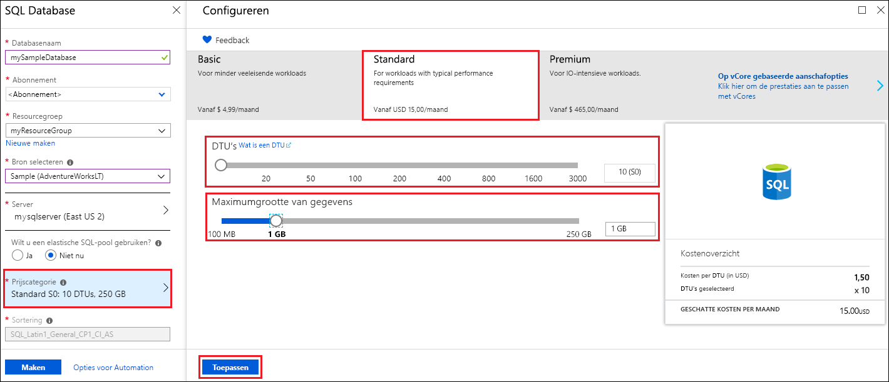
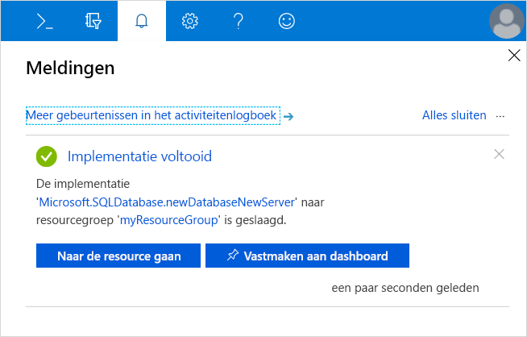
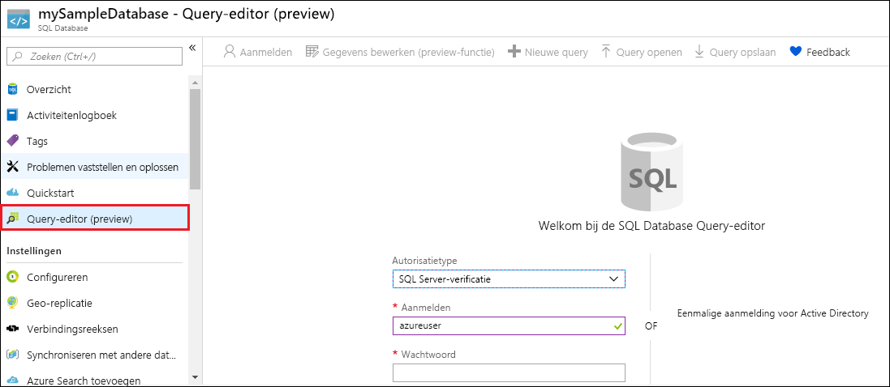

# <a name="quickstart-create-an-azure-sql-database-in-the-azure-portal"></a>Quickstart: Een Azure SQL-database maken in Azure Portal

Azure SQL Database is een *Database as a Service* waarmee u maximaal beschikbare SQL Server-databases kunt uitvoeren en schalen in de cloud. In deze snelstart ziet u hoe u aan de slag gaat door een Azure SQL Database te maken en er vervolgens query’s op uit te voeren met behulp van Azure Portal. 

Als u geen abonnement op Azure hebt, maakt u een [gratis account](https://azure.microsoft.com/free/) voordat u begint.

Voor alle stappen in deze snelstartgids moet u zich aanmelden bij [Azure Portal](https://portal.azure.com/).

## <a name="create-a-sql-database"></a>Een SQL-database maken

Een Azure SQL Database beschikt over een gedefinieerde set [reken- en opslagresources](sql-database-service-tiers-dtu.md). U maakt de database in een [logische Azure SQL Database-server](sql-database-features.md) in een [Azure-resourcegroep](../azure-resource-manager/resource-group-overview.md).

U maakt als volgt een SQL Database met de voorbeeldgegevens van Adventure Works LT:

1. Selecteer in de linkerbovenhoek van Azure Portal **Een resource maken**.
   
1. Selecteer **Databases** en selecteer vervolgens **SQL Database**.
   
1. Typ of selecteer de volgende waarden in het **SQL Database**-formulier: 
   
   - **Databasenaam**: Typ *mySampleDatabase*.
   - **Abonnement**: Selecteer het juiste abonnement in de vervolgkeuzelijst als deze niet wordt weergegeven.  
   - **Resourcegroep**: Selecteer **Nieuwe maken**, typ *myResourceGroup* en selecteer **OK**. 
   - **Bron selecteren**: Selecteer **Voorbeeld (AdventureWorksLT)** in de vervolgkeuzelijst. 
   
   >[!IMPORTANT]
   >Selecteer de gegevens uit **Voorbeeld (AdventureWorksLT)** zodat u deze en andere snelstartgidsen voor Azure SQL Database kunt volgen waarbij deze gegevens ook worden gebruikt. 
   
   
   
1. Selecteer **Server** en selecteer vervolgens **Een nieuwe server maken**. 
   
1. In het formulier **Nieuwe server** typt of selecteert u de volgende waarden: 
   
   - **Servernaam**: Typ *mysqlserver*.
   - **Aanmeldgegevens van serverbeheerder**: typ *azureuser*. 
   - **Wachtwoord**: typ *Azure1234567*. 
   - **Wachtwoord bevestigen**: Voer het wachtwoord opnieuw in.
   - **Locatie**: Selecteer een geldige locatie in de vervolgkeuzelijst.  
   
   >[!IMPORTANT]
   >Onthoud of noteer de aanmeldgegevens en het wachtwoord van de server zodat u zich bij de server en databases voor deze en andere snelstartgidsen kunt aanmelden. Als u uw aanmeldgegevens of wachtwoord vergeet, kunt u de aanmeldnaam ophalen of het wachtwoord opnieuw instellen op de pagina **SQL Server**. U kunt de pagina **SQL Server** openen door de servernaam te selecteren op de **Overzichtspagina** van de database nadat u de database hebt gemaakt.
   
1. Kies **Selecteren**.
   
   
   
1. Selecteer in het **SQL Database**-formulier de optie **Prijscategorie**. Bekijk de hoeveelheid DTU's en opslag die voor elke servicelaag beschikbaar zijn.
   
   >[!NOTE]
   >In deze snelstartgids wordt gebruik gemaakt van het [op DTU gebaseerde aankoopmodel](sql-database-service-tiers-dtu.md). Het [model op basis van vCore](sql-database-service-tiers-vcore.md) is echter ook beschikbaar.
   
   >[!NOTE]
   >Voor de Premium-laag is er meer dan 1 TB aan opslagruimte beschikbaar in alle regio's, met uitzondering van: UK - noord, US - west-centraal, US - zuid 2, China - oost, USDoD - centraal, Duitsland - centraal, US DoD - oost, US Gov - zuid-west, US Gov - zuid-centraal, Duitsland - noordoost, China - noord en US Gov - oost. In deze regio’s is de maximale opslagruimte in de Premium-laag beperkt tot 1 TB. Raadpleeg [P11-P15 huidige beperkingen](sql-database-dtu-resource-limits-single-databases.md#single-database-limitations-of-p11-and-p15-when-the-maximum-size-greater-than-1-tb) voor meer informatie.  
   
1. Voor deze snelstart selecteert u de servicelaag **Standard** en gebruikt u vervolgens de schuifregelaar om **10 DTU's (S0)** en **1** GB aan opslagruimte te selecteren.
   
1. Selecteer **Toepassen**.  
   
   
   
1. Selecteer in het **SQL Database**-formulier de optie **Maken** om de resourcegroep, server en database te implementeren en in te richten. 
   
   De implementatie duurt een paar minuten. Selecteer **Meldingen** op de werkbalk om de implementatievoortgang te bewaken.

   

## <a name="query-the-sql-database"></a>Query's uitvoeren op de SQL-database

Nu u een Azure SQL Database hebt gemaakt, gebruikt u het ingebouwde hulpprogramma voor query's in Azure Portal om verbinding te maken met de database en query's uit te voeren voor de gegevens.

1. Selecteer op de **SQL Database**-pagina voor uw database in het linkermenu de optie **Query-editor (preview)**. 
   
   
   
1. Voer uw aanmeldgegevens in en selecteer **OK**.
   
1. Voer de volgende query in het deelvenster **Query-editor** in.
   
   ```sql
   SELECT TOP 20 pc.Name as CategoryName, p.name as ProductName
   FROM SalesLT.ProductCategory pc
   JOIN SalesLT.Product p
   ON pc.productcategoryid = p.productcategoryid;
   ```
   
1. Klik op **Uitvoeren** en bekijk de resultaten van de query in het deelvenster **Resultaten**.

   
   
1. Sluit de pagina **Query-editor** en selecteer **OK** wanneer u wordt gevraagd om uw niet-opgeslagen bewerkingen te verwijderen.

## <a name="clean-up-resources"></a>Resources opschonen

Bewaar deze resourcegroep, SQL Server en SQL Database als u verder wilt gaan met [Volgende stappen](#next-steps) en wilt leren hoe u op verschillende manieren verbinding kunt maken met uw database en hierop een query kunt uitvoeren. 

Wanneer u klaar bent met deze resources, kunt u ze als volgt verwijderen:

1. Selecteer in het linkermenu in Azure Portal **Resourcegroepen** en selecteer vervolgens **myResourceGroup**.
1. Selecteer **Resourcegroep verwijderen** op de pagina van de resourcegroep. 
1. Typ *myResourceGroup* in het tekstvak en selecteer vervolgens **Verwijderen**.

## <a name="next-steps"></a>Volgende stappen

- U moet een firewallregel op serverniveau maken om via on-premises of externe hulpprogramma’s verbinding met uw Azure SQL Database te maken. Zie [Een serverfirewallregel maken](sql-database-get-started-portal-firewall.md) voor meer informatie.
- Nadat u een serverfirewallregel hebt gemaakt, kunt u met verschillende hulpprogramma’s en programmeertalen [verbinding maken met uw database en query’s uitvoeren](sql-database-connect-query.md) op uw database. 
  - [Verbinding maken en query's uitvoeren met behulp van SQL Server Management Studio](sql-database-connect-query-ssms.md)
  - [Verbinding maken en query's uitvoeren met behulp van Azure Data Studio](https://docs.microsoft.com/sql/azure-data-studio/quickstart-sql-database?toc=/azure/sql-database/toc.json)
- Zie [Azure CLI-voorbeelden](sql-database-cli-samples.md) voor het maken van Azure SQL Databases met behulp van Azure CLI.
- Zie [Azure PowerShell-voorbeelden](sql-database-powershell-samples.md) voor het maken van Azure SQL Databases met behulp van Azure PowerShell.
