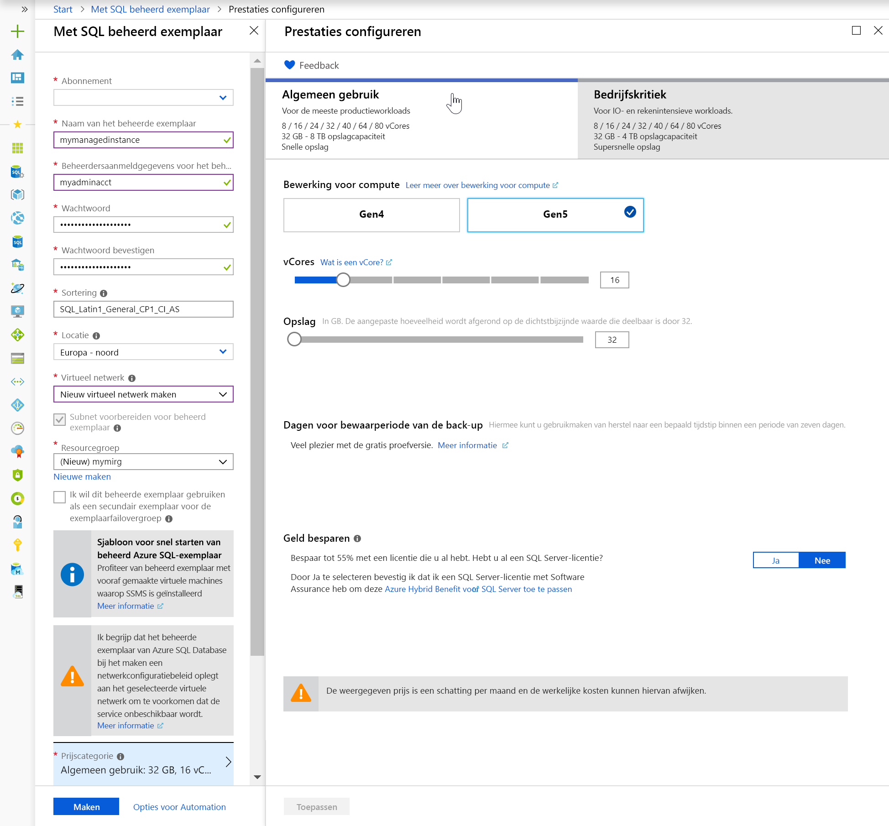
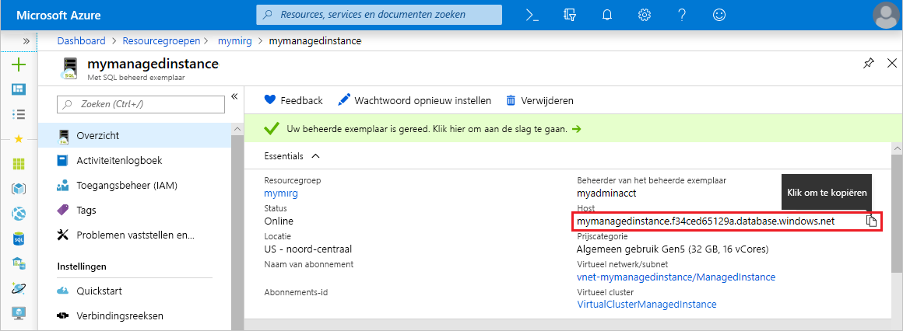

# Quickstart: Een beheerd exemplaar van Azure SQL Database maken

In deze quickstart leert u hoe u een [beheerd exemplaar](sql-database-managed-instance.md) van Azure SQL Database maakt in de Azure-portal.

> [!IMPORTANT]
> Zie voor beperkingen, [ondersteunde regio's](sql-database-managed-instance-resource-limits.md#supported-regions) en [abonnementstypen ondersteund](sql-database-managed-instance-resource-limits.md#supported-subscription-types).

## Aanmelden bij Azure Portal

Meld u aan bij [Azure Portal](https://portal.azure.com/).

## Een beheerd exemplaar maken

In de volgende stappen wordt uitgelegd hoe u een beheerd exemplaar maakt.

1. Kies in de linkerbovenhoek van Azure Portal **Een resource maken**.
2. Zoek naar **beheerd exemplaar** en selecteer vervolgens **Met Azure SQL beheerd exemplaar**.
3. Selecteer **Maken**.

   

4. Vul het formulier voor het **Met SQL beheerd exemplaar** in met behulp van de gegevens in onderstaande tabel:

   | Instelling| Voorgestelde waarde | Description |
   | ------ | --------------- | ----------- |
   | **Abonnement** | Uw abonnement | Een abonnement met toestemming voor het maken van nieuwe resources. |
   |**Naam van het beheerde exemplaar**|Een geldige naam|Zie [naamconventies en beperkingen](https://docs.microsoft.com/azure/architecture/best-practices/naming-conventions) voor geldige namen.|
   |**Beheerdersaanmeldgegevens voor het beheerde exemplaar**|Een geldige gebruikersnaam|Zie [naamconventies en beperkingen](https://docs.microsoft.com/azure/architecture/best-practices/naming-conventions) voor geldige namen. Maak geen gebruik van 'serverbeheerder' aangezien dit een rol is die op serverniveau is gereserveerd.|
   |**Wachtwoord**|Een geldig wachtwoord|Het wachtwoord moet minstens 16 tekens lang zijn en moet voldoen aan de [gedefinieerde complexiteitsvereisten](../virtual-machines/windows/faq.md#what-are-the-password-requirements-when-creating-a-vm).|
   |**Sortering**|De sortering die u wilt gebruiken voor uw beheerde exemplaar|Als u SQL Server-databases wilt migreren, moet u de bronsortering `SELECT SERVERPROPERTY(N'Collation')` controleren en die waarde gebruiken. Zie [Server-level collations](https://docs.microsoft.com/sql/relational-databases/collations/set-or-change-the-server-collation) (Sorteringen op serverniveau) voor informatie over sorteringen.|
   |**Locatie**|De locatie waarop u het beheerde exemplaar wilt maken|Zie [Azure-regio's](https://azure.microsoft.com/regions/) voor informatie over regio's.|
   |**Virtueel netwerk**|Selecteer **Nieuw virtueel netwerk maken** of een geldig virtueel netwerk en subnet.| Als een netwerk/subnet niet beschikbaar is is moet worden [gewijzigd om te voldoen aan de netwerkvereisten](sql-database-managed-instance-configure-vnet-subnet.md) voordat u deze als een doel voor de nieuwe beheerde exemplaar selecteren. Zie [Een VNet configureren voor een beheerd exemplaar](sql-database-managed-instance-connectivity-architecture.md) voor informatie over de vereisten voor het configureren van de netwerkomgeving voor een beheerd exemplaar. |
   |**Resourcegroep**|Een nieuwe of bestaande resourcegroep|Zie [Naming conventions](https://docs.microsoft.com/azure/architecture/best-practices/naming-conventions) (Naamgevingsconventies) voor geldige resourcegroepnamen.|

   

5. Voor gebruik van het beheerde exemplaar als secundaire exemplaarfailovergroep schakelt u het selectievakje in en geeft u het beheerde exemplaar DnsAzurePartner op. Deze functie is beschikbaar als preview en wordt niet weergegeven in de bijbehorende schermafbeelding.
6. Selecteer **Prijscategorie** om reken- en opslagresources toe te wijzen en de opties voor prijscategorieën te bekijken. De prijscategorie voor algemeen gebruik met 32 GB geheugen en 16 vCores is de standaardwaarde.
7. Gebruik de schuifregelaars of tekstvakken om de hoeveelheid opslagruimte en het aantal virtuele kernen op te geven.
8. Wanneer u klaar bent, kiest u **Toepassen** om uw selectie op te slaan.  
9. Selecteer **Maken** om het beheerde exemplaar te implementeren.
10. Selecteer het pictogram voor **Meldingen** om de status van de implementatie te bekijken.

    

11. Selecteer **Implementatie wordt uitgevoerd** om het venster Beheerd exemplaar te openen. Hier kunt u details van de voortgang van de implementatie controleren.

> [!IMPORTANT]
> Het eerste exemplaar in een subnet kent doorgaans een veel langere implementatietijd dan volgende exemplaren. Annuleer de implementatiebewerking niet omdat deze langer duurt dan verwacht. Het tweede beheerde exemplaar in het subnet wordt in slechts enkele minuten gemaakt.

## Resources controleren en de volledig gekwalificeerde servernaam ophalen

Als de implementatie is voltooid, controleert u de resources die zijn gemaakt en haalt u de volledig gekwalificeerde servernaam op voor gebruik in latere snelstartgidsen.

1. Open de resourcegroep voor uw beheerde exemplaar en bekijk de resources die voor u zijn gemaakt in de quickstart [Een beheerd exemplaar maken](#create-a-managed-instance).

   

2. Selecteer de routetabel om de door de gebruiker gedefinieerde routetabel op te geven die voor u is gemaakt.

   

3. Bekijk de vermeldingen in de routetabel om verkeer vanaf en binnen het virtuele netwerk van het beheerde exemplaar door te sturen. Als u de routetabel handmatig maakt of configureert, moet u deze vermeldingen in de routetabel maken.

   

4. Ga terug naar de resourcegroep en selecteer de netwerkbeveiligingsgroep om de beveiligingsregels te bekijken.

   

5. Bekijk de inkomende en uitgaande beveiligingsregels.

   

6. Ga terug naar de resourcegroep en selecteer uw beheerde exemplaar.

   

7. Zoek op het tabblad **Overzicht** de eigenschap **Host** en kopieer het volledig gekwalificeerde hostadres voor het beheerde exemplaar. U gebruikt deze in de volgende quickstart.

   

   De naam ziet er als volgt uit: **naam_van_uw_machine.a1b2c3d4e5f6.database.windows.net**.

## Volgende stappen

- Zie de volgende onderwerpen voor meer informatie over het maken van verbinding met een beheerd exemplaar:
  - Zie [Verbinding maken tussen uw toepassing en het beheerde exemplaar van Azure SQL Database](sql-database-managed-instance-connect-app.md) voor een overzicht van de verbindingsopties voor toepassingen.
  - Zie [Een verbinding vanaf een virtuele Azure-machine configureren](sql-database-managed-instance-configure-vm.md) voor een quickstart over het verbinding maken met een beheerd exemplaar vanaf een virtuele Azure-machine.
  - Zie [Een punt-naar-site-verbinding configureren](sql-database-managed-instance-configure-p2s.md) voor een quickstart over verbinding maken met een beheerd exemplaar vanaf een on-premises clientcomputer met behulp van een punt-naar-site-verbinding.
- Als u een bestaande SQL Server-database van on-premises wilt herstellen naar een beheerd exemplaar, kunt u de [Azure Database Migration Service (DMS) voor migratie](../dms/tutorial-sql-server-to-managed-instance.md) gebruiken om de database terug te zetten vanuit een back-upbestand van de database. U gebruikt de opdracht [T-SQL RESTORE](sql-database-managed-instance-get-started-restore.md) als u de database wilt terugzetten vanuit een back-upbestand van de database.
- Zie [Azure SQL Database bewaken met Azure SQL-analyse](../azure-monitor/insights/azure-sql.md) voor geavanceerde bewaking van de databaseprestaties van het beheerde exemplaar met ingebouwde intelligentie voor het oplossen van problemen
