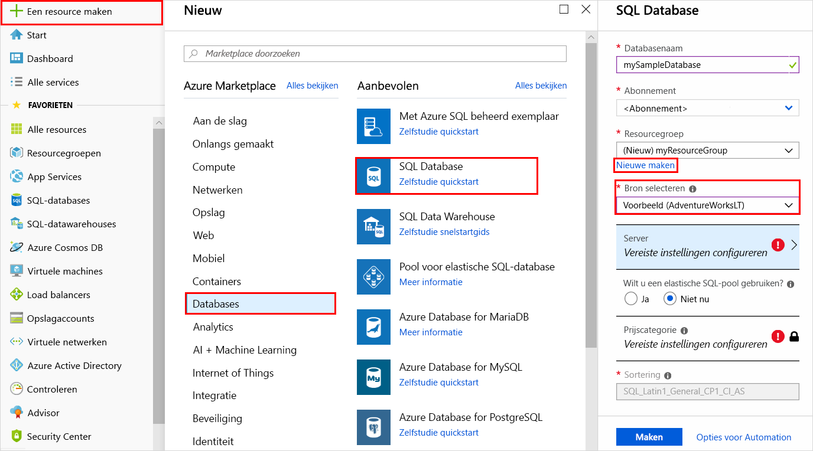
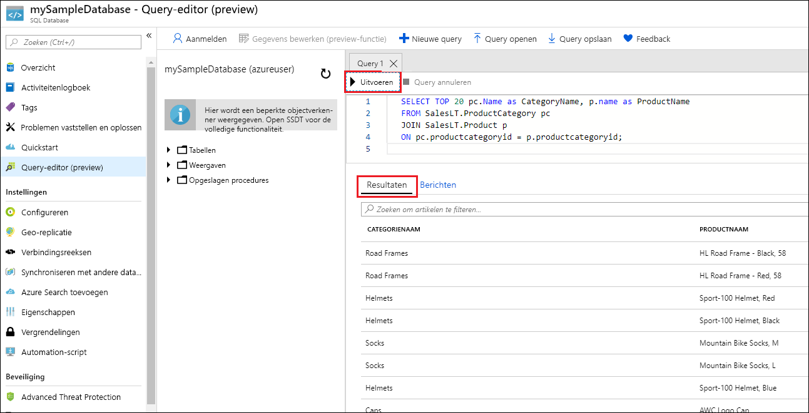

# <a name="quickstart-create-a-single-database-in-azure-sql-database-using-the-azure-portal"></a>Quickstart: Eén database maken in Azure SQL Database via de Azure-portal

Het maken van [één database](sql-database-single-database.md) is de snelste een eenvoudigste implementatieoptie om een database te maken in Azure SQL Database. Aan de hand van deze quickstart kunt u een individuele database maken via de Azure-portal.

Als u nog geen abonnement op Azure hebt, [maak dan een gratis account](https://azure.microsoft.com/free/).

Voor alle stappen in deze snelstartgids moet u zich aanmelden bij [Azure Portal](https://portal.azure.com/).

## <a name="create-a-single-database"></a>Een individuele database maken

Een individuele database bevat een gedefinieerde set reken-, geheugen-, IO- en opslagresources die gebruikmaakt van één van twee [aankoopmodellen](sql-database-purchase-models.md). Wanneer u een individuele database maakt, definieert u ook een [SQL Database-server](sql-database-servers.md) om die te beheren en in een [Azure-resourcegroep](../azure-resource-manager/resource-group-overview.md) in een opgegeven regio te plaatsen.

U maakt als volgt een individuele database met de voorbeeldgegevens van Adventure Works LT:

1. Selecteer in de linkerbovenhoek van Azure Portal **Een resource maken**.
2. Selecteer **Databases** en selecteer vervolgens **SQL-Database** openen de **SQL-Database maken** pagina. 

   

1. Op de **basisbeginselen** tabblad, in de **projectdetails** sectie, typt of selecteert u de volgende waarden:

   - **Abonnement**: Selecteer het juiste abonnement in de vervolgkeuzelijst als deze niet wordt weergegeven.
   - **Resourcegroep**: Selecteer **nieuw**, type `myResourceGroup`, en selecteer **OK**.

   


1. In de **databasedetails** sectie, typt of selecteert u de volgende waarden: 

   - **Databasenaam**: Voer `mySampleDatabase` in.
   - **Server**: Selecteer **nieuw** en voer de volgende waarden in en selecteer vervolgens **Selecteer**. 
       - **Servernaam**: Type `mysqlserver`; samen met enkele nummers uniek. 
       - **Aanmeldgegevens van serverbeheerder**: Typ `azureuser`.
       - **Wachtwoord**: Typ een complex wachtwoord in die voldoet aan de vereisten voor wachtwoorden. 
       - **Locatie**: Kies een locatie in de vervolgkeuzelijst, zoals `West US 2`. 

       

        > [!IMPORTANT]
        > Vergeet niet de aanmeldgegevens en het wachtwoord van de server te noteren zodat u zich bij de server en databases voor deze en andere quickstarts kunt aanmelden. Als u uw aanmeldgegevens of wachtwoord vergeet, kunt u de aanmeldnaam ophalen of het wachtwoord opnieuw instellen op de pagina **SQL Server**. U kunt de pagina **SQL Server** openen door de servernaam te selecteren op de **Overzichtspagina** van de database nadat u de database hebt gemaakt.

      

   - **Elastische SQL-pool gebruiken**: Selecteer de **Nee** optie. 
   - **COMPUTE en opslag**: Selecteer **database configureren** en in deze Quick Start selecteert u de **Standard** servicelaag, en vervolgens de schuifregelaar om te selecteren **10 dtu's (S0)** en **1** GB aan opslagruimte. Selecteer **Toepassen**. 

     


      > [!NOTE]
      > In deze quickstart wordt gebruik gemaakt van het [aankoopmodel op basis van DTU](sql-database-service-tiers-dtu.md). Het [aankoopmodel op basis van vCore](sql-database-service-tiers-vcore.md) is echter ook beschikbaar.
      > [!IMPORTANT]
      > Voor de Premium-laag is er meer dan 1 TB aan opslagruimte beschikbaar in alle regio's, met uitzondering van: China - oost, China - noord, Duitsland - centraal, Duitsland - noordoost, US - west-centraal, US - DoD-regio's en US Government - centraal. In deze regio’s is de maximale opslagruimte in de Premium-laag beperkt tot 1 TB.  Raadpleeg [P11-P15 huidige beperkingen](sql-database-single-database-scale.md#p11-and-p15-constraints-when-max-size-greater-than-1-tb) voor meer informatie.  

    


1. Selecteer de **extra instellingen** tabblad. 
1. In de **gegevensbron** sectie onder **gebruikmaken van bestaande gegevens**, selecteer `Sample`. 

   

   > [!IMPORTANT]
   > Selecteer de gegevens uit **Voorbeeld (AdventureWorksLT)** zodat u deze en andere quickstarts voor Azure SQL Database gemakkelijk kunt volgen waarbij deze gegevens ook worden gebruikt.

1. Laat de rest van de waarden als standaard en selecteer **revisie + maken** aan de onderkant van het formulier. 
1. Controleer de laatste instellingen en selecteer **maken**. 

8. Selecteer in het **SQL Database**-formulier de optie **Maken** om de resourcegroep, server en database te implementeren en in te richten.


## <a name="query-the-database"></a>Een query uitvoeren op de database

Nu u de database hebt gemaakt, gebruikt u het ingebouwde hulpprogramma voor query's in de Azure-portal om verbinding te maken met de database en query's uit te voeren op de gegevens.

1. Selecteer op de **SQL Database**-pagina voor uw database in het linkermenu de optie **Query-editor (preview)**.

   

2. Voer uw aanmeldgegevens in en selecteer **OK**.
3. Voer de volgende query in het deelvenster **Query-editor** in.

   ```sql
   SELECT TOP 20 pc.Name as CategoryName, p.name as ProductName
   FROM SalesLT.ProductCategory pc
   JOIN SalesLT.Product p
   ON pc.productcategoryid = p.productcategoryid;
   ```

4. Klik op **Uitvoeren** en bekijk de resultaten van de query in het deelvenster **Resultaten**.

   

5. Sluit de pagina **Query-editor** en selecteer **OK** wanneer u wordt gevraagd om uw niet-opgeslagen bewerkingen te verwijderen.

## <a name="clean-up-resources"></a>Resources opschonen

Behoud deze resourcegroep, databaseserver en individuele database als u naar de [Volgende stappen](#next-steps) wilt gaan. De volgende stappen laten zien hoe u verbinding maakt met en een query uitvoert op uw database met behulp van verschillende methoden.

Wanneer u klaar bent met deze resources, kunt u ze als volgt verwijderen:

1. Selecteer in het linkermenu in Azure Portal **Resourcegroepen** en selecteer vervolgens **myResourceGroup**.
2. Selecteer **Resourcegroep verwijderen** op de pagina van de resourcegroep.
3. Voer *myResourceGroup* in het tekstvak in en selecteer vervolgens **Verwijderen**.

## <a name="next-steps"></a>Volgende stappen

- Maak een firewallregel op serverniveau om via on-premises of externe hulpprogramma's verbinding met de individuele database te maken. Zie [Een serverfirewallregel maken](sql-database-server-level-firewall-rule.md) voor meer informatie.
- Nadat u een serverfirewallregel hebt gemaakt, kunt u met verschillende hulpprogramma's en programmeertalen [verbinding maken met uw database en query's uitvoeren](sql-database-connect-query.md) op uw database.
  - [Verbinding maken en query's uitvoeren met behulp van SQL Server Management Studio](sql-database-connect-query-ssms.md)
  - [Verbinding maken en query's uitvoeren met behulp van Azure Data Studio](https://docs.microsoft.com/sql/azure-data-studio/quickstart-sql-database?toc=/azure/sql-database/toc.json)
- Zie voor het maken van een individuele database met behulp van Azure CLI, [Azure CLI-voorbeelden](sql-database-cli-samples.md).
- Zie voor het maken van een individuele database met behulp van Azure PowerShell, [voorbeelden van Azure PowerShell](sql-database-powershell-samples.md).
