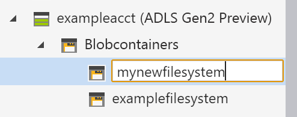
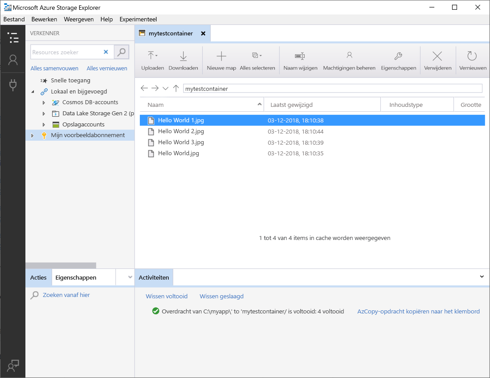

# Snelstart: Azure Storage Explorer gebruiken voor het beheren van gegevens in een Azure Data Lake Storage Gen2-account

In deze snelstart leert u hoe u met behulp van [Azure Storage Explorer](https://azure.microsoft.com/features/storage-explorer/) een directory en een blob maakt. Hierna leert u hoe u de blob naar uw lokale computer downloadt en hoe u alle blobs in een directory bekijkt. U leert ook hoe u een momentopname van een blob maakt, hoe u toegangsbeleid voor directory’s beheert en hoe u een handtekening voor gedeelde toegang maakt.

## Vereisten

[!INCLUDE [storage-quickstart-prereq-include](../../../includes/storage-quickstart-prereq-include.md)]

Voor deze snelstart moet Azure Storage Explorer zijn geïnstalleerd. Zie [Azure Storage Explorer](https://azure.microsoft.com/features/storage-explorer/) voor meer informatie over het installeren van Azure Storage Explorer voor Windows, Macintosh of Linux.

## Aanmelden bij Storage Explorer

Bij de eerste keer opstarten wordt het venster **Microsoft Azure Storage Explorer - Verbinding maken** weergegeven. Hoewel Storage Explorer verschillende manieren biedt om verbinding te maken met opslagaccounts, wordt momenteel slechts één manier ondersteund voor het beheren van ACL's.

|Taak|Doel|
|---|---|
|Een Azure-account toevoegen | Leidt u naar de aanmeldingspagina van uw organisatie om u te verifiëren bij Azure. Dit is momenteel de enige ondersteunde verificatiemethode als u ACL's wilt beheren en instellen. |

Selecteer **Een Azure-account toevoegen** en klik op **Aanmelden...** . Volg de instructies op het scherm om u aan te melden bij uw Azure-account.

Wanneer de verbinding tot stand is gebracht, wordt Azure Storage Explorer geladen en ziet u het tabblad **Explorer**. Deze weergave biedt u inzicht in al uw Azure Storage-accounts, evenals lokale opslag die is geconfigureerd via de [Azure-opslagemulator](../common/storage-use-emulator.md?toc=%2fazure%2fstorage%2fblobs%2ftoc.json), [Cosmos DB](../../cosmos-db/storage-explorer.md?toc=%2fazure%2fstorage%2fblobs%2ftoc.json)-accounts of [Azure Stack](../../azure-stack/user/azure-stack-storage-connect-se.md?toc=%2fazure%2fstorage%2fblobs%2ftoc.json)-omgevingen.

## Een bestandssysteem maken

Blobs worden altijd naar een directory geüpload. Hierdoor kunt u groepen blobs ordenen net zoals u bestanden in mappen op de computer ordent.

Breid het opslagaccount uit dat u hebt gemaakt in de vorige stap om een directory te maken. Selecteer **Blobcontainer**, klik met de rechtermuisknop op **Blobcontainer maken** en selecteer de optie. Voer een naam in voor het bestandssysteem. Als u klaar bent, drukt u op **Enter** om het bestandssysteem te maken. Als de blobdirectory is gemaakt, wordt deze weergegeven onder de map **Blobcontainer** voor het geselecteerde opslagaccount.

## Blobs uploaden naar de directory

Blob-opslag ondersteunt blok-blobs, toevoeg-blobs en pagina-blobs. VHD-bestanden die worden gebruikt voor IaaS-VM's zijn pagina-blobs. Toevoeg-blobs worden gebruikt voor logboekregistratie, bijvoorbeeld wanneer u wilt schrijven naar een bestand en vervolgens meer gegevens wilt blijven toevoegen. De meeste bestanden die zijn opgeslagen in Blob-opslag, zijn blok-blobs.

Selecteer op het directorylint de optie **Uploaden**. Met deze bewerking kunt u een map of bestand uploaden.

Kies de bestanden of map die u wilt uploaden. Selecteer het **blobtype**. Acceptabele keuzes zijn **Toevoeg-blob**, **Pagina-blob** of **Blok-blob**.

Als u een VHD- of VHDX-bestand uploadt, kiest u **VHD-/VHDX-bestanden uploaden als pagina-blobs (aanbevolen)**.

Selecteer in het veld **Uploaden naar map (optioneel)** de naam van een map om de bestanden of mappen in een map onder de directory op te slaan. Als er geen map is gekozen, worden de bestanden rechtstreeks geüpload naar de directory.

Wanneer u **OK** selecteert, worden de geselecteerde bestanden in een wachtrij geplaatst om te worden geüpload. Elk bestand wordt geüpload. Wanneer het uploaden is voltooid, worden de resultaten weergegeven in het venster **Activiteiten**.

## Blobs in een directory weergeven

Selecteer in de toepassing **Azure Storage Explorer** een directory in een opslagaccount. In het hoofdvenster ziet u een lijst met de blobs in de geselecteerde directory.

## Blobs downloaden

Als u blobs wilt downloaden met behulp van **Azure Storage Explorer**, selecteert u een blob en selecteert u vervolgens **Downloaden** op het lint. Er wordt een dialoogvenster geopend waarin u een bestandsnaam kunt invoeren. Selecteer **Opslaan** om het downloaden van een blob naar de lokale locatie te starten.

## Volgende stappen

In deze snelstartgids hebt u geleerd hoe u bestanden overdraagt tussen een lokale schijf en Azure Blob-opslag met behulp van **Azure Storage Explorer**. Voor meer informatie over het instellen van ACL's voor uw bestanden en directory’s gaat u verder met onze instructies over dit onderwerp.

> [!div class="nextstepaction"]
> [ACL's instellen voor bestanden en directory’s](data-lake-storage-how-to-set-permissions-storage-explorer.md)
