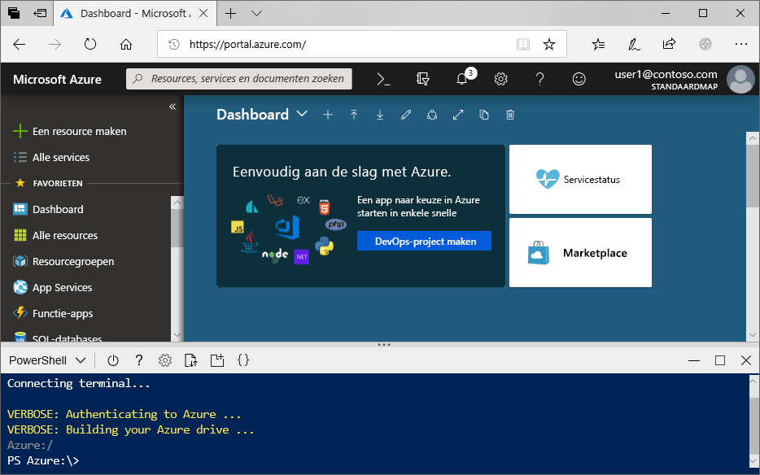
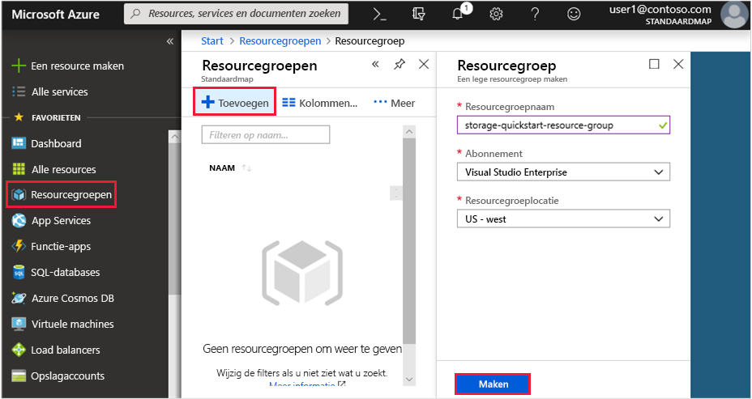
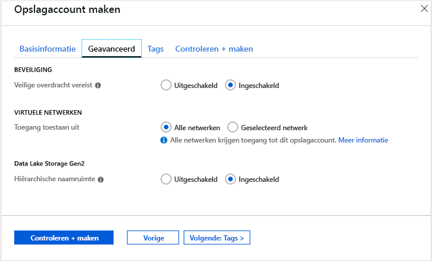

# <a name="quickstart-create-an-azure-data-lake-storage-gen2-storage-account"></a>Snelstart: Een Azure Data Lake Storage Gen2-opslagaccount maken

Azure Data Lake Storage Gen2 biedt [ondersteuning voor een hiërarchische naamruimteservice](data-lake-storage-introduction.md) met een systeemeigen, op mappen gebaseerd bestandssysteem dat is toegesneden op Hadoop Distributed File System (HDFS). Toegang tot Data Lake Storage Gen2-gegevens uit HDFS is beschikbaar via het [ABFS-stuurprogramma](data-lake-storage-abfs-driver.md).

In deze snelstart wordt gedemonstreerd hoe u een account maakt met [Azure Portal](https://portal.azure.com/), [Azure PowerShell](https://docs.microsoft.com/powershell/azure/overview) of [Azure CLI](https://docs.microsoft.com/cli/azure?view=azure-cli-latest).

## <a name="prerequisites"></a>Vereisten

Als u nog geen abonnement op Azure hebt, maak dan een [gratis account](https://azure.microsoft.com/free/) aan voordat u begint. 

|           | Vereiste |
|-----------|--------------|
|Portal     | Geen         |
|PowerShell | Voor deze snelstart is Az.Storage-versie **0.7** of later van de PowerShell-module vereist. Voer de opdracht `Get-Module -ListAvailable Az.Storage` uit om uw huidige versie te vinden. Als er geen resultaten worden weergegeven wanneer u deze opdracht uitvoert, of als een andere versie dan **0.7** wordt weergegeven, dan moet u een upgrade van uw powershell-module uitvoeren. Zie de sectie [Upgrade uitvoeren van uw powershell-module](#upgrade-your-powershell-module) van deze handleiding.
|CLI        | U kunt u aanmelden bij Azure en Azure CLI-opdrachten uitvoeren. Dit kan op twee manieren: <ul><li>U kunt CLI-opdrachten uitvoeren vanuit Azure Portal, in Azure Cloud Shell </li><li>U kunt de CLI installeren en CLI-opdrachten lokaal uitvoeren</li></ul>|

Wanneer u werkt met de opdrachtregel, hebt u de mogelijkheid om de Azure Cloud-shell of de CLI lokaal te installeren.

### <a name="use-azure-cloud-shell"></a>Azure Cloud Shell gebruiken

Azure Cloud Shell is een gratis Bash-shell die u rechtstreeks in Azure Portal kunt uitvoeren. In deze shell is de Azure CLI vooraf geïnstalleerd en geconfigureerd voor gebruik met uw account. Klik op de knop **Cloud Shell** in het menu rechtsboven in Azure Portal:

[](https://portal.azure.com)

Met de knop start u een interactieve shell waarmee u alle stappen in deze snelstartgids kunt uitvoeren:

[](https://portal.azure.com)

### <a name="install-the-cli-locally"></a>De CLI lokaal installeren

U kunt Azure CLI ook lokaal installeren en gebruiken. Voor deze snelstart moet u versie 2.0.38 of later van Azure CLI uitvoeren. Voer `az --version` uit om de versie te bekijken. Als u uw CLI wilt installeren of upgraden, raadpleegt u [De Azure CLI installeren](/cli/azure/install-azure-cli).

## <a name="create-a-storage-account-with-azure-data-lake-storage-gen2-enabled"></a>Een opslagaccount maken waarvoor Azure Data Lake Storage Gen2 is ingeschakeld

Voordat u een account maakt, maakt u eerst een resourcegroep die fungeert als een logische container voor opslagaccounts of andere Azure resources die u maakt. Als u de resources die in deze snelstartgids zijn gemaakt, wilt opschonen, verwijdert u gewoon de resourcegroep. Als u de resourcegroep verwijdert, worden ook het bijbehorende opslagaccount en eventuele andere resources die zijn gekoppeld aan de resourcegroep, verwijderd. Zie [Overzicht van Azure Resource Manager](../../azure-resource-manager/resource-group-overview.md) voor meer informatie over resourcegroepen.

> [!NOTE]
> U moet nieuwe opslagaccounts maken van het type **StorageV2 (algemeen gebruik v2)** om te profiteren van de functies van Data Lake Storage Gen2.  

Zie [Overzicht van Azure-opslagaccount](../common/storage-account-overview.md) voor meer informatie over opslagaccounts.

Neem de volgende regels in acht als u het opslagaccount een naam geeft:

- Namen van opslagaccounts moeten tussen 3 en 24 tekens lang zijn en mogen alleen cijfers en kleine letters bevatten.
- De naam van uw opslagaccount moet uniek zijn binnen Azure. Een opslagaccount kan niet dezelfde naam hebben als een ander opslagaccount.

## <a name="create-an-account-using-the-azure-portal"></a>Een account maken in Azure Portal

Meld u aan bij [Azure Portal](https://portal.azure.com).

### <a name="create-a-resource-group"></a>Een resourcegroep maken

Als u een resourcegroep wilt maken in Azure Portal, volgt u deze stappen:

1. Vouw het menu aan de linkerkant in Azure Portal uit om het menu met services te openen en kies **Resourcegroepen**.
2. Klik op de knop **Toevoegen** om een nieuwe resourcegroep toe te voegen.
3. Voer een naam in voor de nieuwe resourcegroep.
4. Selecteer het abonnement waarin u de nieuwe resourcegroep wilt maken.
5. Kies de locatie voor de resourcegroep.
6. Klik op de knop **Maken**.  

   

### <a name="create-a-general-purpose-v2-storage-account"></a>Een v2-opslagaccount voor algemeen gebruik maken

Als u een v2-opslagaccount voor algemeen gebruik wilt maken in de Azure Portal, volgt u deze stappen:

> [!NOTE]
> De hiërarchische naamruimte is momenteel beschikbaar in alle openbare regio's. De naamruimte is momenteel ook niet beschikbaar in soevereine clouds.

1. Vouw in Azure Portal het menu links open om het menu met services te openen en kies **Alle services**. Schuif vervolgens omlaag naar **Opslag** en kies **Opslagaccounts**. Kies in het venster **Opslagaccounts** dat wordt weergegeven de optie **Toevoegen**.
2. Selecteer uw **abonnement** en de **resourcegroep** die u eerder hebt gemaakt.
3. Voer een naam in voor het opslagaccount.
4. Stel **Locatie** in op **US - west 2**
5. Laat deze velden ingesteld staan op de standaardwaarden: **Prestaties**, **Accounttype**, **Replicatie**, **Toegangslaag**.
6. Kies het abonnement waarin u het opslagaccount wilt maken.
7. Selecteer **Volgende: Geavanceerd >**
8. Laat u de waarden onder de velden **SECURITY** en **VIRTUAL NETWORKS** ingesteld op hun standaardwaarden.
9. In de sectie **Data Lake Storage Gen2** stelt u **Hiërarchische naamruimte** in op **Ingeschakeld**.
10. Klik op **Beoordelen en maken** om het opslagaccount te maken.

    

Uw opslagaccount is nu gemaakt via de portal.

### <a name="clean-up-resources"></a>Resources opschonen

Ga als volgt te werk om een resourcegroep te verwijderen in Azure Portal:

1. Vouw het menu aan de linkerkant in Azure Portal uit om het menu met services te openen en kies **Resourcegroepen** om de lijst met resourcegroepen weer te geven.
2. Zoek de resourcegroep die u wilt verwijderen, en klik met de rechtermuisknop op de knop **Meer** (**...** ) aan de rechterkant van de lijst.
3. Selecteer **Resourcegroep verwijderen** en bevestig dit.

## <a name="create-an-account-using-powershell"></a>Een account maken met PowerShell

Installeer eerst de meest recente versie van de [ PowerShellGet](https://docs.microsoft.com/powershell/gallery/installing-psget)-module.

Voer vervolgens een upgrade uit van uw powershell-module, meld u aan bij uw Azure-abonnement, maak een resourcegroep en vervolgens een opslagaccount.

### <a name="upgrade-your-powershell-module"></a>De PowerShell-module upgraden

[!INCLUDE [updated-for-az](../../../includes/updated-for-az.md)]

Voor de interactie met Data Lake Storage Gen2 met behulp van PowerShell moet u moduleversie Az.Storage **0,7** of hoger installeren.

Begin door een PowerShell-sessie met verhoogde bevoegdheden te openen.

De module Az.Storage installeren

```powershell
Install-Module Az.Storage -Repository PSGallery -AllowPrerelease -AllowClobber -Force
```

### <a name="log-in-to-your-azure-subscription"></a>Aanmelden bij uw Azure-abonnement

Gebruik de opdracht `Login-AzAccount` en volg de instructies op het scherm om te verifiëren.

```powershell
Login-AzAccount
```

### <a name="create-a-resource-group"></a>Een resourcegroep maken

Gebruik de opdracht [New-AzResourceGroup](/powershell/module/az.resources/new-azresourcegroup) om een nieuwe resourcegroep met PowerShell te maken: 

> [!NOTE]
> De hiërarchische naamruimte is momenteel beschikbaar in alle openbare regio's. De naamruimte is momenteel ook niet beschikbaar in soevereine clouds.

```powershell
# put resource group in a variable so you can use the same group name going forward,
# without hardcoding it repeatedly
$resourceGroup = "storage-quickstart-resource-group"
$location = "westus2"
New-AzResourceGroup -Name $resourceGroup -Location $location
```

### <a name="create-a-general-purpose-v2-storage-account"></a>Een v2-opslagaccount voor algemeen gebruik maken

Gebruik de opdracht [New-AzStorageAccount](/powershell/module/az.storage/New-azStorageAccount) om een v2-opslagaccount voor algemeen gebruik met lokaal redundante opslag (LRS) te maken vanuit PowerShell:

```powershell
$location = "westus2"

New-AzStorageAccount -ResourceGroupName $resourceGroup `
  -Name "storagequickstart" `
  -Location $location `
  -SkuName Standard_LRS `
  -Kind StorageV2 `
  -EnableHierarchicalNamespace $True
```

### <a name="clean-up-resources"></a>Resources opschonen

Gebruik de opdracht [Remove-AzResourceGroup](/powershell/module/az.resources/remove-azresourcegroup) om de resourcegroep en alle bijbehorende resources te verwijderen, inclusief het nieuwe opslagaccount: 

```powershell
Remove-AzResourceGroup -Name $resourceGroup
```

## <a name="create-an-account-using-azure-cli"></a>Een account maken met Azure CLI

Meld u aan bij [Azure Portal](https://portal.azure.com) om Azure Cloud Shell te starten.

Als u zich wilt aanmelden bij de lokale installatie van de CLI, voert u de opdracht voor aanmelden uit:

```cli
az login
```

### <a name="add-the-cli-extension-for-azure-data-lake-gen-2"></a>De CLI-extensie voor Azure Data Lake Gen 2 toevoegen

Als u via CLI wilt communiceren met Data Lake Storage Gen2, moet u een extensie toevoegen aan de shell.

Dit doet u als volgt: voer met behulp van Cloud Shell of een lokale shell de volgende opdracht in: `az extension add --name storage-preview`

### <a name="create-a-resource-group"></a>Een resourcegroep maken

Gebruik de opdracht [az group create](/cli/azure/group) om een nieuwe resourcegroep te maken met Azure CLI.

```azurecli-interactive
az group create `
    --name storage-quickstart-resource-group `
    --location westus2
```

> [!NOTE]
> > De hiërarchische naamruimte is momenteel beschikbaar in alle openbare regio's. De naamruimte is momenteel ook niet beschikbaar in soevereine clouds.

### <a name="create-a-general-purpose-v2-storage-account"></a>Een v2-opslagaccount voor algemeen gebruik maken

Gebruik de opdracht [az storage account create](/cli/azure/storage/account) om een v2-opslagaccount voor algemeen gebruik met lokaal redundante opslag te maken vanuit de Azure CLI.

```azurecli-interactive
az storage account create `
    --name storagequickstart `
    --resource-group storage-quickstart-resource-group `
    --location westus2 `
    --sku Standard_LRS `
    --kind StorageV2 `
    --hierarchical-namespace true
```

### <a name="clean-up-resources"></a>Resources opschonen

Gebruik de opdracht [az group delete](/cli/azure/group) om de resourcegroep en alle bijbehorende resources te verwijderen, inclusief het nieuwe opslagaccount.

```azurecli-interactive
az group delete --name myResourceGroup
```

## <a name="next-steps"></a>Volgende stappen

In deze snelstart hebt u een opslagaccount gemaakt met Data Lake Storage Gen2-mogelijkheden. Zie het volgende onderwerp voor informatie over het uploaden en downloaden van blobs naar en uit uw opslagaccount.

* [AzCopy V10](https://docs.microsoft.com/azure/storage/common/storage-use-azcopy-v10?toc=%2fazure%2fstorage%2fblobs%2ftoc.json)
