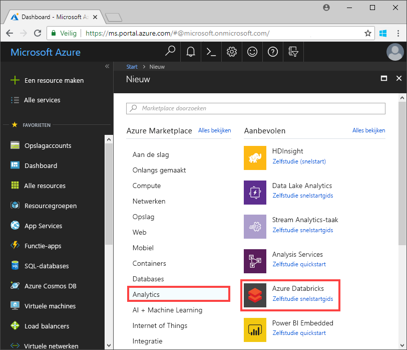
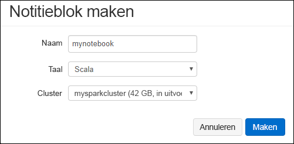
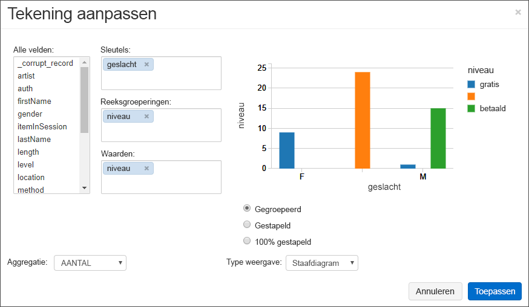
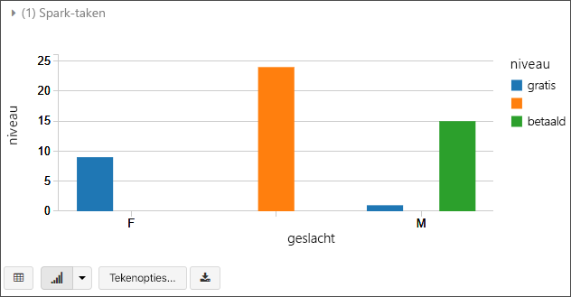
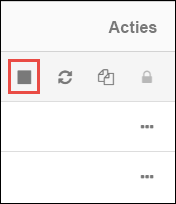

# <a name="quickstart-run-a-spark-job-on-azure-databricks-using-the-azure-portal"></a>Snelstart: Een Apache Spark-taak uitvoeren in Azure Databricks met behulp van Azure Portal

Deze snelstart laat zien hoe u een Apache Spark-taak met Azure Databricks kunt uitvoeren voor het analyseren van gegevens die in een opslagaccount zijn opgeslagen waarvoor Azure Data Lake Storage Gen2 Preview is ingeschakeld.

Als onderdeel van de Spark-taak analyseert u abonnementsgegevens van een radiozender om meer inzicht te krijgen in vrij/betaald gebruik op basis van demografische gegevens.

Als u geen abonnement op Azure hebt, maakt u een [gratis account](https://azure.microsoft.com/free/) voordat u begint.

## <a name="prerequisites"></a>Vereisten

- [Een opslagaccount maken waarvoor Data Lake Storage Gen2 is ingeschakeld](data-lake-storage-quickstart-create-account.md)

## <a name="set-aside-storage-account-configuration"></a>Opslagaccountconfiguratie instellen

> [!IMPORTANT]
> Tijdens deze zelfstudie moet u de naam en toegangssleutel van uw opslagaccount bij de hand hebben. Selecteer in Azure Portal de optie **Alle services** en filter op *opslag*. Selecteer **opslagaccounts** en zoek het account dat u voor deze zelfstudie hebt gemaakt.
>
> Kopieer de **naam** van het opslagaccount vanuit het **Overzicht** naar een teksteditor. Selecteer vervolgens **Toegangssleutels** en kopieer de waarde van **key1** naar de teksteditor. U hebt deze twee waarden nodig voor opdrachten verderop in deze zelfstudie.

## <a name="create-an-azure-databricks-workspace"></a>Een Azure Databricks-werkruimte maken

In deze sectie gaat u een Azure Databricks-werkruimte maken met behulp van Azure Portal.

1. Selecteer in Azure Portal **Een resource maken** > **Analyse** > **Azure Databricks**.

    

2. Geef bij **Azure Databricks Service** de waarden op voor het maken van een Databricks-werkruimte.

    

    Geef de volgende waarden op:

    |Eigenschap  |Beschrijving  |
    |---------|---------|
    |**Werkruimtenaam**     | Geef een naam op voor uw Databricks-werkruimte.        |
    |**Abonnement**     | Selecteer uw Azure-abonnement in de vervolgkeuzelijst.        |
    |**Resourcegroep**     | Geef aan of u een nieuwe resourcegroep wilt maken of een bestaande groep wilt gebruiken. Een resourcegroep is een container met gerelateerde resources voor een Azure-oplossing. Zie [Overzicht van Azure Resource Manager](../../azure-resource-manager/resource-group-overview.md) voor meer informatie. |
    |**Locatie**     | Selecteer **US - west 2**. U kunt desgewenst een andere openbare regio selecteren.        |
    |**Prijscategorie**     |  U kunt kiezen tussen **Standard** en **Premium**. Bekijk de pagina [Prijzen voor Databricks](https://azure.microsoft.com/pricing/details/databricks/) voor meer informatie over deze categorieën.       |

    Selecteer **Vastmaken aan dashboard** en klik op **Maken**.

3. Het maken van de werkruimte duurt enkele minuten. Tijdens het maken van de werkruimte wordt rechts in de portal de tegel **Implementatie verzenden voor Azure Databricks** weergegeven. Mogelijk moet u op uw dashboard naar rechts scrollen om de tegel te zien. Bovenaan het scherm wordt ook een voortgangsbalk weergegeven. U kunt beide gebieden bekijken voor de voortgang.

    

## <a name="create-a-spark-cluster-in-databricks"></a>Een Spark-cluster maken in Databricks

1. Ga in Azure Portal naar de Databricks-werkruimte die u hebt gemaakt en selecteer **Werkruimte starten**.

2. U wordt omgeleid naar de Azure Databricks-portal. Selecteer in de portal **Nieuw** > **Cluster**.

    

3. Op de pagina **Nieuw cluster** geeft u de waarden op waarmee een nieuw cluster wordt gemaakt.

    

    Accepteer alle andere standaardwaarden, anders dan de volgende:

    * Voer een naam in voor het cluster.
    * Maak een cluster met een **5.1 bèta**-runtime.
    * Zorg ervoor dat u het selectievakje **Beëindigen na 120 minuten van inactiviteit** inschakelt. Geef een duur (in minuten) op waarna het cluster moet worden beëindigd als het niet wordt gebruikt.

4. Selecteer **Cluster maken**. Zodra het cluster wordt uitgevoerd, kunt u notitieblokken koppelen aan het cluster en Spark-taken uitvoeren.

Zie [Een Spark-cluster maken in Azure Databricks](https://docs.azuredatabricks.net/user-guide/clusters/create.html) voor meer informatie over het maken van clusters.

## <a name="create-storage-account-file-system"></a>Bestandssysteem voor opslagaccount maken

In deze sectie maakt u een notitieblok in de Azure Databricks-werkruimte en voert u vervolgens codefragmenten uit om het opslagaccount te configureren.

1. Ga in [Azure Portal](https://portal.azure.com) naar de Azure Databricks-werkruimte die u hebt gemaakt en selecteer **Werkruimte starten**.

2. Selecteer **Werkruimte** in het linkerdeelvenster. Selecteer in de **Werkruimte**-vervolgkeuzelijst, **Notitieblok** > **maken**.

    

3. Voer in het dialoogvenster **Notitieblok maken** een naam voor het notitieblok in. Selecteer **Scala** als taal en selecteer het Spark-cluster dat u eerder hebt gemaakt.

    

    Selecteer **Maken**.

4. De Databricks-werkruimte verbinden met uw ADLS Gen2-account. Er zijn drie ondersteunde methoden om dit te bereiken: koppelen met behulp van OAuth, directe toegang met OAuth en directe toegang met gedeelde sleutel. 

    Elke mechanisme wordt weergegeven in het onderstaande voorbeeld. Vergeet bij het proberen van de voorbeelden niet de tijdelijke aanduidingen tussen haken in het voorbeeld te vervangen door uw eigen waarden:

    **Koppelen met behulp van OAuth**     
        
    ```scala
    %python%
    configs = {"fs.azure.account.auth.type": "OAuth",
        "fs.azure.account.oauth.provider.type": "org.apache.hadoop.fs.azurebfs.oauth2.ClientCredsTokenProvider",
        "fs.azure.account.oauth2.client.id": "<service-client-id>",
        "fs.azure.account.oauth2.client.secret": "<service-credentials>",
        "fs.azure.account.oauth2.client.endpoint": "https://login.microsoftonline.com/<tenant-id>/oauth2/token"}
    
    dbutils.fs.mount(
        source = "abfss://<file-system-name>@<account-name>.dfs.core.windows.net/[<directory-name>]",
        mount_point = "/mnt/<mount-name>",
        extra_configs = configs)
    ```

    **Directe toegang met OAuth**

    ```scala
    spark.conf.set("fs.azure.account.auth.type.<account-name>.dfs.core.windows.net": "OAuth")
    spark.conf.set("fs.azure.account.oauth.provider.type.<account-name>.dfs.core.windows.net", "org.apache.hadoop.fs.azurebfs.oauth2.ClientCredsTokenProvider")
    spark.conf.set("fs.azure.account.oauth2.client.id.<account-name>.dfs.core.windows.net": "<service-client-id>")
    spark.conf.set("fs.azure.account.oauth2.client.secret.<account-name>.dfs.core.windows.net": "<service-credentials>")
    spark.conf.set("fs.azure.account.oauth2.client.endpoint.<account-name>.dfs.core.windows.net": "https://login.microsoftonline.com/<tenant-id>/oauth2/token")

    dbutils.fs.ls("abfss://<file-system-name>@<account-name>.dfs.core.windows.net/")
    ```
        
    **Directe toegang met gedeelde sleutel** 

    ```scala    
    spark.conf.set("fs.azure.account.key.<account-name>.dfs.core.windows.net", "<account-key>")

    dbutils.fs.ls("abfss://<file-system-name>@<account-name>.dfs.core.windows.net/")
    ```

5. Geef de code op in de eerste cel en druk op **SHIFT + ENTER** om deze uit te voeren.

Nu is het bestandssysteem voor het opslagaccount gemaakt.

## <a name="ingest-sample-data"></a>Voorbeeldgegevens opnemen

Voordat u met deze sectie begint, moet u eerst aan de volgende vereisten voldoen:

Voer de volgende code in een notitieblokcel in:

    %sh wget -P /tmp https://raw.githubusercontent.com/Azure/usql/master/Examples/Samples/Data/json/radiowebsite/small_radio_json.json

Druk in de cel op **SHIFT+ENTER** om de code uit te voeren.

Voer nu in een cel onder deze cel de volgende code in, waarbij u de waarden tussen haakjes vervangt door dezelfde waarden die u eerder hebt gebruikt:

    dbutils.fs.cp("file:///tmp/small_radio_json.json", "abfss://<file-system>@<account-name>.dfs.core.windows.net/")

Druk in de cel op **SHIFT+ENTER** om de code uit te voeren.

## <a name="run-a-spark-sql-job"></a>Een Spark SQL-taak uitvoeren

Voer de volgende taken uit om een Spark SQL-taak op de gegevens uit te voeren.

1. Voer een SQL-instructie uit om een tijdelijke tabel te maken met gegevens uit het JSON-voorbeeldgegevensbestand, **small_radio_json.json**. Vervang in het volgende codefragment de tijdelijke aanduidingen voor waarden door de naam van het bestandssysteem en de naam van het opslagaccount. Plak het codefragment in een nieuwe codecel in het eerder gemaakte notitieblok en druk op Shift+Enter.

    ```sql
    %sql
    DROP TABLE IF EXISTS radio_sample_data;
    CREATE TABLE radio_sample_data
    USING json
    OPTIONS (
     path  "abfss://<file-system-name>@<account-name>.dfs.core.windows.net/<PATH>/small_radio_json.json"
    )
    ```

    Zodra de opdracht is voltooid, hebt u alle gegevens van het JSON-bestand als een tabel in het Databricks-cluster.

    De magic-opdracht in de taal `%sql` stelt u in staat u SQL-code uit te voeren vanuit het notitieblok, zelfs als het notitieblok van een ander type is. Zie [Talen combineren in een notitieblok](https://docs.azuredatabricks.net/user-guide/notebooks/index.html#mixing-languages-in-a-notebook) voor meer informatie.

2. Laten we eens een momentopname bekijken van de voorbeeld-JSON-gegevens om een beter begrip te krijgen van de query die u uitvoert. Plak het volgende codefragment in de codecel en druk op **Shift+Enter**.

    ```sql
    %sql
    SELECT * from radio_sample_data
    ```

3. U ziet uitvoer in tabelvorm zoals weergegeven in de volgende schermafbeelding (alleen bepaalde kolommen worden weergegeven):

    

    Naast andere gegevens wordt in de voorbeeldgegevens ook het geslacht van de doelgroep van een radiokanaal vastgelegd (kolomnaam **geslacht**) en of het om een gratis dan wel betaald abonnement gaat (kolomnaam **niveau**).

4. U gaat nu een visuele weergave van deze gegevens maken om voor elk geslacht te zien kunnen hoeveel gebruikers een gratis account hebben en hoeveel een betaald. Klik onder in de tabel met uitvoer op het pictogram voor het **staafdiagram** en klik vervolgens op **Tekenopties**.

    

5. In **Tekening aanpassen** sleept en zet u de waarden neer zoals in de schermafbeelding wordt weergegeven.

    

    - Stel **Sleutels** in op **geslacht**.
    - Stel **Reeksgroeperingen** in op **niveau**.
    - Stel **Waarden** in op **niveau**.
    - Stel **Aggregatie** in op **AANTAL**.

6. Klik op **Toepassen**.

7. De uitvoer toont de visuele weergave zoals de volgende schermafbeelding laat zien:

     

## <a name="clean-up-resources"></a>Resources opschonen

Beëindig het cluster wanneer u klaar bent met het artikel. Selecteer **Clusters** in de Azure Databricks-werkruimte en zoek het cluster dat u wilt beëindigen. Plaats de cursor op het weglatingsteken onder de kolom **Acties** en selecteer het pictogram **Beëindigen**.



Als u het cluster niet handmatig beëindigt, stopt het cluster automatisch, op voorwaarde dat het selectievakje **Beëindigen na \_\_ minuten van inactiviteit** is ingeschakeld tijdens het maken van het cluster. Als u deze optie instelt, wordt het cluster gestopt als het gedurende de opgegeven hoeveelheid tijd inactief is.

## <a name="next-steps"></a>Volgende stappen

In dit artikel hebt u een Spark-cluster in Azure Databricks gemaakt en een Spark-taak met gegevens uitgevoerd in een opslagaccount waarvoor Data Lake Storage Gen2 is ingeschakeld. U kunt ook zoeken op [Spark gegevensbronnen](https://docs.azuredatabricks.net/spark/latest/data-sources/index.html) voor meer informatie over het importeren van gegevens uit andere gegevensbronnen in Azure Databricks. Ga naar het volgende artikel voor informatie over het uitvoeren van een ETL-bewerking (Extraction, Transformation, and Loading) met behulp van Azure Databricks.

> [!div class="nextstepaction"]
>[Gegevens uitpakken, transformeren en laden met Azure Databricks](../../azure-databricks/databricks-extract-load-sql-data-warehouse.md)
