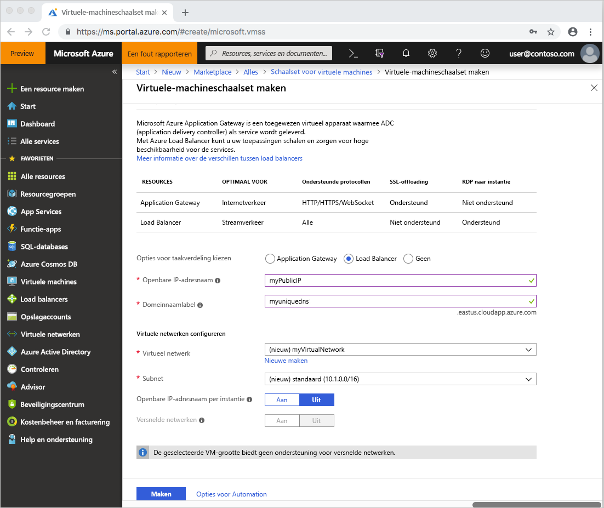

# Quickstart: Een schaalset voor virtuele machines maken in Azure Portal
Met een virtuele-machineschaalset kunt u een reeks identieke virtuele machines met automatisch schalen implementeren en beheren. U kunt het aantal VM’s in de schaalset handmatig schalen of regels voor automatisch schalen definiëren op basis van resourcegebruik zoals CPU, vraag naar geheugen, of netwerkverkeer. Een Azure load balancer verdeelt het verkeer vervolgens naar de VM-exemplaren in de schaalset. In deze snelstartgids gaat u in Azure Portal een schaalset voor virtuele machines maken.

Als u nog geen abonnement op Azure hebt, maak dan een [gratis account](https://azure.microsoft.com/free/?WT.mc_id=A261C142F) aan voordat u begint.

## Meld u aan bij Azure.
Meld u aan bij Azure Portal op https://portal.azure.com.

## Schaalset voor virtuele machines maken
U kunt een schaalset implementeren met een installatiekopie van Windows Server of Linux, zoals RHEL, CentOS, Ubuntu of SLES.

1. Klik in de linkerbovenhoek van Azure Portal op **Een resource maken**.
2. Zoek naar *schaalset*, kies **Virtuele-machineschaalset** en selecteer **Maken**.
3. Voer een naam in voor de schaalset, zoals *myScaleSet*.
4. Selecteer het gewenste type besturingssysteem, zoals *Windows Server 2016 Datacenter*.
5. Voer de naam van de gewenste resourcegroep in, zoals *myResourceGroup*, en de locatie, zoals *US - oost*.
6. Voer de gewenste gebruikersnaam in en selecteer het verificatietype dat u wilt gebruiken.
   - Een **wachtwoord** moet ten minste 12 tekens lang zijn en aan drie van de vier volgende complexiteitsvereisten voldoen: ten minste één kleine letter, één hoofdletter, één cijfer en één speciaal teken. Zie [Wat zijn de wachtwoordvereisten bij het maken van een virtuele machine?](../virtual-machines/windows/faq.md#what-are-the-username-requirements-when-creating-a-vm) voor meer informatie.
   - Als u een installatiekopie voor een Linux-besturingssysteem selecteert, kunt u ook **Openbare SSH-sleutel** kiezen. Geef alleen de openbare sleutel op, zoals *~/.ssh/id_rsa.pub*. U kunt vanuit de portal de Azure Cloud-Shell gebruiken om [SSH-sleutels te maken en gebruiken](../virtual-machines/linux/mac-create-ssh-keys.md).

     
1. Selecteer onder **Opties voor taakverdeling kiezen** een optie voor taakverdeling, zoals *Load balancer*. Voer de resterende gegevens in voor de optie voor uw taakverdeling. Voor bijvoorbeeld *Load balancer* dient u een **openbare IP-adresnaam** en een **domeinnaamlabel** in te voeren.
1. Voer de gegevens voor het virtuele netwerk in onder **Virtuele netwerken configureren**. U kunt bijvoorbeeld een nieuw virtueel netwerk maken, *myVirtualNetwork* en een nieuw subnet, *default*.
1. Selecteer **Maken** om de opties voor de schaalset te bevestigen.
    

## Verbinding maken met een VM in de schaalset
Wanneer u een schaalset maakt in de portal, wordt er ook een load balancer gemaakt. Met behulp van NAT-regels (Network Address Translation) wordt verkeer voor externe verbindingen zoals RDP of SSH naar de exemplaren in de schaalset gedistribueerd.

U kunt deze NAT-regels en verbindingsinformatie als volgt weergeven voor de exemplaren in de schaalset:

1. Selecteer de resourcegroep die u in de vorige stap hebt gemaakt, zoals *myResourceGroup*.
2. Selecteer in de lijst met resources uw **load balancer**, zoals *myScaleSetLab*.
3. Kies **Binnenkomende NAT-regels** in het menu aan de linkerkant van het venster.

    

U kunt met behulp van deze NAT-regels verbinding maken met elke VM in de schaalset. Voor elk VM-exemplaar worden een doel-IP-adres en TCP-poort weergegeven. Als het doel-IP-adres bijvoorbeeld *104.42.1.19* is en de TCP-poort *50001*, maakt u als volgt verbinding met het VM-exemplaar:

- Voor een Windows-schaalset maakt u verbinding maken met het VM-exemplaar met RDP op `104.42.1.19:50001`
- Voor een Linux-schaalset maakt u verbinding maken met het VM-exemplaar met SSH op `ssh azureuser@104.42.1.19 -p 50001`

Voer desgevraagd de referenties in die u hebt opgegeven in de vorige stap bij het maken van de schaalset. De exemplaren in de schaalset zijn gewone VM's waarmee u als elke andere VM kunt werken. Zie [Toepassing implementeren in schaalsets voor virtuele machines](virtual-machine-scale-sets-deploy-app.md) voor meer informatie over het implementeren en uitvoeren van toepassingen op exemplaren in een schaalset.

## Resources opschonen
De resourcegroep, de schaalset en alle gerelateerde resources kunt u verwijderen wanneer u deze niet meer nodig hebt. Om dit te doen, selecteert u de resourcegroep voor de VM en klikt u op **Verwijderen**.

## Volgende stappen
In deze snelstartgids hebt u via Azure Portal een eenvoudige schaalset voor virtuele machines gemaakt. Als u meer wilt weten over schaalsets, gaat u verder met de zelfstudie voor het maken en beheren van schaalsets voor virtuele Azure-machines.

> [!div class="nextstepaction"]
> [Schaalsets voor virtuele Azure-machines maken en beheren](tutorial-create-and-manage-powershell.md)
