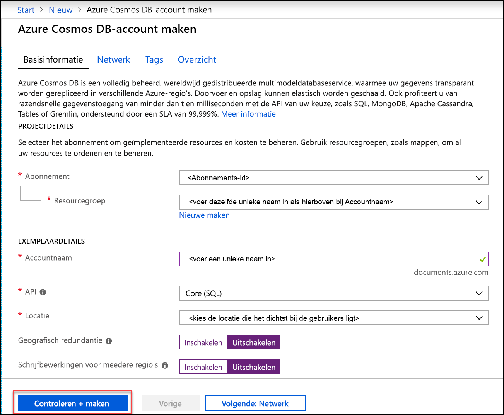
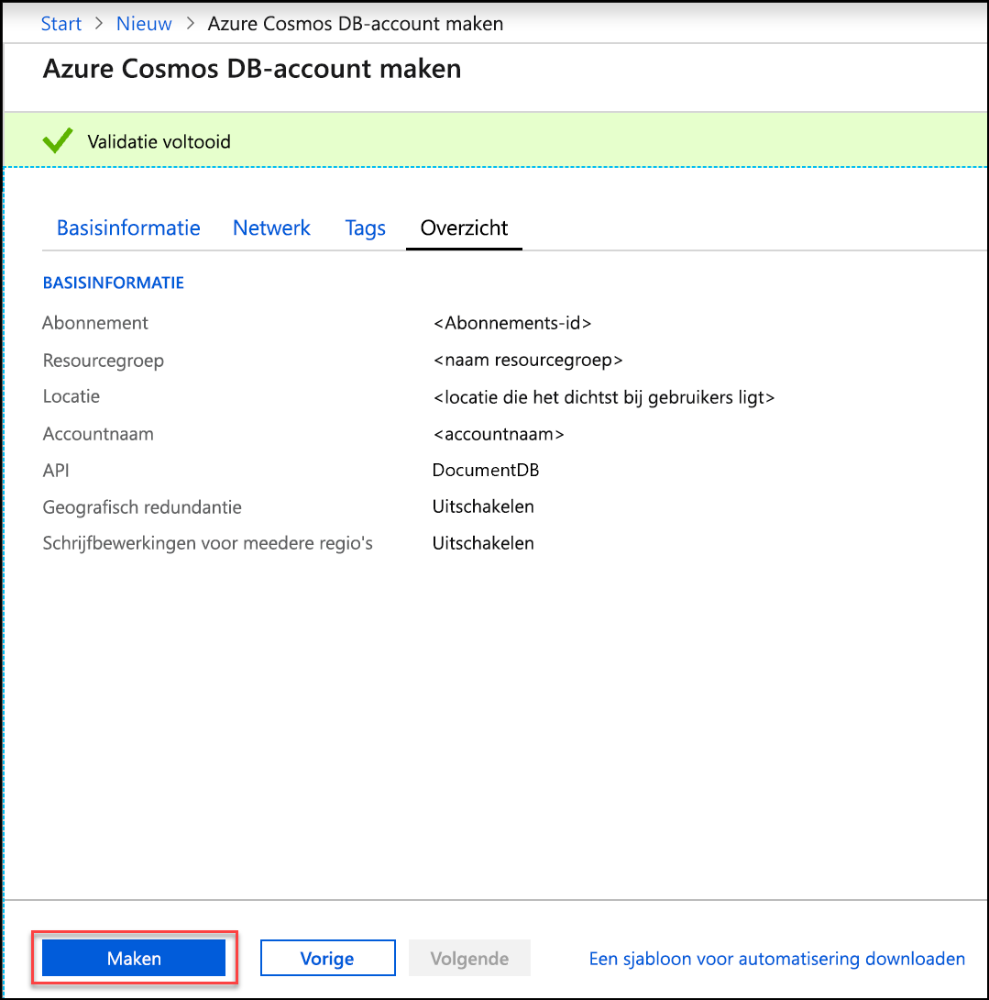
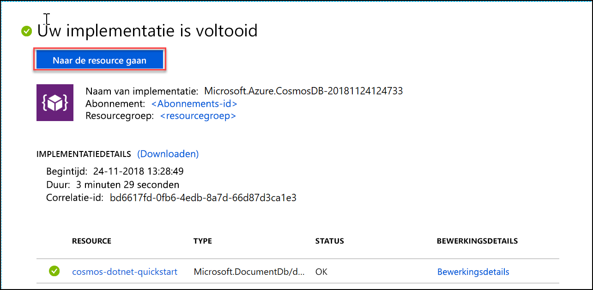

1. Meld u in een nieuw browservenster aan bij [Azure Portal](https://portal.azure.com/).
2. Klik op **Een resource maken** > **Databases** > **Azure Cosmos DB**.
   
   

3. Voer op de pagina **Azure Cosmos DB-account maken** de instellingen in voor het nieuwe Azure Cosmos DB-account. 
 
    Instelling|Waarde|Beschrijving
    ---|---|---
    Abonnement|*Uw abonnement*|Selecteer het Azure-abonnement dat u voor dit Azure Cosmos DB-account wilt gebruiken. 
    Resourcegroep|Nieuwe maken  *Voer een unieke naam in*|Selecteer **Nieuwe maken** en voer een naam voor de nieuwe resourcegroep voor uw account in. Gebruik dezelfde naam als uw accountnaam om het uzelf gemakkelijk te maken. 
    Accountnaam|*Voer een unieke naam in*|Voer een unieke naam in om uw Azure Cosmos DB-account te identificeren. Gebruik een unieke id omdat *documents.azure.com* is toegevoegd aan de id die u hebt opgegeven om uw URI te maken.  De id mag alleen kleine letters, cijfers en het koppelteken (-) bevatten, en moet 3 tot 31 tekens lang zijn.
    API|Core (SQL)|De API bepaalt het type te maken account. Azure Cosmos DB biedt vijf API's: SQL (documentdatabase), Gremlin (grafiekendatabase), MongoDB (documentdatabase), Table-API en Apache Cassandra-API. Momenteel is vereist dat u voor elke API een afzonderlijk account maakt.   Selecteer **Core SQL** omdat u in dit artikel een documentdatabase maakt en query's uitvoert met SQL-syntaxis.   [Meer informatie over de SQL-API](../articles/cosmos-db/documentdb-introduction.md)|
    Locatie|*Selecteer de regio die het dichtst bij uw gebruikers is gelegen*|Selecteer een geografische locatie waar u het Azure Cosmos DB-account wilt hosten. Gebruik de locatie die zich het dichtst bij uw gebruikers bevindt, zodat ze de snelst mogelijke toegang tot de gegevens hebben.
    Georedundantie inschakelen| Leeg laten | Hiermee maakt u een gerepliceerde versie van uw database in een tweede (gekoppelde) regio. Laat dit leeg.  
    Schrijfbewerkingen in meerdere regio's| Leeg laten | Zo maakt u het voor elk van uw databaseregio's mogelijk om zowel een schrijf- als leesregio te zijn. Laat dit leeg.  

    Klik dan op **Controleren + maken**. U kunt de secties **Netwerk** en **Tags** overslaan. 

    

    Lees de overzichtsinformatie en klik op **Maken**. 

    

4. Het duurt enkele minuten om het account te maken. Wacht tot in de portal het bericht **Uw implementatie is voltooid** wordt weergegeven en klik op **Naar de resource gaan**.     

    

5. In de portal wordt nu **Gefeliciteerd! weergegeven. Uw Azure Cosmos DB-account is gemaakt** weergeeft.

    

