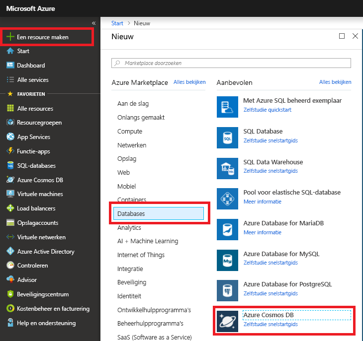

1. Meld u aan bij [Azure Portal](https://portal.azure.com/).
1. Selecteer **Een resource maken** > **Databases** > **Azure Cosmos DB**.
   
   

1. Op de **Create Azure Cosmos DB Account** pagina, de basisinstellingen voor de nieuwe Azure Cosmos-account invoeren. 
 
    |Instelling|Waarde|Beschrijving |
    |---|---|---|
    |Abonnement|Abonnementsnaam|Selecteer het Azure-abonnement dat u wilt gebruiken voor dit Azure Cosmos-account. |
    |Resourcegroep|Naam van de resourcegroep|Selecteer een resourcegroep of selecteer **nieuw**, voer een unieke naam voor de nieuwe resourcegroep. |
    | Accountnaam|Voer een unieke naam in|Voer een unieke naam voor uw Azure Cosmos-account. Gebruik een unieke id omdat *documents.azure.com* is toegevoegd aan de id die u hebt opgegeven om uw URI te maken.  De id mag alleen kleine letters, cijfers en het koppelteken (-) bevatten. Het moet tussen 3-31 tekens lang zijn.|
    | API|Core (SQL)|De API bepaalt het type te maken account. Azure Cosmos DB heeft vijf API's: Core (SQL) en MongoDB voor documentgegevens, Gremlin voor grafiekgegevens, Azure Table en Cassandra. Op dit moment moet u voor elke API een afzonderlijk account maken.   Selecteer **Core (SQL)** een documentdatabase en een query maken met behulp van SQL-syntaxis.   [Meer informatie over de SQL-API](../articles/cosmos-db/documentdb-introduction.md).|
    | Locatie|Selecteer de regio het dichtst in de buurt van uw gebruikers|Selecteer een geografische locatie waar u het Azure Cosmos DB-account wilt hosten. Gebruik de locatie die zich het dichtst bij uw gebruikers zodat ze de snelst mogelijke toegang tot de gegevens.|
   
   

1. Selecteer **Controleren + maken**. U kunt overslaan de **netwerk** en **Tags** secties. 

1. Controleer de accountinstellingen en selecteer vervolgens **maken**. Het duurt een paar minuten om het account te maken. Wacht tot de portal-pagina om weer te geven **uw implementatie is voltooid**. 

    

1. Selecteer **naar de resource gaan** om naar de Azure Cosmos DB-account-pagina te gaan. 

    
