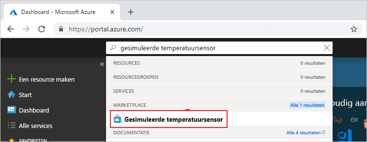
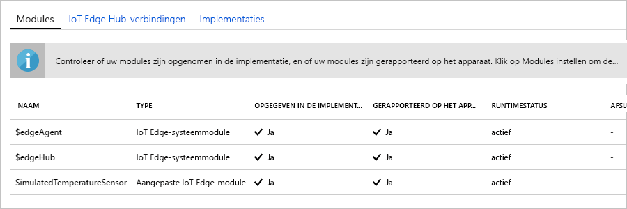

Een van de belangrijkste mogelijkheden van Azure IoT Edge is dat u er modules voor uw IoT Edge-apparaten mee kunt implementeren vanuit de cloud. Een IoT Edge-module is een uitvoerbaar pakket dat is geïmplementeerd als container. In dit gedeelte wordt een vooraf samengestelde module geïmplementeerd vanuit de [sectie IoT Edge-modules van de Azure Marketplace](https://azuremarketplace.microsoft.com/marketplace/apps/category/internet-of-things?page=1&subcategories=iot-edge-modules). Met deze module genereert u telemetrie voor uw IoT Edge-apparaat.

1. Voer in [Azure Portal](https://portal.azure.com) in het zoekvak **Gesimuleerde temperatuursensor** in en open het resultaat uit Marketplace.

   

2. Kies het IoT Edge-apparaat dat deze module moet ontvangen. Geef in de **Doelapparaten voor IoT Edge-module** de volgende informatie op:

   1. **Abonnement:** selecteer het abonnement dat de IoT-hub bevat die u gebruikt.

   2. **IoT-hub**: selecteer de naam van de IoT-hub die u gebruikt.

   3. **Naam van IoT Edge-apparaat**: voer **myEdgeDevice** in als u de voorgestelde apparaatnaam al eerder in deze snelstartgids hebt gebruikt. Of selecteer **Apparaat zoeken** om een apparaat te kiezen in een lijst met apparaten in uw IoT-hub. 
   
   4. Selecteer **Maken**.

3. Nu u een IoT Edge-module in de Azure Marketplace hebt gekozen en een IoT Edge-apparaat hebt geselecteerd dat de module moet ontvangen, gaat u verder naar een wizard met drie stappen om precies te definiëren hoe de module wordt geïmplementeerd. In de wizardstap **Modules toevoegen** ziet u dat de module **SimulatedTemperatureSensor** automatisch wordt ingevuld. In de zelfstudies gebruikt u deze pagina om meer modules aan uw implementatie toe te voegen. In deze snelstart implementeren we alleen deze ene module. Selecteer **Volgende** om door te gaan naar de volgende stap van de wizard.

4. In de wizardstap **Routes opgeven** definieert u hoe berichten tussen modules en naar IoT Hub worden uitgewisseld. In deze snelstart wilt u dat alle berichten van alle modules naar de IoT Hub (`$upstream`) worden gestuurd. Als de gegevens niet automatisch worden ingevuld, voegt u de volgende code toe en selecteert u **Volgende**:

   ```json
    {
    "routes": {
        "route": "FROM /messages/* INTO $upstream"
        }
    }
   ```

5. In de wizardstap **Implementatie controleren** kunt u een preview bekijken van het JSON-bestand waarmee alle modules worden gedefinieerd die naar uw IoT Edge-apparaat worden geïmplementeerd. U ziet dat zowel de module **SimulatedTemperatureSensor** als de twee extra systeemmodules **edgeAgent** en **edgeHub** hiervan deel uitmaakt. Selecteer **Indienen** wanneer u klaar bent met beoordelen.

   Wanneer u een nieuwe implementatie bij een IoT Edge-apparaat indient, wordt er niets naar uw apparaat gepusht. In plaats daarvan voert het apparaat regelmatig query’s uit naar eventuele nieuwe instructies. Zodra informatie over de nieuwe implementatie wordt gedetecteerd, worden die gegevens gebruikt om de installatiekopieën van de module uit de cloud te halen en worden de modules lokaal uitgevoerd. Dit proces kan enkele minuten duren. 

6. Nadat u de informatie over de implementatie van de module hebt ingediend, keert u terug naar de pagina **IoT Edge**. Selecteer uw apparaat in de lijst met IoT Edge-apparaten om de details weer te geven. 

7. Blader op de pagina met apparaatdetails omlaag naar het gedeelte **Modules**. U ziet hier drie modules: $edgeAgent, $edgeHub en SimulatedTemperatureSensor. Als bij een of meer modules wordt vermeld dat ze worden geïmplementeerd maar niet per apparaat worden gerapporteerd, betekent dit dat ze nog door uw IoT Edge-apparaat worden opgestart. Wacht enkele momenten en selecteer **Vernieuwen** bovenaan de pagina. 

   
