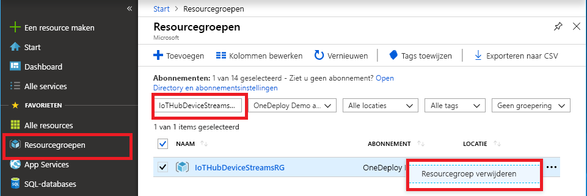

Als u verder wilt gaan met het volgende aanbevolen artikel, kunt u de resources die u al hebt gemaakt behouden en opnieuw gebruiken.

Anders kunt u de Azure-resources die u in dit artikel hebt gemaakt verwijderen om kosten te voorkomen. 

> [!IMPORTANT]
> Het verwijderen van een resourcegroep kan niet ongedaan worden gemaakt. De resourcegroep en alle resources daarin worden permanent verwijderd. Zorg ervoor dat u niet per ongeluk de verkeerde resourcegroep of resources verwijdert. Als u de IoT Hub in een bestaande resourcegroep hebt gemaakt met resources die u wilt behouden, moet u alleen de IoT Hub-resource zelf verwijderen in plaats van de resourcegroep te verwijderen.
>

Een resourcegroep verwijderen op naam:

1. Meld u aan bij [Azure Portal](https://portal.azure.com) en klik op **Resourcegroepen**.

2. Typ in het tekstvak **Filteren op naam...** de naam van de resourcegroep die uw IoT Hub bevat. 

3. Klik rechts van de resourcegroep in de lijst met resultaten op **...** en vervolgens op **Resourcegroep verwijderen**.

    

4. U wordt gevraagd om het verwijderen van de resourcegroep te bevestigen. Typ de naam van de resourcegroep nogmaals om te bevestigen en klik op **Verwijderen**. Na enkele ogenblikken worden de resourcegroep en alle resources in de groep verwijderd.