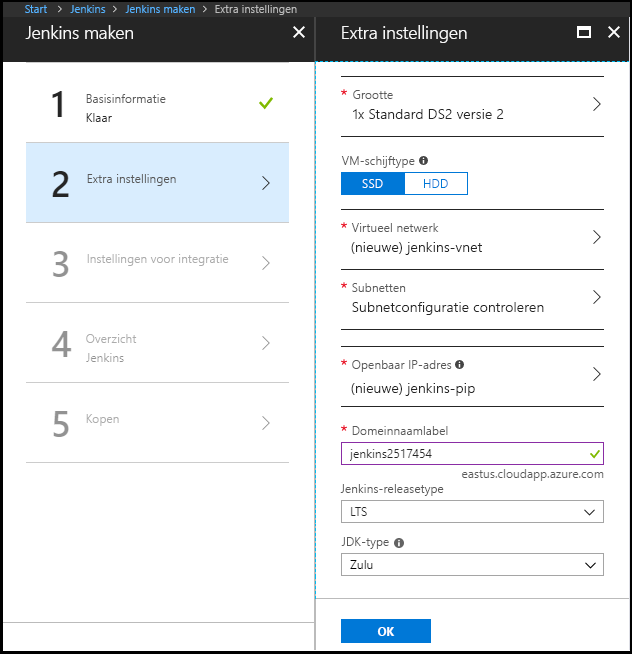

1. Open in de browser de [Azure Marketplace-installatiekopie voor Jenkins](https://azuremarketplace.microsoft.com/marketplace/apps/azure-oss.jenkins?tab=Overview).

1. Selecteer **GET IT NOW**.

    

1. Bekijk de prijsgegevens en de voorwaarden, en selecteer **Continue**.

    

1. Selecteer **Maken** om de Jenkins-server te configureren in de Azure-portal. 

    

1. Geef op het tabblad **Basisinformatie** de volgende waarden op:

   - **Naam**: voer `Jenkins` in.
   - **Gebruikersnaam**: voer de gebruikersnaam in die moet worden gebruikt bij het aanmelden bij de virtuele machine waarop Jenkins wordt uitgevoerd. De gebruikersnaam moet voldoen aan [specifieke vereisten](/azure/virtual-machines/linux/faq#what-are-the-username-requirements-when-creating-a-vm).
   - **Verificatietype**: selecteer **Openbare SSH-sleutel**.
   - **Openbare SSH-sleutel**: kopieer en plak een openbare RSA-sleutel in een indeling met één regel (de sleutel moet beginnen met `ssh-rsa`) of in de PEM-indeling met meerdere regels. U kunt SSH-sleutels genereren met ssh-keygen in Linux en macOS, of met PuTTYGen in Windows. Raadpleeg het artikel [SSH-sleutels gebruiken met Windows in Azure](/azure/virtual-machines/linux/ssh-from-windows) voor meer informatie over SSH-sleutels en Azure.
   - **Abonnement**: selecteer het Azure-abonnement waarin u Jenkins wilt installeren.
   - **Resourcegroep**: selecteer **Nieuwe maken** en voer een naam in voor de resourcegroep die dient als logische container voor de verzameling resources die samen de Jenkins-installatie vormen.
   - **Locatie**: selecteer **US - oost**.

     

1. Selecteer **OK** om verder naar het tabblad **Aanvullende instellingen** te gaan. 

1. Geef op het tabblad **Aanvullende instellingen** de volgende waarden op:

   - **Grootte**: selecteer de juiste grootte voor de virtuele Jenkins-machine.
   - **VM-schijftype**: kies HDD (hardeschijfstation) of SSD (solid-state drive) om aan te geven welk schijfopslagtype is toegestaan voor de virtuele Jenkins-machine.
   - **Virtueel netwerk**: selecteer **Virtueel netwerk** om de standaardinstellingen te wijzigen. (optioneel)
   - **Subnetten**: selecteer **Subnetten**, controleer de gegevens en selecteer **OK**.
   - **Openbaar IP-adres**: de naam van het IP-adres is standaard de Jenkins-naam die u hebt opgegeven op de vorige pagina, met het achtervoegsel -IP. U kunt ervoor kiezen om deze standaardinstelling te wijzigen.
   - **Domeinnaamlabel**: geef de waarde op voor de volledig gekwalificeerde URL naar de virtuele Jenkins-machine.
   - **Jenkins-releasetype**: selecteer het gewenste releasetype uit de opties: `LTS`, `Weekly build` of `Azure Verified`. De opties `LTS` en `Weekly build` worden toegelicht in het artikel [Jenkins LTS Release Line](https://jenkins.io/download/lts/). De optie `Azure Verified` verwijst naar een [Jenkins LTS-versie](https://jenkins.io/download/lts/) die is geverifieerd voor uitvoering in Azure. 
   - **JDK-type**: JDK die moet worden geïnstalleerd. Standaard wordt Zulu getest, gecertificeerde builds van OpenJDK.

     

1. Selecteer **OK** om verder naar het tabblad **Integratie-instellingen** te gaan.

1. Geef op het tabblad **Integratie-instellingen** de volgende waarden op:

    - **Service-principal**: de service-principal wordt aan Jenkins toegevoegd als een referentie voor verificatie met Azure. `Auto` betekent dat de principal wordt gemaakt met MSI (Managed Service Identity). `Manual` betekent dat de principal door u moet worden gemaakt. 
        - **Toepassings-id** en **Geheim**: als u de optie `Manual` selecteert voor de optie **Service-principal**, moet u de `Application ID` en `Secret` voor de service-principal opgeven. U ziet dat **Bijdrager** de standaardrol is tijdens het [maken van een service-principal](/cli/azure/create-an-azure-service-principal-azure-cli). Dit is voldoende om met Azure-resources te werken.
    - **Cloud-agents inschakelen**: geef de standaardcloudsjabloon voor agents op, waarbij `ACI` verwijst naar Azure Container Instance en `VM` verwijst naar virtuele machines. U kunt ook `No` opgeven als u geen cloudagent wilt inschakelen.

1. Selecteer **OK** om verder naar het tabblad **Overzicht** te gaan.

1. Wanneer het tabblad **Overzicht** wordt weergegeven, wordt de ingevoerde informatie gevalideerd. Zodra het bericht **Validatie voltooid** wordt weergegeven (bovenaan het tabblad), selecteert u **OK**. 

     

1. Wanneer het tabblad **Maken** wordt weergegeven, selecteert u **Maken** om de virtuele Jenkins-machine te maken. Er wordt een melding weergegeven in de Azure-portal wanneer de server klaar is.

     
